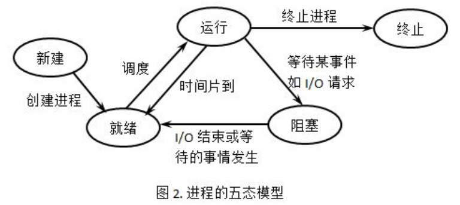

# 2.3进程及其实现

## 进程的定义和性质

进程是 **操作系统进行资源分配和保护的基本单位** ；是支持程序执行的系统机制，既能用来共享资源又能描述程序并发执行过程的系统基本单位。

***为什么引入进程概念？***

+ 刻画系统动态性
+ **发挥系统的并发性**（主要原因）
+ 程序并发执行引起资源共享和竞争，执行程序不再处于封闭环境中。
+ 程序概念自身无法刻画程序的并发特征，从而引入进程概念。
+ 解决系统"共享性"，正确描述程序执行状态。

## 进程的状态及转换

（待补充：模型图的实际理解）

### 进程的三态，五态模型

***(上课强调：图重要需要掌握）***

三态图运行状态：

+ 运行态：进程占有处理器正在运行的状态
+ 就绪态：进程具备运行条件，等待系统分配处理器以便运行的状态
+ 等待态：指进程不具备运行条件，正在等待某个时间完成的状态。

五态模型在三态模型的基础上增加了新建态和终止态：

+ 新建态：对应于进程被创建的状态，尚未进入就绪队列
+ 终止态：指进程完成任务到达正常结束点，或者出现无法克服的错误而异常终止，或被操作系统及有终止权的进程所终止时所处的状态。

**五态模型创建一个进程需要两个步骤：**

+ 为新进程分配所需要的资源和建立必要的管理信息
+ 设置该进程为就绪态，并等待被调度执行

**对终止态的进程的解释：** 

处于终止态的进程不再被调度执行，下一步将被系统撤销，最终从系统消失。

终止一个进程的两个步骤：

+ 先等待操作系统或相关的进程进行善后处理（如抽取信息）
+ 回收占用的资源，并被系统删除

### 进程七态模型——挂起

**背景**：三态和五态模型都是假设内存中有序不断的创建进程。系统资源不满足进程运行要求时，必须把某些进程挂起（suspend)。

**挂起的目的**：为了**暂时不参与调度****，释放它占有资源**。置于磁盘对换区，以平滑系统负荷。

带有挂起的模型即为七态模型。七态模型在五态模型基础上增加了挂起就绪态和挂起等待态：

+ 挂起就绪态：进程具备运行条件，但是在外存中，只有被对换到内存才能被调度执行。
+ 挂起等待态：标明进程正在等待某一个事件发生且在外存中。

**挂起进程的特征**： 

+ 该进程不能被立即执行
+ 挂起进程可能会等待一个事件，但所等待的事件是独立于挂起条件的，事件结束并不能导致进程执行条件（即：挂起的这个进程可能在等待一个事件，但是这个事件对进程没有必然的影响）
+ 进程进入挂起状态是由于操作系统，父进程或进程本身阻止它运行
+ 结束进程挂起状态的命令只能通过操作系统或父进程发出。

## 进程的描述和组成

### 进程映像（elf)

+ 进程控制块

+ 进程程序块

+ 进程核心块

+ 进程数据块
  
  
  
  进程->用户线程（共享用户空间）->内核线程（没有用户空间）

### 进程的上下文（必须掌握）

操作系统中把**进程物理实体**和**支持进程运行的环境**合称为进程上下文。
新进程占有处理器时，新老进程随之发生上下文切换。进程的运行被认为是在上下文中执行。

### 进程控制块（PCB）

Process Control Block（PCB）- 进程控制块是操作系统用于记录和刻划进程状态及有关信息的 **数据结构** 。
包括：进程执行时的情况，进程让出处理器后所处状态，断点等信息。
其包含三类信息：

- 标识信息
- 现场信息
- 控制信息

### 进程的队列及管理

处于同一状态的所有 **PCB** 链接在一起的数据结构称为进程队列。

同一状态进程的PCB既可按 **先来先到** 的原则排成队列，也可按照 **优先数或其他原则** 排队（调度，算法时会提及）

通用队列组织方式：
（需要进一步查询数据结构补全）

- 线性方式
- 链接方式
- 索引方式

## 进程上下文切换和CPU模式切换（待补）

进程切换是让处于运行态的进程中断运行，让出处理器，这时要做一次 **进程上下文切换** ，CPU(用户态到核心态） 

**（重要，掌握两种切换的对应）**

### 进程切换

### 调度和切换时机问题

（主要一点：修改PCB信息）

### 处理器模式切换

## 进程的控制和管理

首先说明概念：

**管态**：管态又名特权态，系统态或核心态。

**目态**：又名用户态。

**原语**：在管态下执行，完成系统特定功能的过程

原语和机器指令类似，特点是 **执行过程中不允许被中断** ，是不可分割的基本单位，是顺序的不可能并发。

进程的控制和管理包括：

+ 创建进程
+ 阻塞进程
+ 唤醒进程
+ 挂起进程
+ 激活进程
+ 终止进程
+ 撤销进程

上述功能均通过原语实现。
