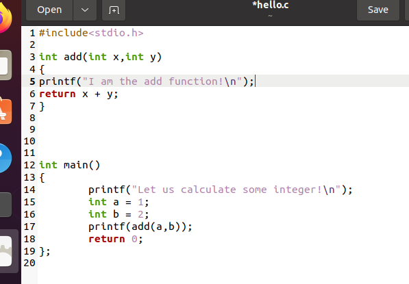
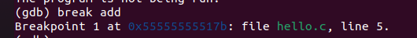

# 操作系统实验——前两个

操作系统老师布置了四个实验。由于没有模板，所以我选择先写成博客，供后来人参考。

基于上面的目的，该教程极其琐碎，几乎事无巨细的整理了思路教程，不喜请跳跃阅读。

## 实验一

名称：Linux操作系统基础

实验内容：

+ 安装Vmware Workstation虚拟机环境

+  在虚拟机中安装Red Hat Linux或Ubuntu Linux操作系统

+ 练习Linux基本命令，掌握Linux基本命令格式和使用方法

### 实验一解析

#### 安装Vmware

安装Vmware Workstation环境只需要在网上下载一个Vmware Workstation 16就可以了。由于Hadoop的时候已经安装过了，在此不再重复。

Hadoop老师安装了一个Red Hat Linux 5,但是一来比较老旧，资料大部分有点过时，二来系统被配置了特定的静态IP，联网和下载都比较麻烦，又因为本人使用Ubuntu较多，果断选择玩一次Ubuntu.

#### 准备Ubuntu:

首先先从阿里云下载Ubuntu镜像。我选择的是Ubuntu21.04版本。并选择了桌面GUI版：

[Index of /ubuntu-releases/21.04/ (aliyun.com)](http://mirrors.aliyun.com/ubuntu-releases/21.04/)

在这个链接点击


下载桌面版本的Ubuntu.

~~（个人吐槽：平常都是从手机上玩命令行的，第一次见到desktop版本的还是挺激动的！）~~

~~如果你想和命令行玩，可以下载下面那个。其实不碍事。~~

#### 安装Ubuntu：

之后打开虚拟机，新建一个虚拟机，选择Ubuntu的镜像：


设置linux内账号和密码：


其他保持默认，之后启动虚拟机，将会进入自动安装。

保持网络畅通，等待一会儿：


安装步骤进行中。这里首先配置最小安装，因为我们不在虚拟机里做什么游戏，所以最小安装即可，需要的话我们可以自行安装。选好之后点Continue.


~~经过一番，漫长，痛苦，无助的安装之后，它终于完成了……~~

安装好之后，第一次进入Online Accounts会有点卡。等待一会儿之后点击Skip.

之后点击三次next，就可以进入系统了。


注意上面这个对话框关掉就可以了。


于是我们便安装好了Ubuntu。Linux基础命令我基本上熟知，在此便不再赘述，我们继续进行实验。

## 实验二

名称：Linux系统分析基础

实验内容：

1) 练习VI编辑器，掌握使用vi编辑C语言程序文件

2) 练习Gcc编译器，掌握使用GCC编译C语言程序的基本方法

3) 练习GDB调试器，掌握使用GDB调试C语言可执行程序的基本方法

### 实验二解析

#### 注意事项和ROOT密码修改

首先注意一点：Ubuntu和CentOS不同，其安装使用apt,命令一般为:

apt-get install xxxxxx.

另外这个系统目前root是没有密码的，我们首先要设置密码才能更好的使用su命令。

首先在虚拟机内右键打开命令行界面。


在里面敲入：

```shell
sudo passwd root
```

之后会显示让你输入当前账户的密码，如果你忘了，请参考实验一 安装Ubuntu部分。


输入正确的话，会显示New password。此时输入的是root的密码，输入一个密码即可，建议和ubuntu密码一致;之后会让输入Retype new password，重复密码输入回车即可。提示BAD PASSWORD不要慌，只是个警告。

**注意！！！建议不要使用小键盘，因为小键盘可能会输入失败，导致密码出错**

输入完成后，使用

```shell
su root
```

切换到root权限，输入密码之后便可进入root权限。（因为本人懒得敲sudo了）

#### 切换阿里云更新源

切换好之后，我们还要切换一下安装源。默认安装的源是Ubuntu国外的US镜像，速度比较慢，我们换成阿里云的源：

进入root权限后，输入如下代码：

```shell
vi /etc/apt/sources.list
```

按下a键进入Insert模式，之后找到deb前面没有#（注释）的部分，比如：


将us.archive.ubuntu.com改为mirrors.aliyun.com即可，如图所示。


如果按下上下左右输入ABCD，请参考下方的附。

安装完成之后，保存文件，并输入如下指令更新软件源：

```shell
apt-get update
```

更新成功后大概如图：


（可能会有点报错，好像不碍事）

#### 附：重装VI

因为原本的VIM-common是有问题的，必须得自行安装一个。

如果你的按上下左右却输入了ABCD，均可按照这个方式解决。

首先用ESC从VI里退出，输入q!强制退出。

之后在root模式下输入命令：

```shell
apt-get remove vim-common -y
```

等待完成后输入

```shell
apt-get install vim -y
```

来安装正常的vim。

注意这个过程比较慢，因为我们现在还没换源。换源完成后速度会快很多。

完成之后我们便可参照切换阿里云更新源来换源。

#### 安装GCC和GDB

首先使用下面的指令安装gcc(gdb会随附安装)：

```
apt-get install gcc -y
```

安装完成之后，我们用下面指令回到home目录，然后开始实验：

```shell
cd ~
```

首先使用vi写一个最简单的小文件：

```shell
vi hello.c
```


```c
#include<stdio.h>
int main()
{
printf("hello world");
return 0;
}
```

写好保存。

#### GCC的使用

之后我们使用gcc生成“**带调试信息的可执行文件**”。

这里必须要先提及 **GCC的参数**

GCC的命令参数我们要用的就是这么几个：

+ -o 可以自定义生成的可执行文件的名称
+ -g 生成调试信息

其他的参数（来源[gcc和gdb的使用以及实战(bomblab）_千裡的博客-CSDN博客](https://blog.csdn.net/weixin_44520881/article/details/108244830)，感谢大佬的教程）：

+ -x language filename：忽视后缀名。比如gcc -x c hello.jpg，但是编译c++代码要使用g++。
+ -c ：只进行预处理，编译，和汇编，通过源代码生成.o文件。
+ 大写-S（常用）：通过预处理和编译，生成汇编代码。
+ -E：只激活预处理,这个不生成文件, 需要把它重定向到一个输出文件里面。如：gcc -E hello.c > pianoapan.txt
+ -o（常用）：可以自定义生成的可执行文件的名称，否则可执行文件名为a.out难听死。
+ -O0 、-O1 、-O2 、-O3（常用）：编译器的优化选项的 4 个级别，-O0 表示没有优化, -O1 为默认值，-O3 优化级别最高。

我们要用的就是这段指令：

```shell
gcc -g -o hello hello.c
```

运行之后使用ls命令查看一下文件在不在：


确定文件存在之后我们运行它一下看看：

```shell
./hello
```


成功，接下来进行GDB调试。

#### GDB的使用

GDB是Linux非常强大的一个调试工具。

为了更好的进行调试，我们需要对代码进行一点点小优化，让它适合被调用。



修改完成后：

```c
#include<stdio.h>

int add(int x,int y)
{
printf("I am the add function!\n");
return x + y;
}

int main()
{
	printf("Let us calculate some integer!\n");
	int a = 1;
	int b = 2;
	printf("%d",add(a,b));
	return 0;
};

```

之后我们继续使用

```c
gcc -g -o hello hello.c
```

生成文件。

生成后准备使用gdb进行调试：

```C
gdb hello
```


如上。

接下来我们使用list来查看反编译的代码：

由于我们带了 -g 参数，你将会看到代码如图：


我们决定从add函数下手，使用断点功能 break 来下断点，用法为 break + 函数名：

```c
break add
```



断点后我们要尝试用gdb对程序进行一些修改,比如把add函数返回值进行点修改：

首先用

```
run
```

来启动程序，之后它会断在我们之前设置的地方。


可以看到程序断点在了程序部分，也就是那个Add函数上。

接下来我们使用gdb的 **步进** 功能来调试程序。我们的目标是把最终输出结果修改掉。

步进分两种，一个是 'next',一个是'step',前者不会进入子函数（比如printf是个函数，它就会直接输出，而不是进入printf的逻辑）,后者会。

这里显然我们应该使用next。

我们输入

``` 
next
```

来跳转下一步：


程序执行到了返回的一步。接下来我们尝试修改返回值。首先看看x 和 y现在的值是多少（其实更上面的图已经显示了）

敲下 

```
print x 或者 print y
```

来查看x 和 y 的值。


现在我们修改其中一个：

使用set命令来修改：

```
set x=1000
```


接下来我们让程序继续正常运行，输入continue看看是否调试是否生效：

```
continue
```


输出结果变成了 1000+2=1002，GDB使用成功，程序正常退出！

之后输入quit退出gdb。
