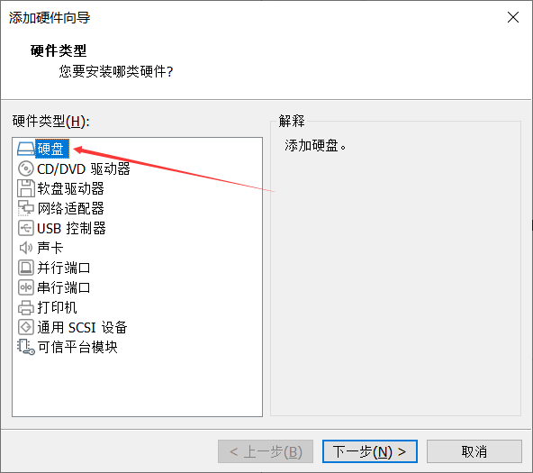

## 实验三

### 前言

在此之前，这里有一个非常详尽的教程。它对应的Ubuntu任务已经非常的接近成功。

很不幸，它在一次重启之后，消失了。

博客的主人很郁闷。

但是生活总是要继续的，只能重新写了。Ubuntu虚拟机恢复了一次快照，所以一切都是全新。

之前的文章也踩了不少的坑，或许这次可以从一开始就解决这些问题，显得好像我未卜先知，提前规避了各种问题一样。

**或许你看到的行云流水，只不过是一次次失败积攒出来的，没有人一开始就学会了一切，不过是踩得坑多了，百度的多了罢了。**

**虽然看起来是心平气和的写的教程，实际上博主已经崩溃过了。但是也没办法，因为不写下来就会忘记，所以必须和大脑皮层抢时间。**

哎，哪儿有一遍过的教程，都是我们作为先锋一脚一脚的踩进去坑，然后再从坑里出来，再写明坑的位置而已。

好了，废话就说这么多，我们继续吧。

### 题目

名称：Linux系统调用

实验内容：

1) 学习Makefile基本使用方法

2) 下载Linux源代码，尝试在Linux源程序中增加一个系统调用

3) 编译一次Linux内核，检查新增系统调用的效果

### 解析

#### Makefile入门

Makefile的基本使用我之前虽然写过，但是丢失了，我这里贴一下网上我跟着学的教程。

[ Makefile 语法入门_阿飞的博客-CSDN博客_makefile 语法](https://blog.csdn.net/afei__/article/details/82696682)

这可能是我第一次直接贴其他人的教程。不过Makefile在这里的重点并不是“怎么写”而是“怎么用”，所以不用太担心。

上面的坑是你需要先安装make,使用如下指令：

```bash
apt-get install make
```

我们基本跳过这个部分，因为后面才是痛苦的根源。

#### 事前准备1 - 添加空间

Linux内核编译需要 **非常多的空间**，以及 **非常长的时间**。截止目前，最长的一次使用了如下配置，8核全开，2个小时后因为空间不足失败。


我们首先新建一个磁盘，把磁盘大小设定为30G， **这里务必分足够大，目前已知其编译大小能超过9G，小心点的好。**




（后面不详细写了，主要是一定要分配足够空间，这玩意太吃空间了）

搞定之后就会成为这样：


接下来我们去系统配置这个磁盘：

打开虚拟机，切换到root模式：

输入fdisk -l，进入磁盘管理界面。


找到刚才分配的30GB的那个，记住前面的/dev/sdb（你们的可能不同，但大概率是相同的）

接下来输入：

```bash
fdisk /dev/sdb
```


敲n，回车创建分区，之后一路敲回车，之后就可以创建分区。


此时修改还在内存，输入w回车保存。

分区之后使用fdisk -l 再次查看:


记下这个我们用来后面挂载。

敲命令：

```bash
mkfs -t ext4 /dev/sdb1
```


之后挂载：

```bash
mkdir /data
mount /dev/sdb1 /data
```


此时挂载成功。注意这个挂载是临时的，下次我们还要用，记住这个指令：

```
mount /dev/sdb1 /data
```

#### 事前准备2 - 火力全开

编译需要很长的时间。如果你想加快速度，那就把核心数调到最高吧。


在这里试试看，如果发生了这样：


说明超标了。此时返回上一个即可。

#### 事前准备3 - SSH

因为虚拟机内存不是说分就能分的，所以需要使用SSH来防止terminal崩溃导致出问题。

**另外：其解决了XSHELL无法连接的问题**。

Xshell不能连接的原因是Ubuntu系统中，桌面版本默认不自带ssh服务。所以我们要安装ubuntu服务：

首先执行：

```bash
sudo apt-get install openssh-server -y
```

之后我们就安装了ssh服务。现在需要启用ubuntu里的ssh服务，让它能正常工作，执行如下代码：

```bash
sudo /etc/init.d/ssh start
```

之后便能成功链接，此时已经成功运行SSH。

#### 解压源码

首先使用uname -r查看当前的内核版本：


之后去linux内核下载地址：

[The Linux Kernel Archives](https://www.kernel.org/)

下载最接近但略微高一点版本号，或者相同版本号的内核（个人建议）：


点击tarball下载下来文件。之后右键 - 复制 - 粘贴到ubuntu的桌面：


接下来在桌面打开命令行终端，进入root模式，使用如下命令将它复制到刚刚挂载的30G硬盘里：(注意如果你的版本号不一致自己改版本号)

```bash
cp linux-5.13.19.tar.xz /data 
```

拷贝过去之后，使用

```bash
cd /data
```

切换目录,并使用

```bash
tar -xvf linux-5.13.19.tar.xz
```

解压文件。

解压后使用

```bash
cd linux-5.13.19
```

进入文件夹，到此源码解压完成

#### 源码的编译准备

编译需要许多奇奇怪怪的包。首先先用apt安装它们：

```
apt-get install libncurses5-dev -y
apt-get install build-essential -y
apt-get install libncurses5-dev -y	 
apt-get install flex -y		
apt-get install bison -y
apt-get install libssl-dev -y
apt-get install libelf-dev -y
```

之后执行

```bash
make mrproper
```

清理代码，然后 **将虚拟机屏幕最大化，里面的终端也最大化后** 执行内核配置命令：（否则会报错）

```bash
make menuconfig
```

执行后会显示如图界面


左右切换到Save上，回车回车回车（三次）之后就会回到这个界面。

然后左右切换到Exit上回车，退出内核配置设置。

接下来要对该内核配置文件进行修改，使用

```bash
gedit .config
```

打开文件，右上角有搜索功能：

搜索 **等号左边的部分**并改为右边的项：

```bash
CONFIG_SYSTEM_TRUSTED_KEYS=""
CONFIG_SYSTEM_REVOCATION_KEYS=""
CONFIG_DEBUG_INFO_BTF=n
```

改好后点击save保存。

保存完成后准备修改源码。

#### 源码的修改

添加系统调用需要操作：

+ 分配系统调用号
+ 添加服务例程的原型声明
+ 实现系统调用服务例程

首先分配系统调用号：

敲如下命令：

```bash
vim arch/x86/entry/syscalls/syscall_64.tbl
```

拉到如图所示的位置


特点是上方箭头为common，下面对应为x32,从这里新加一条系统调用，名字照着起，序号顺着来即可。


如上图所示。

之后记下这个名字，保存后准备添加服务例程的原型声明。

使用

```bash
vim include/linux/syscalls.h
```

按下shift + G跳转到最后一行，在 **#endif**前面添加如图所示代码：


**注意自己修改后面的名称**

之后实现系统调用服务例程，使用

```bash
vim kernel/sys.c
```

按下shift + G跳转到最后一行，在 **#endif**前面添加如图所示代码：

```
SYSCALL_DEFINE0(firehomework){
printk("This is a sample!\n");
return 0;
}
```

保存后准备开始编译源码。

#### 编译源码

由于编译源码非常容易就会导致内存不够，系统崩溃导致图形化界面崩溃，所以我们使用Xshell的SSH。

使用原本的账号登录

首先在系统内执行：

```
ifconfig
```

记下这个：


然后去Xshell（hadoop 安装了，如果没有装，自行去装）

我这里使用的是FinalShell，功能基本一致，反正就是瞅命令行。

连入之后先敲

```bash
su root
```

敲好之后进入linux内核源码文件夹，开始编译


（执行下面的命令）

注：根据 @希望潇洒的风：Ceeling 所述：


他持观点为直接使用

```bash
make -j$(nproc)
```

即可，无需使用两条命令。

由于对MakeFile的了解甚少，该说法尚存疑，如有测试的朋友可以在留言区给我留言。

```bash
make bzImage –j$(nproc)
make modules –j$(nproc)
```


出现这个时，输入1回车。

在经过漫长的等待之后（三个半小时）

终于编译完成：


占用大小20G+，所以30G预留是非常重要的。

然后先做个快照，再运行：

```
make modules_install
make install
update-grub2
reboot -n
```


终于在所有的东西都结束之后，成功的安装了内核。


重启，提示内存不足，把虚拟机内存拉到4GB后再次重试：


再次运行uname -r，提示5.13.19，终于成功！！！！

#### 测试

接下来我们写一个C语言程序，来测试调用。

看前面，我们修改的时候设置的系统调用号是447.所以我们如下写一个程序：

（进入root)

```bash
vi test.c
```

```c
#define _GNU_SOURCE
#include<unistd.h>
#include<sys/syscall.h>
int main(){
        syscall(447);
}   
```

然后编译：

```
gcc -o test test.c
```

运行：


没有反应，因为需要去系统信息看。

键入指令:

```bash
dmesg
```

查看


成功啦！！！！！！！