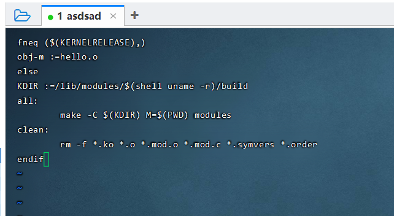
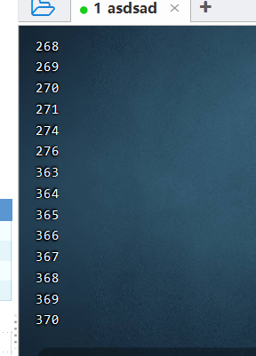

# 实验四


## 题目

**实验四**

名称：Linux内核模块

实验内容：

1)   学习Linux内核模块的基本概念，掌握开发一个简单的内核模块的基本方法

2)   在内核模块中添加遍历task_struct链表的代码，输出当前运行的进程的ID序列 

## 解析

### 关于Linux内核模块

Linux Kernel Module(LKM)，即Linux内核模块。

Linux内核是宏内核，简单来说就是内核就是一个整体，可以理解成为一个可执行程序，内核包揽了所有的系统功能，比如，进程调度、内核管理、文件系统、设备管理等等。这样势必出现一个问题，那就是如果开启所有的功能，会使得内核变得十分的臃肿。而LKM，可以从一定程度上，解决这个问题。通过将内核功能模块实现为LKM，可以对内核进行精简，只保留最为核心的功能，然后，其他功能模块，可以随着后续需求，进行动态的加载。Linux内核通过LKM可以动态的管理内核功能，使内核功能就要U盘一样，支持热插拔，这样做不仅可以节约内核运行时的硬件要求，同时可以满足内核功能的实时扩展性。
————————————————（以上话来源如下）
版权声明：本文为CSDN博主「奔跑的码仔」的原创文章，遵循CC 4.0 BY-SA版权协议，转载请附上原文出处链接及本声明。
原文链接：https://blog.csdn.net/lhl_blog/article/details/105904368

说白了就是：Linux包含那么多功能没啥用，内核只管最核心的，剩下的按需加载。~~有点创意工坊那味了~~

### 编译内核模块 - 前置学习

由于内核模块是Linux规定的，所以我们开发要按照Linux开发的规则。

由于我们此处只是简单的学习一下，所以我们丢出一个Hello World示例：

```c
  // 这些引入是必须的。类似输出要引入stdio.h一样。  
  #include <linux/init.h>                                                 
  #include <linux/module.h>
  // 这是内核模块调用的函数，名字随意，一会儿在下面进行注册 
  static int __init module_init_func(void)
  {
      printk("hello, world.\n");
      return 0;
  }
  // 这是内核退出的函数。同上的要求。（有点那种析构函数的感觉哎） 
  static void __exit module_exit_func(void)
  {
      return;
  }
  // 这里的是模块的许可，版本，创作者，描述。 
  MODULE_LICENSE("GPL v2");
  MODULE_VERSION("v0.1");
  MODULE_AUTHOR("lhl");
  MODULE_DESCRIPTION("LKM, helloworld.");
  // 这是模块进入和退出的注册，里面写的就是上面的随意的函数名称。
  module_init(module_init_func);
  module_exit(module_exit_func);
```

其配套一个简单的Makefile:

```makefile
	ifneq ($(KERNELRELEASE),)
obj-m :=改这里的名称.o
	else
KDIR :=/lib/modules/$(shell uname -r)/build
all:
	make -C $(KDIR) M=$(PWD) modules
clean:
	rm -f *.ko *.o *.mod.o *.mod.c *.symvers *.order
endif
```

这个makefile的主要作用就是将模块编译到内核里去。

基本含义如下：

obj-m:用于定义内核模块的二进制名称，注意，该文件名称与内核模块的c程序文件名进行对应。
KERS:用于声明内核编译环境的位置。
all：用于定义目标文件的编译规则，make -C ( K E R S ) 表 示 进 入 内 核 编 译 环 境 ， M = (KERS)表示进入内核编译环境，M=(KERS)表示进入内核编译环境，M=(shell pwd)指定当前LKM的路径，modules表示进行LKM的编译。
clean:与all目标类似，这里用于定义清理LKM编译过程中产生的文件，包括.ko文件。
————————————————（来源同样是这位大佬）
版权声明：本文为CSDN博主「奔跑的码仔」的原创文章，遵循CC 4.0 BY-SA版权协议，转载请附上原文出处链接及本声明。
原文链接：https://blog.csdn.net/lhl_blog/article/details/105904368

### 编译内核模块 - 输出ID序列

首先我们要知道：

Linux内核的进程控制块PCB是一个task_struct结构体。所有运行在系统中的进程都以task_struct链表的形式，存放在内核中。

关于结构体内的定义，请参阅本文末。其过长，不予完全展示。

我们需要获取这个结构体内的pid并输出。

```c
#include <linux/init.h>
#include <linux/module.h>
#include <linux/kernel.h>
#include <linux/sched.h>
//注意如果你用的是Ubuntu，要取消下面这句的注释
//因为在新版代码里，for_each_process被放在了其他位置
//感谢@希望潇洒的风：Ceeling @ 光影下的朝阳鱼提出的问题
//#include <linux/sched/signal.h>
// 初始化函数
static int hello_init(void)
{
    struct task_struct *p;  //Linux内核的进程控制块是task_struct结构体，所有运行在系统中的进程都以task_struct链表的形式存在内核中
    printk(KERN_ALERT"进程号\t");
    for_each_process(p)  //for_each_process是一个宏，在sched.h里面定义: 是从init_task开始遍历系统所有进程，init_task是进程结构链表头。
    {
            printk(KERN_ALERT"%d\n",p->pid);
    }
    return 0;
}
// 清理函数
static void hello_exit(void)
{
    printk(KERN_ALERT"goodbye!\n");
}

// 函数注册
module_init(hello_init);  
module_exit(hello_exit);  

// 模块许可申明
MODULE_LICENSE("GPL");  


```

准备好上述代码后，进入虚拟机，**进入你做完实验三的内核**（否则无法编译）。

之后新建文件夹：

```
mkdir mingzisuibianqi
cd mingzisuibianqi
```

(文件夹名随便起，只是怕冲突了而已)

之后随便创建一个c语言文件：

```bash
gedit mingzisuibianqi.c
```

在里面写入如下代码：

```c
#include <linux/init.h>
#include <linux/module.h>
#include <linux/kernel.h>
#include <linux/sched.h>

// 初始化函数
static int hello_init(void)
{
    struct task_struct *p;  //Linux内核的进程控制块是task_struct结构体，所有运行在系统中的进程都以task_struct链表的形式存在内核中
    printk(KERN_ALERT"进程号\t");
    for_each_process(p)  //for_each_process是一个宏，在sched.h里面定义: 是从init_task开始遍历系统所有进程，init_task是进程结构链表头。
    {
            printk(KERN_ALERT"%d\n",p->pid);
    }
    return 0;
}
// 清理函数
static void hello_exit(void)
{
    printk(KERN_ALERT"goodbye!\n");
}

// 函数注册
module_init(hello_init);  
module_exit(hello_exit);  

// 模块许可申明
MODULE_LICENSE("GPL");  

```


进入文件夹后，创建Makefile文件：

```
gedit Makefile
```

在里面输入

```makefile
	ifneq ($(KERNELRELEASE),)
obj-m :=对应上面的C语言名字.o
else
KDIR :=/lib/modules/$(shell uname -r)/build
all:
	make -C $(KDIR) M=$(PWD) modules
clean:
	rm -f *.ko *.o *.mod.o *.mod.c *.symvers *.order
endif
```




之后输入make编译。

内核模块的编译分为两种：单独编译和嵌入到内核代码中编译。一般情况下，LKM的编译选择单独编译，这种编译方式有两种优势：

+ 编译速度快；
+ 便于代码的维护。
+ 单独编译需要提前构建内核编译环境，构建方式有两种：

下载内核源码，编译完成后，执行make modules_install安装。
如果是Ubuntu系统，可以使用sudo apt-get install linux-headers-$(uname -r)安装适配于当前内核的构建环境。

（然后注意，上面的我们在实验三已经做过了）

编译完成后，在文件夹内输入如下代码测试：

```bash
sudo insmod 对应上面的C语言名字.ko
dmesg
```

移除命令:

```c
sudo rmmod 对应上面的C语言名字
```



如图所示。


### 附录：task_struct的结构体定义

```c
task_struct  //进程描述符

Struct  task_struct

{

1、支持对称多处理器方式(SMP)时的数据成员

(1)int processor;  //进程正在使用的CPU

(2)int last_processor;  //进程最后一次使用的CPU

(3)int lock_depth;  //上下文切换时系统内核锁的深度

2、其他数据成员

(1)unsigned short used_math;  //是否使用MPU

(2)char comm[16];  //进程正在运行的可执行文件的文件名

(3)struct rlimit rlim[RLIM_NLIMITS];  //结构rlimit用于资源管理，定义在linux/include/linux/resource.h中，成员共有两项：rlim_cur是资源的当前最大数目；rlim_max是资源可有的最大数目。

(4)int errno;  //最后一次出错的系统调用错误号，0表示无错误。系统调用返回时，全程量也拥有该错误。

(5)long debugreg[8];  //保存INTEL CPU调试寄存器的值，在ptrace系统调用中使用。

(6)struct exec_domain *exec_domain;  //Linux可以运行由80386平台其它UNIX操作系统生成的符合iBCS2标准的程序。关于此类程序与Linux程序差异的消息就由exec_domain结构保存。

(7)unsigned long personality;  //Linux 可以运行由80386平台其它UNIX操作系统生成的符合iBCS2标准的程序。 Personality进一步描述进程执行的程序属于何种UNIX平台的“个性”信息。通常有PER_Linux、PER_Linux_32BIT、 PER_Linux_EM86、PER_SVR3、PER_SCOSVR3、PER_WYSEV386、PER_ISCR4、PER_BSD、 PER_XENIX和PER_MASK等，

(8)struct linux_binfmt *binfmt;  //指向进程所属的全局执行文件格式结构，共有a。out、script、elf和java等四种。结构定义在include/linux/binfmts.h中(core_dump、load_shlib(fd)、load_binary、use_count)。

(9)int exit_code，exit_signal;  //引起进程退出的返回代码exit_code，引起错误的信号名exit_signal。

(10)int dumpable:1;  //布尔量，表示出错时是否可以进行memory dump。

(11)int did_exec:1;  //按POSIX要求设计的布尔量，区分进程是正在执行老程序代码，还是在执行execve装入的新代码。

(12) int tty_old_pgrp;  //进程显示终端所在的组标识。

(13) struct tty_struct *tty;  //指向进程所在的显示终端的信息。如果进程不需要显示终端，如0号进程，则该指针为空。结构定义在include/linux/tty.h中。

(14) struct wait_queue *wait_chldexit;  //在进程结束时，或发出系统调用wait4后，为了等待子进程的结束，而将自己(父进程)睡眠在该队列上。结构定义在include/linux/wait.h中。

3、调度数据成员

(1) volatile long states;  //表示进程的当前状态:

ASK_RUNNING:正在运行或在就绪队列run-queue中准备运行的进程，实际参与进程调度。

TASK_INTERRUPTIBLE:处于等待队列中的进程，待资源有效时唤醒，也可由其它进程通过信号(signal)或定时中断唤醒后进入就绪队列run-queue。

TASK_UNINTERRUPTIBLE:处于等待队列中的进程，待资源有效时唤醒，不可由其它进程通过信号(signal)或定时中断唤醒。

TASK_ZOMBIE:表示进程结束但尚未消亡的一种状态(僵死状态)。此时，进程已经结束运行且释放大部分资源，但尚未释放进程控制块。

TASK_STOPPED:进程被暂停，通过其它进程的信号才能唤醒。导致这种状态的原因有二，或者是对收到SIGSTOP、SIGSTP、SIGTTIN或SIGTTOU信号的反应，或者是受其它进程的ptrace系统调用的控制而暂时将CPU交给控制进程。

TASK_SWAPPING: 进程页面被交换出内存的进程。

(2) unsigned long flags;  //进程标志:

PF_ALIGNWARN 打印“对齐”警告信息。

PF_PTRACED 被ptrace系统调用监控。

PF_TRACESYS 正在跟踪。

PF_FORKNOEXEC 进程刚创建，但还没执行。

PF_SUPERPRIV 超级用户特权。

PF_DUMPCORE dumped core。

PF_SIGNALED 进程被信号(signal)杀出。

PF_STARTING 进程正被创建。

PF_EXITING 进程开始关闭。

PF_USEDFPU 该进程使用FPU(SMP only)。

PF_DTRACE delayed trace (used on m68k)。

(3)long priority;  //进程优先级。 Priority的值给出进程每次获取CPU后可使用的时间(按jiffies计)。优先级可通过系统调用sys_setpriorty改变(在kernel/sys.c中)。

(4)unsigned long rt_priority;  //rt_priority 给出实时进程的优先级，rt_priority+1000给出进程每次获取CPU后可使用的时间(同样按jiffies计)。

(5)long counter;  //在轮转法调度时表示进程当前还可运行多久。在进程开始运行是被赋为priority的值，以后每隔一个tick(时钟中断)递减1，减到0时引起新一轮调 度。重新调度将从run_queue队列选出counter值最大的就绪进程并给予CPU使用权，因此counter起到了进程的动态优先级的作用 (priority则是静态优先级)。

(6)unsigned long policy;  //该进程的进程调度策略，可以通过系统调用sys_sched_setscheduler()更改(见kernel/sched.c)。调度策略有:

SCHED_OTHER 0 非实时进程，基于优先权的轮转法(round robin)。
SCHED_FIFO 1 实时进程，用先进先出算法。
SCHED_RR 2 实时进程，用基于优先权的轮转法。
4、信号处理
(1) unsigned long signal; //进程接收到的信号。每位表示一种信号，共32种。置位有效。
(2) unsigned long blocked;  //进程所能接受信号的位掩码。置位表示屏蔽，复位表示不屏蔽。
(3) struct signal_struct *sig;  //因为signal和blocked都是32位的变量，Linux最多只能接受32种信号。对每种信号，各进程可以由PCB的sig属性选择使用自定义的处理 函数，或是系统的缺省处理函数。指派各种信息处理函数的结构定义在include/linux/sched.h中。
5、进程队列指针
(1)struct task_struct *next_task，*prev_task; //所有进程(以PCB的形式)组成一个双向链表。next_task和就是链表的前后指针。链表的头和尾都是init_task(即0号进程)。
(2)struct task_struct *next_run，*prev_run;  //由正在运行或是可以运行的，其进程状态均为TASK_RUNNING的进程所组成的一个双向循环链表，即run_queue就绪队列。该链表的前后向指针用next_run和prev_run，链表的头和尾都是init_task(即0号进程)。

(3)struct task_struct *p_opptr，*p_pptr;和struct task_struct *p_cptr，*p_ysptr，*p_osptr;  //以上分别是指向原始父进程(original parent)、父进程(parent)、子进程(youngest child)及新老兄弟进程(younger sibling，older sibling)的指针

6、进程标识

(1) unsigned short uid，gid;  //uid和gid是运行进程的用户标识和用户组标识。

(2) int groups[NGROUPS];  //与多数现代UNIX操作系统一样，Linux允许进程同时拥有一组用户组号。在进程访问文件时，这些组号可用于合法性检查。

(3) unsigned short euid，egid; //euid 和egid又称为有效的uid和gid。出于系统安全的权限的考虑，运行程序时要检查euid和egid的合法性。通常，uid等于euid，gid等于 egid。有时候，系统会赋予一般用户暂时拥有root的uid和gid(作为用户进程的euid和egid)，以便于进行运作。

(4) unsigned short fsuid，fsgid;  //fsuid 和fsgid称为文件系统的uid和gid，用于文件系统操作时的合法性检查，是Linux独特的标识类型。它们一般分别和euid和egid一致，但在 NFS文件系统中NFS服务器需要作为一个特殊的进程访问文件，这时只修改客户进程的fsuid和fsgid。

(5) unsigned short suid，sgid;  //suid和sgid是根据POSIX标准引入的，在系统调用改变uid和gid时，用于保留真正的uid和gid。

(6) int pid，pgrp，session;  //进程标识号、进程的组织号及session标识号，相关系统调用(见程序kernel/sys.c)有sys_setpgid、sys_getpgid、sys_setpgrp、sys_getpgrp、sys_getsid及sys_setsid几种。

(7) int leader;//是否是session的主管，布尔量。

7、 时间数据成员

(1) unsigned long timeout;  //用于软件定时，指出进程间隔多久被重新唤醒。采用tick为单位。

(2) unsigned long it_real_value，it_real_iner;  //用于itimer(interval timer)软件定时。采用jiffies为单位，每个tick使it_real_value减到0时向进程发信号SIGALRM，并重新置初值。初值由 it_real_incr保存。具体代码见kernel/itimer.c中的函数it_real_fn()。

(3) struct timer_list real_timer;  //一种定时器结构(Linux共有两种定时器结构，另一种称作old_timer)。数据结构的定义在include/linux/timer.h中，相关操作函数见kernel/sched.c中add_timer()和del_timer()等。

(4) unsigned long it_virt_value，it_virt_incr;  //关于进程用户态执行时间的itimer软件定时。采用jiffies为单位。进程在用户态运行时，每个tick使it_virt_value减1，减到0时 向进程发信号SIGVTALRM，并重新置初值。初值由it_virt_incr保存。具体代码见kernel/sched.c中的函数 do_it_virt()。

(5) unsigned long it_prof_value，it_prof_incr;  //同样是 itimer软件定时。采用jiffies为单位。不管进程在用户态或内核态运行，每个tick使it_prof_value减1，减到0时向进程发信号 SIGPROF，并重新置初值。初值由it_prof_incr保存。 具体代码见kernel/sched.c中的函数do_it_prof。

(6) long utime，stime，cutime，cstime，start_time;  //以上分别为进程在用户态的运行时间、进程在内核态的运行时间、所有层次子进程在用户态的运行时间总和、所有层次子进程在核心态的运行时间总和，以及创建该进程的时间。

8、 信号量数据成员

(1) struct sem_undo *semundo;  //进程每操作一次信号量，都生成一个对此次操作的undo操作，它由sem_undo结构描述。这些属于同一进程的undo操作组成的链表就由semundo 属性指示。当进程异常终止时，系统会调用undo操作。sem_undo的成员semadj指向一个数据数组，表示各次undo的量。结构定义在 include/linux/sem.h。

(2) struct sem_queue *semsleeping;  //每一信号量集合对应一个sem_queue等待队列(见include/linux/sem.h)。进程因操作该信号量集合而阻塞时，它被挂到semsleeping指示的关 于该信号量集合的sem_queue队列。反过来，semsleeping。sleeper指向该进程的PCB。

9、 进程上下文环境

(1) struct desc_struct *ldt;  //进程关于CPU段式存储管理的局部描述符表的指针，用于仿真WINE Windows的程序。其他情况下取值NULL，进程的ldt就是arch/i386/traps.c定义的default_ldt。

(2) struct thread_struct tss;  //任务状态段，其内容与INTEL CPU的TSS对应，如各种通用寄存器.CPU调度时，当前运行进程的TSS保存到PCB的tss，新选中进程的tss内容复制到CPU的TSS。结构定义在include/linux/tasks.h中。

(3) unsigned long saved_kernel_stack;  //为MS-DOS的仿真程序(或叫系统调用vm86)保存的堆栈指针。

(4) unsigned long kernel_stack_page;  //在内核态运行时，每个进程都有一个内核堆栈，其基地址就保存在kernel_stack_page中。

10、 文件系统数据成员

(1) struct fs_struct *fs;  //fs 保存了进程本身与VFS的关系消息，其中root指向根目录结点，pwd指向当前目录结点，umask给出新建文件的访问模式(可由系统调用umask更 改)，count是Linux保留的属性。

struct files_struct *files;  //files包含了进程当前所打开的文件(struct file *fd[NR_OPEN])。在Linux中，一个进程最多只能同时打开NR_OPEN个文件。而且，前三项分别预先设置为标准输入、标准输出和出错消息输出文件。 

(3) int link_count;  //文件链(link)的数目。

11、 内存数据成员

(1) struct mm_struct *mm;  //在linux 中，采用按需分页的策略解决进程的内存需求。task_struct的数据成员mm指向关于存储管理的mm_struct结构。其中包含了一个虚存队列 mmap，指向由若干vm_area_struct描述的虚存块。同时，为了加快访问速度，mm中的mmap_avl维护了一个AVL树。在树中，所有的 vm_area_struct虚存块均由左指针指向相邻的低虚存块，右指针指向相邻的高虚存块。 结构定义在include/linux/sched.h中。

12、页面管理

(1) int swappable:1;  //进程占用的内存页面是否可换出。swappable为1表示可换出。

(2) unsigned long swap_address;  //虚存地址比swap_address低的进程页面，以前已经换出或已换出过，进程下一次可换出的页面自swap_address开始。

(3)unsigned long min_flt，maj_flt;  //该 进程累计的minor缺页次数和major缺页次数。

(4) unsigned long nswap;  //该进程累计换出的页面数。

(5) unsigned long cmin_flt，cmaj_flt，cnswap;  //以本进程作为祖先的所有层次子进程的累计换入页面、换出页面计数。

(6) unsigned long old_maj_flt，dec_flt;

(7) unsigned long swap_cnt;  //下一次信号最多可换出的页数。

13. 进程队列的全局变量

(1) current;  //当前正在运行的进程的指针，在SMP中则指向CPU组中正被调度的CPU的当前进程.

(2) struct task_struct init_task;  //即0号进程的PCB，是进程的“根”，始终保持初值INIT_TASK。

(3) struct task_struct *task[NR_TASKS];  //进程队列数组，规定系统可同时运行的最大进程数(见kernel/sched.c)。NR_TASKS定义在include/linux/tasks.h 中，值为512。每个进程占一个数组元素(元素的下标不一定就是进程的pid)，task[0]必须指向init_task(0号进程)。可以通过 task[]数组遍历所有进程的PCB。但Linux也提供一个宏定义for_each_task()，它通过next_task遍历所有进程的PCB。

(4) unsigned long volatile jiffies;  //Linux的基准时间。系统初始化时清0，以后每隔10ms由时钟中断服务程序do_timer()增1。

(5) int need_resched;  //重新调度标志位。当需要Linux调度时置位。在系统调用返回前(或者其它情形下)，判断该标志是否置位。置位的话，马上调用schedule进行CPU调度。

(6) unsigned long intr_count;  //记录中断服务程序的嵌套层数。正常运行时，intr_count为0。当处理硬件中断、执行任务队列中的任务或者执 行bottom half队列中的任务时，intr_count非0。这时，内核禁止某些操作，例如不允许重新调度。
————————————————
版权声明：本文为CSDN博主「IT小书生」的原创文章，遵循CC 4.0 BY-SA版权协议，转载请附上原文出处链接及本声明。
原文链接：https://blog.csdn.net/t595180928/article/details/79791635
```

