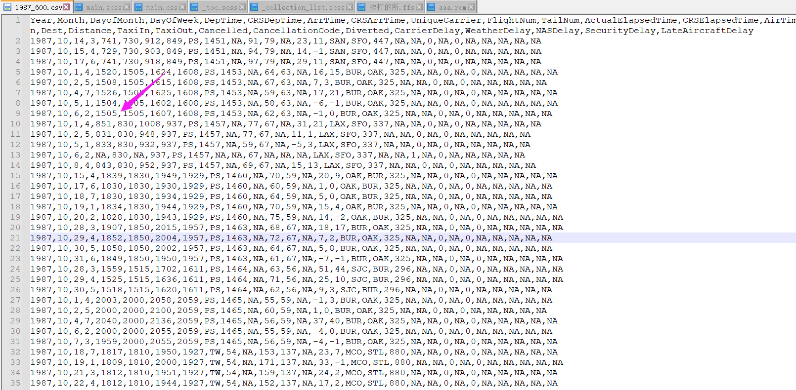
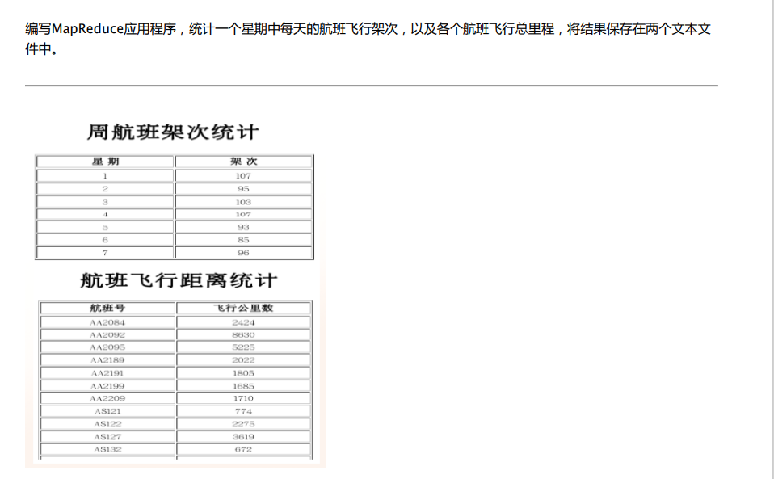
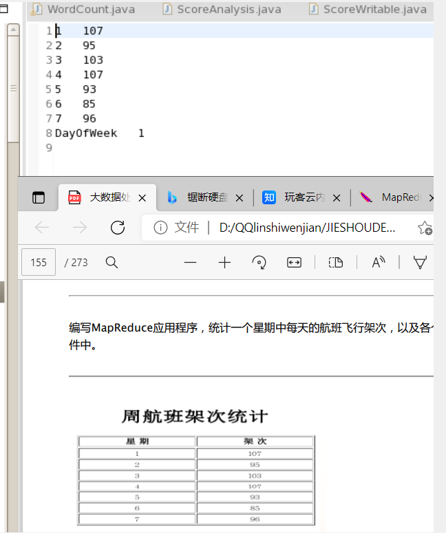
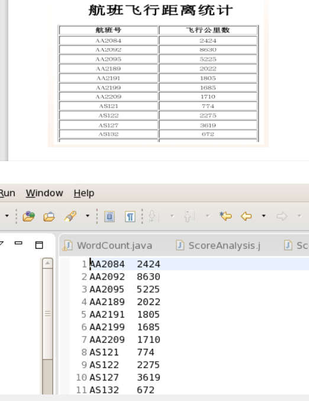

# Hadoop MapReduce 作业思路详解

## 解析

### 第一步：寻求已知源码

首先我们拥有一个Wordcount代码：（无用引入已经抹除）

```java
public class WordCount {
    public static class TokenizerMapper extends
            Mapper<Object, Text, Text, IntWritable> {
        private final static IntWritable one = new IntWritable(1);
        private Text word = new Text();

        public void map(Object key, Text value, Context context)
                throws IOException, InterruptedException {

            StringTokenizer itr = new StringTokenizer(value.toString());
            while (itr.hasMoreTokens()) {
                word.set(itr.nextToken());
                context.write(word, one);
            }
        }
    }

    public static class IntSumReducer extends
            Reducer<Text, IntWritable, Text, IntWritable> {
        private IntWritable result = new IntWritable();

        public void reduce(Text key, Iterable<IntWritable> values,
                Context context) throws IOException, InterruptedException {
            int sum = 0;
            for (IntWritable val : values) {
                sum += val.get();
            }
            result.set(sum);
            context.write(key, result);
        }
    }

    public static void main(String[] args) throws Exception {
        Configuration conf = new Configuration();
        String[] otherArgs = new GenericOptionsParser(conf, args)
                .getRemainingArgs();
        if (otherArgs.length != 2) {
            System.err.println("Usage: wordcount <in> <out>");
            System.exit(2);
        }
        Job job = new Job(conf, "word count");
        job.setJarByClass(WordCount.class);
        job.setMapperClass(TokenizerMapper.class);
        job.setCombinerClass(IntSumReducer.class);
        job.setReducerClass(IntSumReducer.class);
        job.setOutputKeyClass(Text.class);
        job.setOutputValueClass(IntWritable.class);
        FileInputFormat.addInputPath(job, new Path(otherArgs[0]));
        FileOutputFormat.setOutputPath(job, new Path(otherArgs[1]));
        System.exit(job.waitForCompletion(true) ? 0 : 1);
    }
}
```

我们可以看到这个源码的结构是这样的：

Map + Reduce + job(设置Mapper和Reducer)

于是我们的目标就是：分析Map和Reduce怎么魔改一下让他能用：

#### 分析Mapper

```java
    public static class TokenizerMapper extends
            Mapper<Object, Text, Text, IntWritable> {
        private final static IntWritable one = new IntWritable(1);
        private Text word = new Text();

        public void map(Object key, Text value, Context context)
                throws IOException, InterruptedException {

            StringTokenizer itr = new StringTokenizer(value.toString());
            while (itr.hasMoreTokens()) {
                word.set(itr.nextToken());
                context.write(word, one);
            }
        }
    }
```

首先我们看到：StringTokenizer（一个不认识的玩意）

网上搜索一下：

**Java StringTokenizer** 属于 java.util 包，用于分隔字符串。（菜鸟教程）

之后我们注意到一句代码：

**context.write(word, one);**

这显然是一句类似于写入的代码，写入到hadoop估计是给下一步处理的。

之后我们看看这个write传入了什么值：

一个是word,一个是one,我们把定义拿过来：

```java
 private final static IntWritable one = new IntWritable(1);

private Text word = new Text();
word.set(itr.nextToken());
```

于是我们观察到这个东西的传值是：一个Text（word）和一个IntWritable（Int开头应该是说明数据流是Int的？）

并且我们根据wordcount的能力进行思考：

假设输入：

word word

wordcount输出：word 2

根据one的定义是new IntWritable(1),可以猜测它在Map处的处理应该是进行了两次context，每一次设置的都是1，也就是两次处理是加在一起的（注意这里还不能完全确定，但是后面Reduce处就能确定了）

之后我们便确定逻辑：

它首先分开字符串->之后每一个分开的字符串都会当一个单词被检测->检测到单词就context.write计数一个1->处理完毕。

之后我们看看Reducer是怎么回事。

#### 分析Reducer

```java
    public void reduce(Text key, Iterable<IntWritable> values,
            Context context) throws IOException, InterruptedException {
        int sum = 0;
        // Find values in IntWritable
        for (IntWritable val : values) {
        	//Add the sum.
            sum += val.get();
        }
        //Set the result for sum
        result.set(sum);
        //Now we have the truly result.
        context.write(key, result);
    }
}

```

（注释自己瞎加的不要在意）

我们首先看这个循环：

```java
for (IntWritable val : values) {
        	//Add the sum.
            sum += val.get();
        }
```

也就是说不知道怎么来了一个IntWritable,然后获取里面的值加到sum里。

根据Map部分，这个IntWritable肯定是Map那里的那个context.write部分，也就是那个写死的new IntWritable(1)。

也就是说这就是统计单词数的。

同时我们能发现：这个values（循环的总部分）应该代表了相同单词对应的所有IntWritable集合。实现机制不知道，但是肯定是这样子，不然统计的sum不就不是这个单词的了吗？

再看剩余的代码就是设置结果和写入结果了。也就是说逻辑就是这样的：

Map（一次处理一行，处理完了之后把单词和一个数值1交上去）

Reducer（收集Map们，并且把相同单词的那个数值1加到一起，得到单词的总数）

于是我们便可以准备好对我们的数据进行处理了。

### 第二步：分析下一步的源码

首先我们传入的是CSV文件，我们用记事本打开看一下：



于是我们清楚了：

它是一行一行的；用逗号分开。

接下来我们便可以编写Map了：

#### 想办法“沾点亲戚”？

首先我们看题：



注意到：

星期对应的架次是数字->星期相当于单词->只要出现了这个星期肯定有架次->一个变相的WordCount->写出一个输入自己数据的Wordcount.

注意到2：

航班号是用两个数据组合起来的数据->使用字符串分割可以得到这两个数据然后拼起来->飞行公里数对应一个后面的数值->如果得到航班号，每出现一次航班号就要加一次飞行公里数->假设飞行公里数是1，那么相当于航班号对应的加1，也就是说当飞行公里数为1时，等同于统计航班号的wordcount->注意到之前写死的new IntWritable(1)->将1改成飞行公里数->一个修改了更多的Wordcount。

现在我们已经搞懂了这玩意就是个变种的Wordcount，接下来我们就想办法和Wordcount"沾点亲戚"，让他达到要求。

#### 开始魔改代码

首先我们可以看到上面的两个思路都不需要对reduce进行修改。也就是说都是Map的事情。

我们首先处理第一个：一个输入自己数据的Wordcount.

我们知道**Java StringTokenizer** 属于 java.util 包，用于分隔字符串。但是我们不会用啊！

这好办，反正我还知道有个分割方法我会：xxxx.toString().split("xxx")

于是我们改写代码：（请看代码的注释）

```java
    public static class TokenizerMapper extends
            Mapper<Object, Text, Text, IntWritable> {
        private final static IntWritable one = new IntWritable(1);
        private Text weektext = new Text();
        private Text hangbantag = new Text();
        public void map(Object key, Text value, Context context)
                throws IOException, InterruptedException {
            //使用这种方法分割字符串，我们就能很方便的得到星期。
        	String[] csvvalue = value.toString().split(",");
        	String week = csvvalue[3];
        	weektext.set(week);
            //因为我们的目标还是出现了星期就一定有架次，所以我们只需要把上面的word换成我们得到的星期就行了
            //去掉表头
            if(!week.equals("DayOfWeek"))
        	context.write(weektext,one);
        }
    }
```

于是这个代码就改好了，把输入文件丢进wcin之后试试看——



处理的数据已经一致了！说明思路无误！（最后那个是表头，想个办法去掉就行了，比如判断是不是和表头相同，如果是就不写入，这个好办）

接下来我们看另外一个：

复制一份刚刚的Map改个名字，然后魔改一番：（同样是看代码注释）

```java
public static class DistanceMapper extends
    Mapper<Object, Text, Text, IntWritable> {
    	//FIX IT FOR MORE
    	//private final static IntWritable one = new IntWritable(1);
    	private Text hangbantag = new Text();
    	public void map(Object key, Text value, Context context)
        throws IOException, InterruptedException {
    		String[] csvvalue = value.toString().split(",");
    		String hangbandaihao = csvvalue[8];
    		String hangbanhao = csvvalue[9];
    		//组合在一起获取到了我们的航班号   
    		hangbantag.set(hangbandaihao + hangbanhao);
    		//得到飞行距离（字符串）
    		String distance = csvvalue[18];
            //使用TRY CATCH去掉表头（因为字符串转成数字会崩）
    		try
    		{
    			int distancenum = Integer.parseInt(distance);
                //将new IntWritable里的赋值直接填写成飞行距离，这样就完成了我们的思路
    			context.write(hangbantag,new IntWritable(distancenum));
    		}
    		catch(Exception e)
    		{
                //无关紧要……
    			System.out.println("Biao Tou");
    		}
}	
```

之后我们发现一个问题：两个Mapper，下面就一个Job……

所以我们要加一个Job。这个代码基本就是复刻一下，改一下输出路径（输出路径冲突不是报错嘛），然后改一下输入的Mapper:

```java
		//这边是原来wordcount的代码
        Job job = new Job(conf, "word count");
        job.setJarByClass(WordCount.class);
        //Set Mapper
        job.setMapperClass(TokenizerMapper.class);
        //Set combiner
        job.setCombinerClass(IntSumReducer.class);
        //Set Reducer
        job.setReducerClass(IntSumReducer.class);
        //Mapper output
        job.setOutputKeyClass(Text.class);
        //Reducer output
        job.setOutputValueClass(IntWritable.class);
        //Add files in this job（这里是添加输入和输出的位置）
        FileInputFormat.addInputPath(job, new Path(otherArgs[0]));
        FileOutputFormat.setOutputPath(job, new Path(otherArgs[1]));
        //这里是复制了上面之后开始修改的
        Job job2 = new Job(conf,"distance");//这里改了一下任务名
        job2.setJarByClass(WordCount.class);
		//这里换了Mapper
        job2.setMapperClass(DistanceMapper.class);
        //Set combiner
        job2.setCombinerClass(IntSumReducer.class);
        //Set Reducer
        job2.setReducerClass(IntSumReducer.class);
        //Mapper output
        job2.setOutputKeyClass(Text.class);
        //Reducer output
        job2.setOutputValueClass(IntWritable.class);
        //这里修改了一下输出路径（那个"1"
        FileInputFormat.addInputPath(job2, new Path(otherArgs[0]));
        FileOutputFormat.setOutputPath(job2, new Path(otherArgs[1] + "1"));
		//分析了一下，这是一个三目运算符
		//原本是job.waitForCompletion(true)之后判断
		//System.exit(job.waitForCompletion(true) ? 0 : 1);
		//根据英语猜测应该是任务是否完成
        System.exit((job.waitForCompletion(true)&&job2.waitForCompletion(true)) ? 0 : 1);
```

运行结果：



## 其他的要求呢？

输出到文件已经有了代码，接下来就是想办法缝合到一起。

### 一些坑

你肯定认为“啊缝合一个老师给了的代码太简单了”，很不幸，代码是有问题的。

```java
Configuration cfg = new Configuration();
FileSystem hdfs = FileSystem.get(cfg);
Path src = new Path(outputPath + "/part-00000");
Path dst = new Path("/root/flight.dat");
hdfs.copyToLocalFile(src, dst);
```

问题出在两行上：

1. FileSystem的获取问题：使用 FileSystem fs= ileSystem.get(conf); 获取fs会出现如下错误Error: java.lang.IllegalArgumentException: Wrong FS: hdfs:// ...（原因我查询到的博客没有讲，烦请大佬指出）大多数网上说的做法是把集群上的core-site.xml和hdfs-site.xml放到当前工程下，但这不是正规处理。正确做法是使用srcPath生成FileSystem。
2. 第三行对应的文件名有错，输出的文件名为part-r-00000.

经过修改后的代码如下：

```java
Configuration cfg = new Configuration(); 
//将src提前到FileSystem获取处，从而让下文可以得到src。
//修改文件名
Path src = new Path(outputPath + "/part-r-00000");
//使用srcPath生成FileSystem
FileSystem hdfs = src.getFileSystem(cfg);
Path dst = new Path("/root/flight.dat");
hdfs.copyToLocalFile(src, dst);
```

之后我们准备输出：

由于我们有两个要输出的表格，所以我们要复刻两份。之后我们修改最后System.exit()判断函数，最后的最后是这样的：

```java
        if(job.waitForCompletion(true)&&job2.waitForCompletion(true))
        {
        	String outputPath = otherArgs[1];
        	Configuration cfg = new Configuration();
        	Path src = new Path(outputPath + "/part-r-00000");
        	FileSystem hdfs = src.getFileSystem(cfg);
        	Path dst = new Path("/root/flight.dat");
        	hdfs.copyToLocalFile(src, dst);
        	//Distance output
        	src = new Path(outputPath + "1" + "/part-r-00000");
        	dst = new Path("/root/flight2.dat");
        	hdfs = src.getFileSystem(cfg);
        	hdfs.copyToLocalFile(src, dst);
        }
```

总体代码如下：

```java
package org.apache.hadoop.examples;

import java.io.IOException;
import java.util.StringTokenizer;
import java.util.Random;

import org.apache.hadoop.conf.Configuration;
import org.apache.hadoop.fs.Path;
import org.apache.hadoop.io.IntWritable;
import org.apache.hadoop.io.NullWritable;
import org.apache.hadoop.io.Text;
import org.apache.hadoop.mapreduce.Job;
import org.apache.hadoop.mapreduce.Mapper;
import org.apache.hadoop.mapreduce.Reducer;
import org.apache.hadoop.mapreduce.lib.input.FileInputFormat;
import org.apache.hadoop.mapreduce.lib.output.FileOutputFormat;
import org.apache.hadoop.util.GenericOptionsParser;
import org.apache.hadoop.fs.Path;
import org.apache.hadoop.conf.Configuration;import org.apache.hadoop.fs.FileSystem;

public class WordCount {
	//for mapper
    public static class TokenizerMapper extends
            Mapper<Object, Text, Text, IntWritable> {
        private final static IntWritable one = new IntWritable(1);
        private Text weektext = new Text();
        private Text hangbantag = new Text();
        public void map(Object key, Text value, Context context)
                throws IOException, InterruptedException {
        	String[] csvvalue = value.toString().split(",");
        	// map the week and the hangbandaihao(fuck for no chinese commit)
        	String week = csvvalue[3];
        	String hangbandaihao = csvvalue[8];
        	weektext.set(week);
        	//hangbantag.set(hangbandaihao);
        	//System.out.println(week + " " + hangbandaihao);
            if(!week.equals("DayOfWeek"))
        		context.write(weektext,one);
        }
    }
    //For distance:
    public static class DistanceMapper extends
    Mapper<Object, Text, Text, IntWritable> {
    	//FIX IT FOR MORE
    	//private final static IntWritable one = new IntWritable(1);
    	private Text hangbantag = new Text();
    	public void map(Object key, Text value, Context context)
        throws IOException, InterruptedException {
    		String[] csvvalue = value.toString().split(",");
    		// Get the hangbandaihao + hangbanhao
    		String hangbandaihao = csvvalue[8];
    		String hangbanhao = csvvalue[9];
    		//Combine it then we can get the key.
    		hangbantag.set(hangbandaihao + hangbanhao);
    		//Get the distance.
    		String distance = csvvalue[18];
    		//18
    		try
    		{
    			int distancenum = Integer.parseInt(distance);
    			context.write(hangbantag,new IntWritable(distancenum));
    		}
    		catch(Exception e)
    		{

    		}
}	
}
    
   //For reduce
    public static class IntSumReducer extends
            Reducer<Text, IntWritable, Text, IntWritable> {
        private IntWritable result = new IntWritable();

        public void reduce(Text key, Iterable<IntWritable> values,
                Context context) throws IOException, InterruptedException {
            int sum = 0;
            // Find values in IntWritable
            for (IntWritable val : values) {
            	//Add the sum.
                sum += val.get();
            }
            //Set the result for sum
            result.set(sum);
            //Now we have the truly result.
            context.write(key, result);
        }
    }
    
    public static void main(String[] args) throws Exception {
        Configuration conf = new Configuration();
        String[] otherArgs = new GenericOptionsParser(conf, args)
                .getRemainingArgs();
        if (otherArgs.length != 2) {
            System.err.println("Usage: wordcount <in> <out>");
           System.exit(2);
        }
        //A new Job
        Job job = new Job(conf, "word count");
        job.setJarByClass(WordCount.class);
        //Set Mapper
        job.setMapperClass(TokenizerMapper.class);
        //Set combiner
        job.setCombinerClass(IntSumReducer.class);
        //Set Reducer
        job.setReducerClass(IntSumReducer.class);
        //Mapper output
        job.setOutputKeyClass(Text.class);
        //Reducer output
        job.setOutputValueClass(IntWritable.class);
        //Add files in this job
        FileInputFormat.addInputPath(job, new Path(otherArgs[0]));
        FileOutputFormat.setOutputPath(job, new Path(otherArgs[1]));
        //Another new job.
        Job job2 = new Job(conf,"distance");
        job2.setJarByClass(WordCount.class);
        job2.setMapperClass(DistanceMapper.class);
        //Set combiner
        job2.setCombinerClass(IntSumReducer.class);
        //Set Reducer
        job2.setReducerClass(IntSumReducer.class);
        //Mapper output
        job2.setOutputKeyClass(Text.class);
        //Reducer output
        job2.setOutputValueClass(IntWritable.class);
        //Reducer new output
        FileInputFormat.addInputPath(job2, new Path(otherArgs[0]));
        FileOutputFormat.setOutputPath(job2, new Path(otherArgs[1] + "1"));
        //Try to download the file on our disk
        if(job.waitForCompletion(true)&&job2.waitForCompletion(true))
        {
        	String outputPath = otherArgs[1];
        	//Download the file
        	Configuration cfg = new Configuration();
        	//He give us the wrong code which has IllegalArgumentException.
        	//And here he give us a wrong file name. 
        	Path src = new Path(outputPath + "/part-r-00000");
        	FileSystem hdfs = src.getFileSystem(cfg);
        	Path dst = new Path("/root/flight.dat");
        	hdfs.copyToLocalFile(src, dst);
        	//Distance output
        	src = new Path(outputPath + "1" + "/part-r-00000");
        	dst = new Path("/root/flight2.dat");
        	hdfs = src.getFileSystem(cfg);
        	hdfs.copyToLocalFile(src, dst);
        }
    }
}
```

（以上代码已去除表头）
