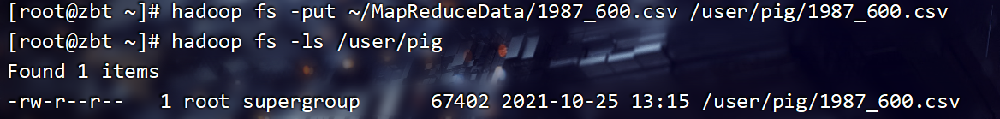
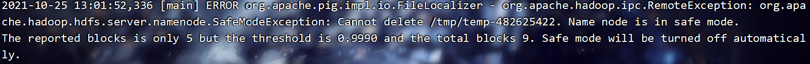
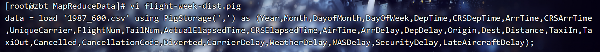
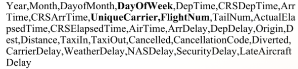
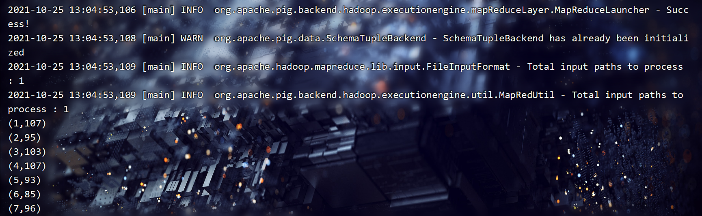
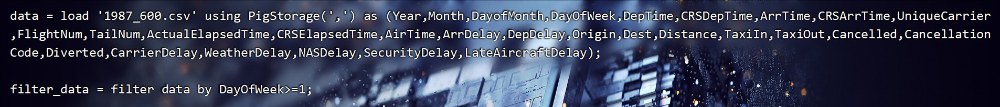

## **项目（2）--基于Pig Latin实验**
注：该实验主笔为：@Sofm，感谢他对博客的支持。

#### 1、任务目标


#### 2、目标实现

##### （1）将航班数据上传至HDFS

使用start-all.sh启动hadoop

可以先创建一个pig目录

```bash
hadoop fs -mkdir /user/pig
```


使用hadoop的put命令将源文件上传到HDFS，也就是我们刚刚创建的文件夹

```bash
hadoop fs -put ~/MapReduceData/1987_600.csv /user/pig/1987_600.csv
```



如果遇到这样的报错，说明hadoop的NameNode安全模式在开启状态，只需要输入以下代码即可关闭安全模式



```bash
hadoop dfsadmin -safemode leave
```


这样，第一个小目标就顺利完成啦！


##### （2）编写Pig程序flight-week-dist.pig

创建一个flight-week-dist.pig文件

```bash
vi flight-week-dist.pig 
```


###### 统计周航班次数

任务目标


脚本编写：

```bash
 data = load 'hdfs://zbt:9000/user/pig/1987_600.csv' using PigStorage(',') as (Year,Month,DayofMonth,DayOfWeek,DepTime,CRSDepTime,ArrTime,CRSArrTime,UniqueCarrier,FlightNum,TailNum,ActualElapsedTime,CRSElapsedTime,AirTime,ArrDelay,DepDelay,Origin,Dest,Distance,TaxiIn,TaxiOut,Cancelled,CancellationCode,Diverted,CarrierDelay,WeatherDelay,NASDelay,SecurityDelay,LateAircraftDelay);
```



解释：

此load语句是加载"hdfs://zbt:9000/user/pig/1987_600.csv"路径下的文件，你需要根据你自己上传的路径来修改，主机名也不要忘记改哟！

从句using PigStorage(',')是根据逗号来将数据进行分隔

从句as....是为此数据设置表头

```bash
filter_data = filter data by DayOfWeek>=1;
```


解释：

此filter语句的目的是为了去除这样的表头，以免影响最终结果



```bash
group_week1 = group filter_data by DayOfWeek;
foreach_group_week1 = foreach group_week1 generate group, COUNT($1);
dump foreach_group_week1
```


解释：

此group语句是通过周数将data数据进行分组

不必多说，foreach语句是将分好组的数据进行遍历，后面的COUNT($1)是统计每周有多少条数据，统计出来的结果真是我们想要的答案

dump语句是将结果展示出来


解释：

store..into...语句是将结果输出至文本文件中，文件名可以依照自己的喜好修改

输出结果如下：



至此，统计周航班次数的目标就已达成！

###### 统计各航班飞行总里程

任务目标


任务分析：

相信在看这篇文章的同学们，之前一定看过MapReduce的文章。上篇文章已经提到航班号是由UniqueCarrier和FlightNum两列数据组成。而飞行公里数，我们可以从Distance这一列得到。


现在摆在我们面前的问题有两个

​	1、我们如何将UniqueCarrier和FlightNum两列数据组成为一列。

​	2、如何将好多好多的飞行公里数加在一起然后呈现出来。

脚本编写：



刚刚我们已经了解了这两行代码的用法，我就不多赘述了。

下面这行代码正是解决问题一的关键

```bash
week_concat = foreach filter_data generate CONCAT (UniqueCarrier, FlightNum) as hangBanHao, Distance;
```


解释：

我们使用了CONCAT()函数，这个函数的作用可以将两列或者多列数据组合在一起

如果你想具体的了解这个函数，你可以去W3Cschool进行更详细的学习，网址如下：

[Apache Pig CONCAT()函数_w3cschool](https://www.w3cschool.cn/apache_pig/apache_pig_concat.html)

从句as的作用是给已经合并为一列的数据列起一个新的名字，以便我们后续对他其他进行操作

```bash
group_week2 = group week_concat by hangBanHao;
foreach_group_week2 = foreach group_week2 generate group, SUM(week_concat.Distance);
dump foreach_group_week2
```


解释：

后面我们用group语句通过hangBanHao对他进行分组

SUM()可以解决问题二，他和foreach语句搭配在一起，可以将每组中的公里数加在一起，以实现我们的目标

老规矩，学习网址如下：

[Apache Pig SUM()函数_w3cschool](https://www.w3cschool.cn/apache_pig/apache_pig_sum.html)

dump语句用于展示数据

```bash
store foreach_group_week2 into 'flight2.dat';
```


解释：

store..into...语句是将结果输出至文本文件中，文件名可以依照自己的喜好修改

输出结果如下：


后面其实还有很多数据，因为太长就不便全部展示了

至此，大功告成！


###### 总代码一览

```bash
data = load '1987_600.csv' using PigStorage(',') as (Year,Month,DayofMonth,DayOfWeek,DepTime,CRSDepTime,ArrTime,CRSArrTime,UniqueCarrier,FlightNum,TailNum,ActualElapsedTime,CRSElapsedTime,AirTime,ArrDelay,DepDelay,Origin,Dest,Distance,TaxiIn,TaxiOut,Cancelled,CancellationCode,Diverted,CarrierDelay,WeatherDelay,NASDelay,SecurityDelay,LateAircraftDelay);

filter_data = filter data by DayOfWeek>=1;

group_week1 = group filter_data by DayOfWeek;
foreach_group_week1 = foreach group_week1 generate group, COUNT($1);
dump foreach_group_week1

week_concat = foreach filter_data generate CONCAT (UniqueCarrier, FlightNum) as hangBanHao, Distance;
group_week2 = group week_concat by hangBanHao;
foreach_group_week2 = foreach group_week2 generate group, SUM(week_concat.Distance);
dump foreach_group_week2

store foreach_group_week1 into 'flight1.dat';
store foreach_group_week2 into 'flight2.dat';
```


###### 运行脚本

在该脚本所在文件夹中输入：

```bash
pig -x local flight-week-dist.pig
```

运行成功后，刷新一下文件夹，相信你就可以看到你的新文件啦！

如果你找不到你的新文件，你大可以看看运行的日志信息，根据日志来寻找你的新文件。

第一次写这玩意，如果写的不好，请各位看官多多包涵！0.0

