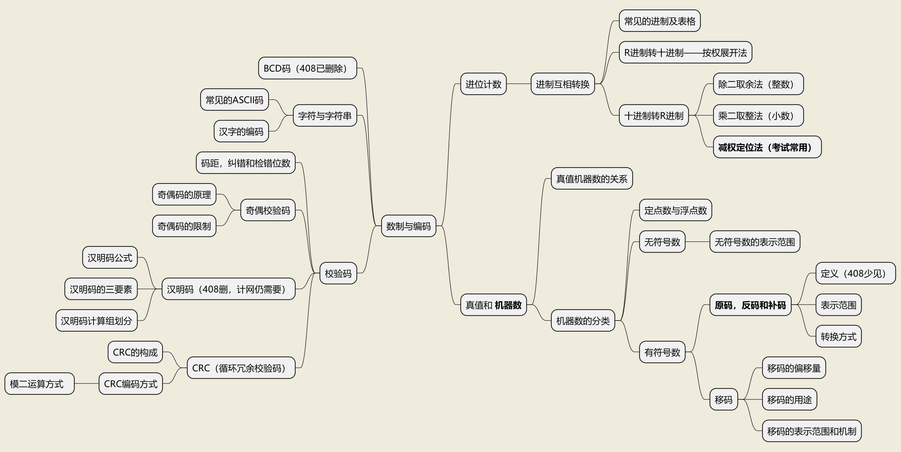
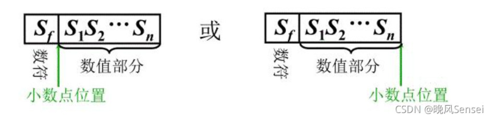
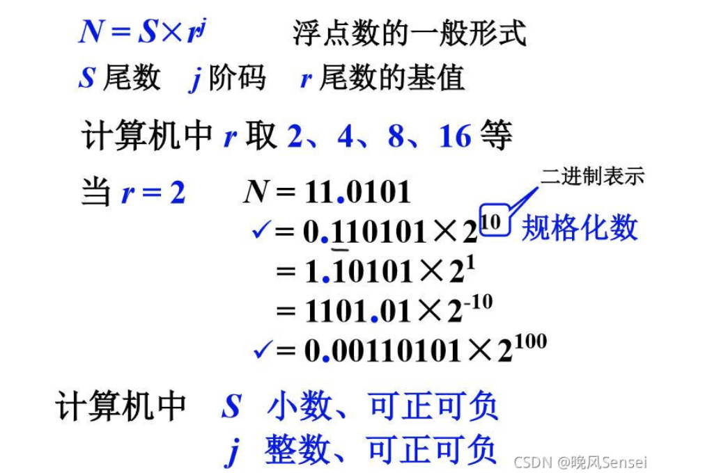
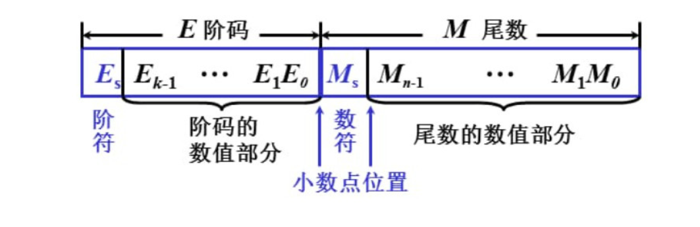

# 计算机组成原理-02：数据的表示和运算

## 前言

该博客用于记录计算机组成原理的学习（主要是最后发现写笔记还是一团混乱之后试图寻找更好的学习方式）

由于计算机组成原理对本人的难度过高，如有错漏，烦请不吝指正（反正也没人看）

MD内所有程序绘图，均由“PlantUML" 进行绘制。

## 章节综述

该章节共有4个知识点（重点使用粗体标记）：

- 数制与编码
	- **原码，反码和补码**
- 定点数的表示和运算
- 浮点数的表示和运算
- 算术逻辑单元ALU

该章节特点：

1. 知识散乱
2. ~~表示时而使用计算机语言时而使用人类语言，引发混乱~~

## 数制与编码

数制与编码共需掌握：进制转换，真值和机器数，BCD码（408已删除），字符与字符串，校验码

### 知识结构图：

### 进制转换

#### 常见的进制和表示

计算机内常见的进制为二进制，八进制，十进制和十六进制。

二进制用“B”表示；八进制用“Q”或“O”表示；十进制用“D”表示；十六进制用“H”表示；

如10110B 80H;

**注意：在十六进制中ABCDEF对应10,11,12,13,14,15**

#### R进制转十进制——按权展开法

对于R进制转成十进制时（例如10110B），我们知道它每一位对应的是R的0,1,2,3...次方（因为是进位上去的，类比10进制）

这个R的几次方称之为权，故将其转换为十进制，就是让他对应的次方乘以它所在位置的数，最后相加即可。

如：1100B = **2^3 + 2^2 + 0 + 0** = **8 + 4** = 12.

##### 二，八，十六进制的相互转换（待补原理）

二进制转十六进制：左右补0到够位数，然后四个一组直接转换成16进制的数；

二进制转八进制：左右补0到够位数，然后三个一组直接转换成八进制的数；

#### 十进制转R进制

十进制转二进制，根据整数和小数的不同分为除二取余法和乘二取整法（本质上一样），考试时，常用减权定位法（速算）

##### 除二取余法

以十进制为例：1256/10 = 125余6，也就是说，让一个数对另一个数取余，剩下的数就会是末位（当然了，如果没有数，显然是能整除）

所以若需要将一个数转换为二进制数，只需要让它除以2，然后就能得到末位；然后再对剩下的那个结果继续处理，就能得到所有的位了。

例：

56 转换为 二进制：

56/2=28余0，故最后一位是0；

28/2=14余0，故倒数第二位也是0；

14/2=7余0；故倒数第三位也是0；

7/2=3余1，故倒数第四位是1；

3/2=1余1，故倒数第五位是1；

1/2=0余1，故第一位为1：

故最后结果为111000。

##### 乘二取整法

对于小数如0.123，乘以10得到的整数位就是最高位，然后一直到没有为止。

那么和除二取余法相同的原理，乘以2得到的整数位也会是最高位，之后剩下的结果继续乘就好：

如：0.45 * 2=0.9 - 整数位 0:

0.9*2 = 1.8 整数位1：剩下0.8：

0.8*2 = 1.6 整数位1 ： 剩下0.6：

0.6*2 = 1.2 整数位1 ： 剩下0.2

0.2 * 2 = 0.4 整数位0 ： 剩下0.4

0.4*2 = 0.8 整数位0 剩下0.8……

到这里就回来了（说明乘不完，必然会有精度损失，当有精度损失时，按照题目要求控制）

**为什么会有精度损失呢？**

这里引用https://blog.csdn.net/weixin_39582737/article/details/113020127的一些通俗的解释：

我们区分小数和整数，是依靠一个“单位1”来实现的。这个单位1默认是每一个进制都能表示，从2进制到99999进制，不难发现它们总能表达1这个数。

而小数不同，小数分割了这个“单位1”，以苹果的数量举例，假如你有3个苹果，我可以说你有3个苹果。但是假如你只有半个苹果，我就可以说你有1/2个苹果。

在十进制中，单位苹果被切成10等份(因为10个这个分量的苹果放在一起时，就会进位成为1个整苹果)。在二进制中，单位苹果被切成2等份(只要2个这个分量的苹果放一起就会进位成1个整苹果)

那么对于它的进制转换，就是将部分的1转换为自己进制的表达方式。

如我有0.45个十进制下的苹果：

对于二进制来讲，它首先要用“半个苹果的半个苹果“：0.25个苹果（因为对于二进制来说只有一半或者一半的一半……）

现在还差0.2个苹果，于是再加上0.125个苹果……

这下子无穷无尽了，因为并不是所有的分配方式都能用另外一个方式表达的

（在十进制里，典型的类似案例，就是把10分成3份）

##### 减权定位法

这个高大上的名字是新东方考研的老师起的，实际上就是借助二进制不是0就是1的特性，如果你看到对应的位是1，直接用对应的数去加就好了。

(想当初我也是背过从0到16GU盘具体MB大小的人.jpg)

由于最后一位其实是2的0次方，要注意不要对错了。

如1110就等于0+2+4+8 = 14

***插播：1000 = 8，即2的三次方，故对于对应次方，1后面有几位，就是几次方***

***10000 = 2^4 = 16***

### 真值和机器数（重点部分）

#### 真值和机器数的关系

真值：就是现实中的数字，只不过用二进制表示。像什么+1011B，-100B啥的

机器数：~~机器试图理解人类时使用的自己的语言~~ 带有符号位或者各种其他表示形式的，适用于机器的表示方式。比如原码补码反码什么的，（按需求）会有一个符号位，若有，则0代表正，1代表负。

#### 机器数的分类

##### 定点数和浮点数

机器数按照*表示方式*分为定点数和浮点数。

所谓定点/浮点，就是指小数点“动不动”。大家注意，在计算机中没有专门的硬件用于表示小数点，**计算机中的小数点都是以约定的方式给出的**。（摘抄于知乎）

1. 定点数：

定点数小数点位置是固定的，所以表示数据的时候，只能表示纯小数和纯整数。小数点位置在前面就是小数，小数点位置在最后面就是整数。前面的数符是符号位。

这种表示方式，注定发生：一定长度的定点数据所能表示的数据范围和精度很有限，并且程序员不得不在运算的各个 阶段预先引入比例因子，把数据统一放大或缩小，来保证都是同一种数（不然咋处理啊）

2. 浮点数：

浮点数的表示方式其实比较类似科学计数法。科学计数法依赖 一个小数 * 10的几次方，浮点数也是这个玩法，只不过换成了2的几次方（或者4的，8的）。

~~他~~我们管原本科学计数法里那个前面的小数叫尾数，管那个几次方叫阶码，那个几次方的底数叫尾数的基值。

由于这个尾数和阶码都是一段，所以得用两个类似定点数的结构（符号位 + 数值部分）。

~~要吐槽一下浮点数这边它们最爱干的是阶码有的时候写二进制有的时候写十进制……属于是人类在理解机器的时候部分变成机器了（赛博朋克？）~~

##### 有符号数和无符号数

机器码按照有无符号位分为有符号数和无符号数。

###### 无符号数

无符号数就是没有符号位的表示方式。此时寄存器的位数反应了无符号数的表示范围。显而易见的，无符号数没法表示负数。

如，内存地址MAR为8位时，其可以表示00000000到11111111，也就是0~255。

显然，**无符号数的表示范围** 为0~2^n - 1（因为从0开始）

###### 有符号数

有符号数需要存储一位符号位。同时还需要对符号进行操作。由于再向下展开标题显得过于繁琐，请移步到另外一篇博客。

链接：https://firehomework.github.io/jisuanjizuchengyuanli/02.%E6%95%B0%E6%8D%AE%E7%9A%84%E8%A1%A8%E7%A4%BA%E5%92%8C%E8%BF%90%E7%AE%97/

### 字符与字符串

