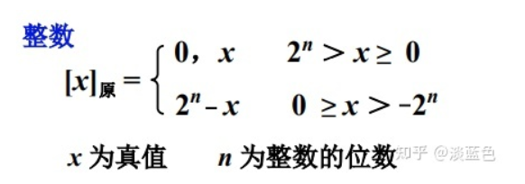
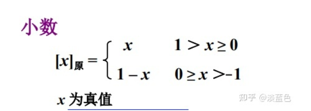
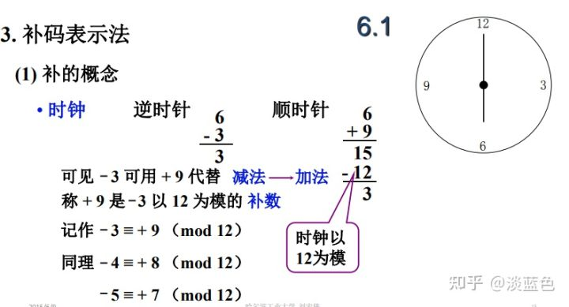
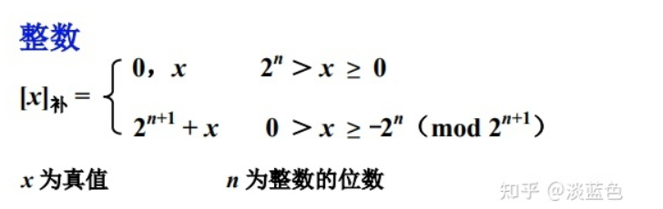
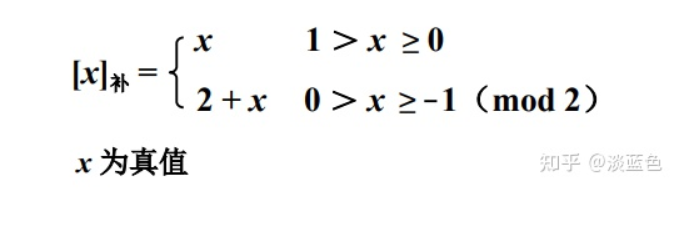
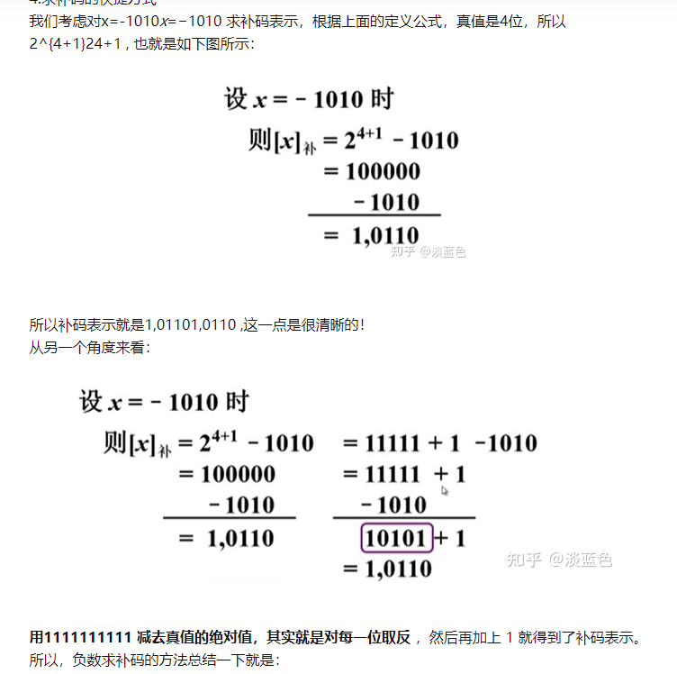
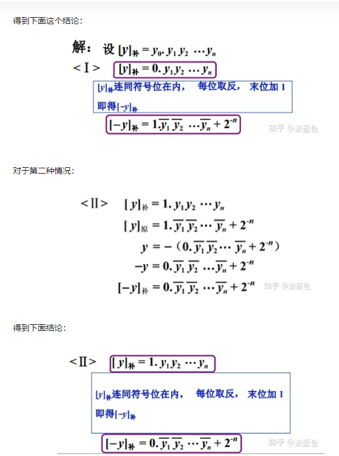
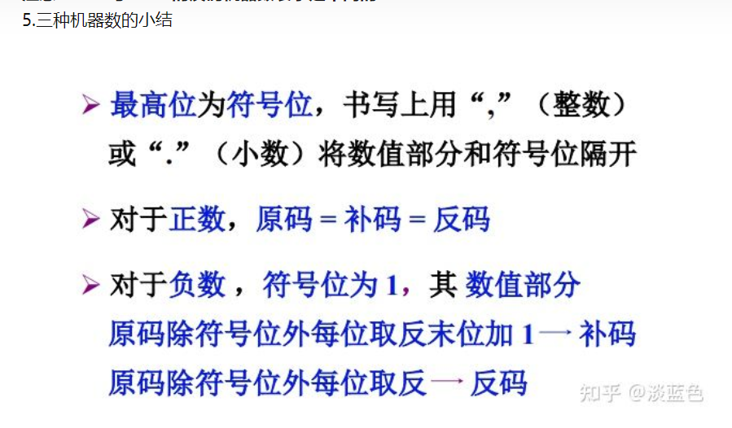

# 计算机组成原理-有符号数

建议配合02-数据的表示和运算 一起食用。

## 原码，反码和补码

### 学习前置

前提：计组规定符号位使用0作为正数，1作为负数。

我们规定，编码的最高位是符号位（移码不算）

另外关于2^n的对照：（B代表二进制）

2^n ->100000...(n个0)B，**仔细看，n位的时候，这个数比n位多一位，也就是说它是能顶到符号位的**（用于加个符号什么的）

2^-n->0点[**n-1个0**]1 B [如0.5是2^-1,在二进制里就是0.1，是0个0和一个1]（用于得到最小的小数/最大的小数什么的）

1->0000001B(用于代表最小的整数，也用于代表最大的小数)

它们在定义里会经常出来让你懵逼发生了什么……

### 原码

#### 表示方式

当有一位符号位时，正常的十进制表示：

+20，-20（将那个+和-当成它们的符号位）

**提取共同点：符号位 + 表示的数值（对于负数，就是它的绝对值）**

**原码的表示和此一致，不过符号位换成了0和1，绝对值拿二进制写。**

所以诸如这些真值，转换成原码就是这样：

+01010->001010

-01010->101010

表示的时候，符号位和数值位分开，整数用逗号分割，小数用英文句号分割。

**什么？你问又有整数又有小数怎么办？**

一定是没有好好看前面的部分：

定点数小数点位置是固定的，所以表示数据的时候，只能表示纯小数和纯整数。小数点位置在前面就是小数，小数点位置在最后面就是整数。前面的数符是符号位。所以那种情况是不存在滴。

原码表示是要存储在计算机中的，所以**想要求得某个真值的原码表示，必须已知机器数的数值部分的长度才行。**

#### 定义（408不咋考）

（此处图片引用了：https://zhuanlan.zhihu.com/p/359064358，在此致以感谢）

##### 整数

实不相瞒这定义就很……不是个玩意……，这个定义可以说是连符号位一起算出来，结果得到的时候把符号位也给当结果得出来，所以看上去就怪怪的。

定义解释：

以0为分界线，正数的时候上面的是（0,x）：

**这个逗号真的就是逗号**，那意思就是说整数直接把0这个符号位和逗号加在x前面。

如果是负数，**负数的负数就是正数（就是那个-x**），然后让2^n加上去充当符号位（比最大表示还大1，这不就和符号位一般长了）

根据这个定义，那么0就有两个表示了：

+0:0,000

-0:1,000

##### 小数

小数的时候：

这个原理和刚才的整数一模一样，唯一不同的是，对于小数来说最大的表示是1也就是2的0次方。同样的，对于小数也有两种0的表示

0.0000和1.0000。

#### 表示范围

显然整数部分能表示的是 [-2^n+1,2^n - 1]，(其中还有两个0……)

小数部分就是[-1+2^-n,1-2^-n]，(其中也有两个0)

#### 转换方式

考试的时候，将真值转为机器码，只需要将符号位改好就行，正的就是0负的就是1，没什么多余的。

### 补码

原码在计算中容易出现一些问题：

1. 符号位在计算的时候，是不参与到运算中的，导致符号位计算之后可能变化，可能不变。（计算器只会加法）
2. 0有两个表示方式，无疑会带来小麻烦

于是为了方便计算机计算，引入了补码的概念。

#### 什么是补码

其实补码的思路很简单，如这个表盘：如果我要完成6点到3点，我既可以往回减（-3个小时），我也可以先转一圈再往回减（12-3=9）

补码本质是靠忽略了某个进位来达到自己的目的。

模数的定义我没找到，根据知乎来说，一个正数和一个负数互为补数时它们绝对值之和即为模数

显然，**你转几圈都不影响两个数之间互为补数**，故有：

+ 一个负数加上“模”即得该负数的补数
+ 一个正数和一个负数互为补数时它们绝对值之和即为模数
+ 你多转几圈也不影响两个数之间互为补数（**这个很重要！下面用到了**）

**换到二进制里来，我们不难想到，假设如果有n位用来表示数据，想表示一个负数的补码，就让它的模加上负数。**

那么这个时候后面肯定都是0前面是一个1，（因为最后要忽略掉这个进位1，进位了剩下的肯定都是0）

有n个0就是2^n。那么我们的模找到了是2^n

于是对于：-0100，我们让10000减去0100得到：1100。

这个数值得到之后我们发现：现在计算机没法知道这个数到底是啥数——1100既可以原本就是1100，也可以是负数变来的呀。

没办法只好引入一个符号位：

对正的：01100

对负的：11100

所以最后推知：正数的补码就是在前面加个符号位（表示形式上，是原码本身）。

于是乎来了符号位上面的就蛋疼了，因为那个拉胯的定义算出来是连着符号位一起算出来的。也就是说符号位也得算在n里。

可是我们上面的模可没有考虑到这一点，我们默认是忽略进位的！

既然转一圈不够，那就再转一圈——也就是说走两圈模——二进制刚好你多转一圈就把符号位甩出来了（多了一位嘛）

于是我们的模变成2*2^n = 2^(n+1)。

*实不相瞒此处让我懵逼了很久，明明总数据位只有n位，怎么出来了个n+1?*

*这么解释的话，其实这个n+1位是多转了一圈（走了两份模）表示出来的，在二进制多走一圈刚好能多一位的情况下，它刚好就成了这个样子，个人觉得更好理解了。*

~~害，反正408其实不管这个……~~

同样的根据上面的东西可以得出定义：

#### 定义

~~实不相瞒，这定义感觉就是在想办法硬凑……~~

##### 整数

这个定义和当初的定义一样蹩脚，同样的正数和原码一样就是在前面加个0和逗号。

对于负数，根据上面的解释，转两圈然后再加负数。

##### 小数

小数的定义也不过就是把原本的1（对于小数来说溢出不就是1么）乘了个2（也是转两圈）。

#### 转换方式

##### 快速求补码

其实408前面的东西都没啥用，老师说了基本不考定义，我也只是希望能理解而已（耽误时间的很……）

重要的还是补码求法：

+ 正数补码是它本身
+ 负数补码是除了符号位，按位取反，末位加1.

而且很棒的是，补码转原码也是按位取反然后末位加1就好了。

我都懒得理解这玩意是咋实现的了，贴一下知乎大佬的说法好了，反正会用得了，没人会问这种东西的

##### 变补

补码是对除了符号位的按位取反末位加1.变补就是对所有位都按位取反末位加1。

变补是一种运算，不是一种码制。它的出现就是为了解决下面的重要结论用的（也就是补码的减法），针对减法会出现[-x]补的问题。

##### 重要结论

常见的一种问题是已知[x]补，求[-x]补。这个问题常常使用在补码的加减法里。

当然可以变成原码，然后再加负号，再倒腾回来。

**[x]补和[-x]补的关系是：连符号位，按位取反，末位加1.**

即：**关系是变补的关系。**

解释我也懒得写了，同样贴知乎大佬的：~~（反正实话实说这东西记住得了……）~~

#### 表示范围

根据上面的显示，整数[-2^n,2^n)

小数[-1,1) 

（因为曾经表示-0的现在用来表示-2^n或者-1了)

当然了，这里面就没有+0和-0的区分了。

### 移码
#### 移码的解释

移码是用来判断大小的。因为补码不容易判断大小（比较的时候，计算机不会处理正负位的比较）。

移码因为是判断浮点数的阶码（就是 2的几次方那个）用的，所以移码没有小数。

对于移码来说，比较出错的原因是符号位0正1负，而其实0比1大~~（所以你们当年定义的时候就不能直接定义成1正0负吗？！）~~

移码直接加上2^n(记得2^n其实是符号位+1)，于是一进位，就转成了0负1正了。

就这。我们 管那个2^n为偏移量。有的时候不是这个偏移量，但是原理搞懂就没问题~~（把符号位变成它应该的样子）~~

当然了书上的解释说是这一番操作把所有的负数都变成了正数，这个说法确实没错。

### 三种机器数小结

