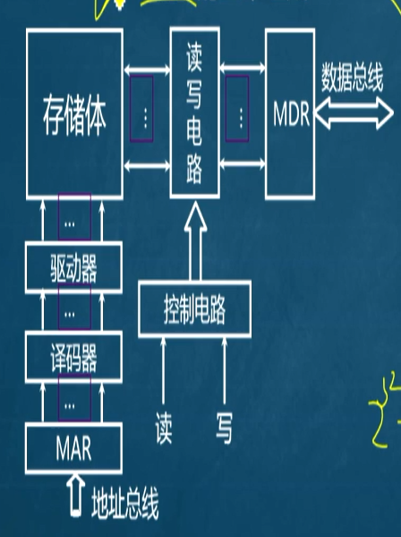
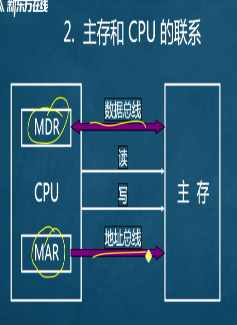

# 存储器的结构
## 前言
特点：知识繁杂，概念为主

分为：
* 存储器的分类
* 存储器的层次化结构
* 半导体随机存取存储器
* **主存储器与CPU的连接**
* 双口RAM和**多模块存储器**（多体交叉，流水线）
* **高速缓冲存储器(Cache)**
* 虚拟存储器（和操作系统有关，简单提及）
    * 段式/段页式基本不考
    * 408注意：其会与OS联合出题
## 存储器的分类（了解）
### 按存储介质分类
1. 半导体存储器
如ttl双极性，MOS管；优点：快（复杂度O(1)),缺点：易失
2. 磁表面存储器：磁头，载磁体（机械硬盘）
3. 磁芯存储器：（硬磁材料，大型机）
4. 光盘存储器：激光，磁光材料。
2～4均为非易失的，掉电还在。
### 按存取方式分类
#### 存取时间和物理地址无关（随机访问）
（按照某个地址-直接取对应某个地址的东西）
分成：
* 随机存储器：程序执行时可读可写；
* 只读存储器：只读，不可写
#### 存取时间和物理地址有关（顺序访问）
* 顺序存取存储器-磁带
* 直接存取存储器-磁盘
#### 按在计算机中的作用分类
* 存储器：
   * **主存**
       * RAM
          * 静态RAM(SRAM)
          * 动态RAM(DRAM)
       * ROM
          * MROM(一次性）
          * PROM(可编程）
          * EPROM（可擦写）
          * EEROM(可擦写，和上面那个核心技术为Flash）
   * Flash Memory(也就是SSD)
   * **缓存** (Cache-介于CPU和主存之间的设备)
   * 辅存（磁带，光盘等）
## 存储器的层次结构
### 存储器三个主要特性的关系
* CPU:
   * 寄存器
   * 缓存
   * 主存
   CPU是不能直接访问磁盘的，需要操作系统将磁盘的数据加载到主存之后才能查看。(IO操作)
### 主存的层次
2个层次：
CPU-缓存-主存层次（组成原理）：
* 目的：速度
主存-辅存层次：
* 主存储器：（内存条）
* 虚拟存储器：（辅存，磁盘什么的）
* 物理/实地址：主存的正常地址，从头排到尾。
* 逻辑地址/虚地址：和编译环境有关，文件有关一般是程序运行的时候要用的地址
#### 虚实地址的用途：
进程运行时，只占用部分主存（实地址），剩下的放于虚地址；若需要调用到主存中没有的部分，将主存中对应部分不需要的拿出来-放回去-拿新的（即操作系统页面置换，也就是swap功能）

CPU在执行主存的命令时：

主存里面的地址都是逻辑地址/虚拟地址。

load(a)->a是一个逻辑地址（在每个进程的逻辑地址空间里）-》根据逻辑地址去查，查询到其实际存储在物理的什么地方-完成映射

#### 逻辑关系

（408考察极为细）

Cache是主存的备份-主存是磁盘的备份-程序是在磁盘里的-拿出来一部分程序给CPU操作-CPU读取执行指令-CPU找指令-指令不在主存里，在虚存里-置换到主存里；

CPU优先到Cache里找-找不到就找主存；

### 主存的基本组成

地址寄存器（通过地址线输入[比如10号房间，但输入的是1010]）->译码器翻译成对应的数据->（此时我们已经打开了对应的位置，等待控制电路确定读写）->若读：存储体把东西写到MDR里；若写，把MDR的写进存储体里（靠读写电路来实现）

**主存的最基本组成**：

+ 地址总线
+ 数据总线
+ 控制（总线）电路

### 主存和CPU的联系

在我们设计的时候，往往将数据寄存器和地址寄存器设计到CPU里，然后通过数据总线和地址总线进行连接；读写由CPU发出控制命令。

### 主存中存储单元地址的分配

我们假设地址线有24根，那么从全0到全1，有2^24种数据。

寻址：cpu根据指令中给出的地址信息来寻找有效地址。

比如如果8根地址线，00000000就是一条地址信息，CPU就用这个来寻找。

如果按字节寻址，那么就是一个
