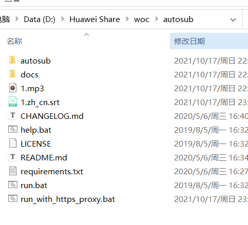
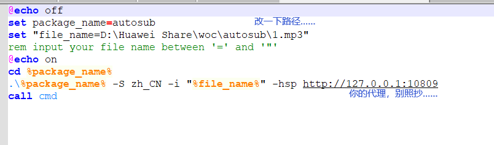
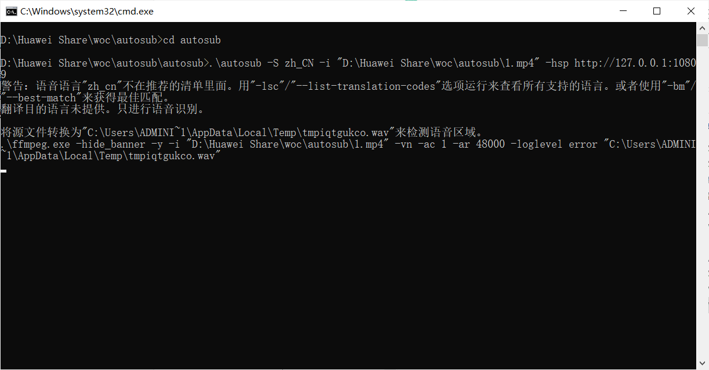
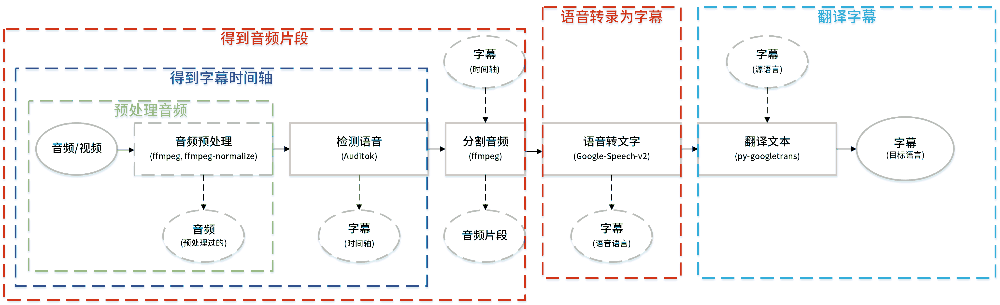
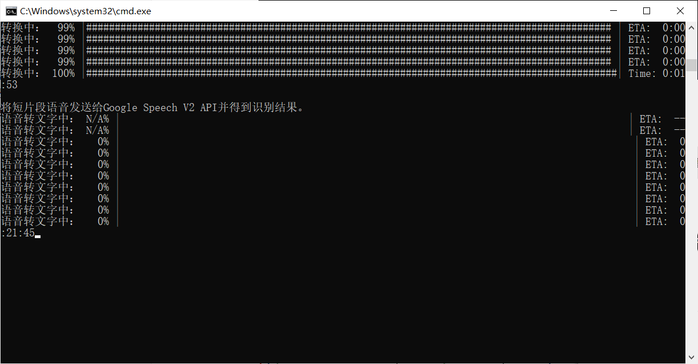
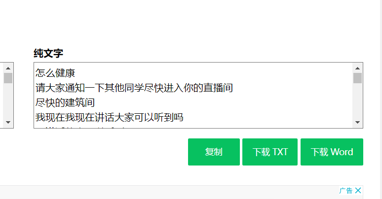

# AutoSub初体验——转换认知实习语音

## 前言

最近要写个认知实习的报告。早就忘了都讲了什么东西了。还好钉钉有回放……几个小时的视频？？？？？

不得已决定使用工具来对它进行研究。

思路是：因为没有PPT，将老师讲的话识别出来，之后将识别的话拼凑拼凑就当认知实习的报告了。

思路延伸：看看B站UP的机器识别字幕怎么来的，然后提取出来就是所求。

有了思路，说干就干，要想转换肯定得有源文件。

## 下载钉钉回放视频

满怀希望的点进去一看……

没有办法，只能用抓包大法，根据网上的教程一顿研究，大概确定了添加Vconsole的思路。

具体资料在[钉钉直播回放下载教程——第二弹_哔哩哔哩_bilibili](https://www.bilibili.com/video/BV1Vq4y1u7cM/)

这不是我们这次的重点。

下载得到了三个视频。都是mp4格式。

### 使用AutoSub

由于视频时间又臭又长，一般的软件免费额度妥妥的不好使。

一番寻找之后，找到了这个东西：AutoSub。

这是调用Google 的免费API的，额度貌似没啥限制。问题就是得科学一下才能连他们的服务器。

这边不提供科学上网的技巧。首先到AutoSub的Github~~整点薯条~~下载文件：

[Releases · BingLingGroup/autosub (github.com)](https://github.com/BingLingGroup/autosub/releases)

下载了标有nuitka的那个。

之后系统带上Python，从

这里右键打开powershell，之后输入pip install -r requirements.txt。如果没有配置过清华源会很慢，记得去配置（请自行搜索怎么配置清华源……）

这些完成后，修改run_with_https_proxy.bat，将他改成类似这样：

然后运行。注意，不需要提前转换mp4为mp3,否则会被再次转码，直接mp4处理速度貌似就很快。

耐心等待……

顺便放一下这个AutoSub的工作原理：

(咱们没用到翻译文本这个功能)

发送iNG（保持网络畅通 + 科学）

转换好之后得到了字幕文件（废话，原本这就是给什么UP主一类的添加字幕用的啊喂！）

之后我们找个网站转换一下……[it365 字幕转换文字软件](https://it365.gitlab.io/zh-cn/srt-to-txt/)

就得到了如下信息：

这个东西的应用不仅可以在这种地方，还可以用来翻译手头的生肉……（这才是本来用途吧喂！）

## 后文和下载

有些时候觉得科技这个东西果然都是看怎么用。

转码好的三个文件在这里，如果有朋友觉得自己的名字啥的被暴露了，还请联系我我给你删了。

 [转换.zip](..\..\src\assets\转换.zip) 

