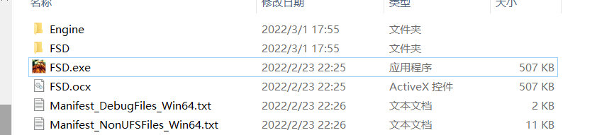
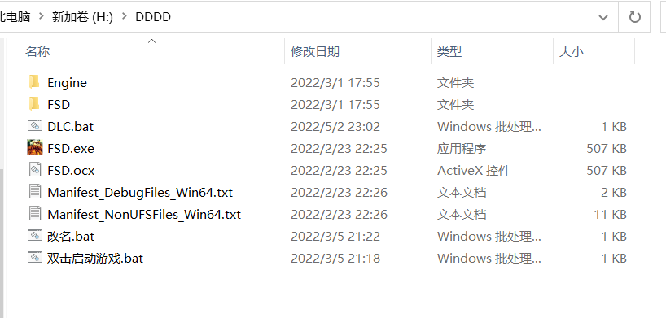
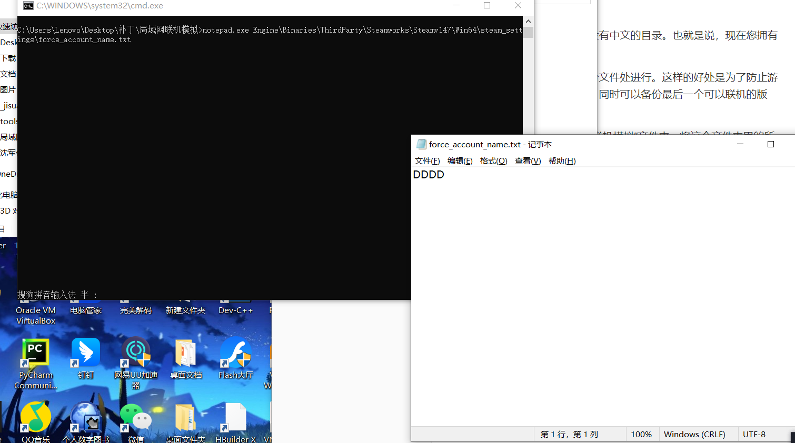
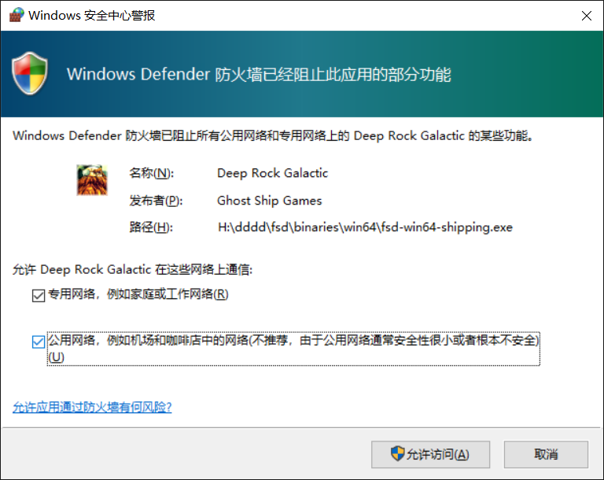
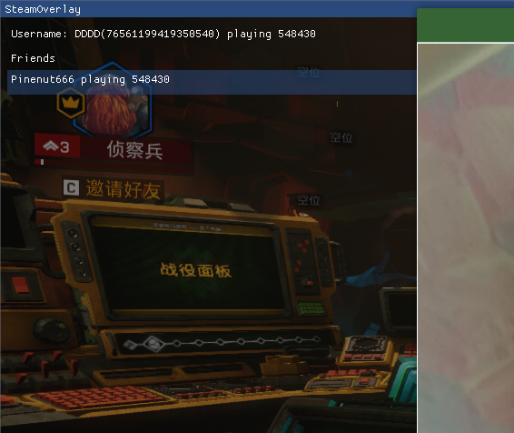
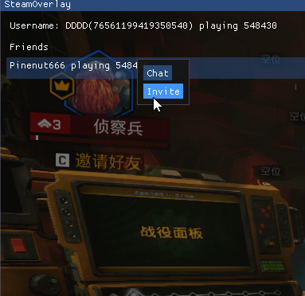
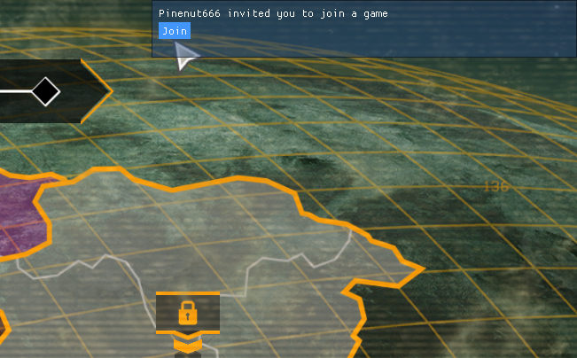
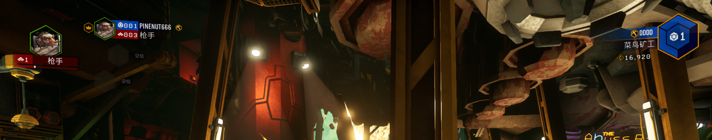

# 说明

该版本由B站@Pinenutn 根据Goldberg补丁制作而成。

该版本不保证一直可用。

## 什么可能不工作？

由于该游戏拥有多层验证，而其中关于活动的验证的对应破解补丁似乎已经失效，故可能不工作的有下面的东西：

1. 社区
2. 深潜
3. 每日作业
4. 每周作业
5. 免费啤酒活动等
6. 万圣节圣诞节等主要活动

由于本人并没有打到上述的东西方向，故我并没有办法测试，如果您感兴趣这方面，上面这些的对应破解补丁位置在https://github.com/0P3N50URC3-F0R3V3R/blackbeard，您可以自己下载，测试，并确定其是否可用。本人默认其不可用，并没有时间对此进行修正，很抱歉。

## 使用注意事项？

1. 本补丁不保证一定兼容游侠，也不一定保证能兼容所有局域网环境。据我所知，不转发广播包的环境，可能无法搜索到其他好友。
2. 该补丁并非永远有效的。其本质是对游戏的破解，故如果您遇到了问题，可能要去我的B站专栏搜索一下，是否有新的更新。
3. 我并非该游戏的忠实用户。所以催更我不一定就能更了。我并没有该游戏的合法版本，以后也不一定会持有，请各位理性看待此事，我只是受人所托尝试研究，当然了，如果有人可以提供游戏的合法文件或者合法账号，我可以在游戏出现问题时，试图继续进行研究。

## 如何使用？

首先，我们默认您使用的是Steam版本，其他版本不做保证。打开您的Steam并定位到游戏文件夹，它会是这个样子的：（没有那个ocx正常，那是我瞎命名的）

将这里的所有文件备份到一个没有中文的目录。也就是说，现在您拥有了您的游戏的备份文件。

我们所有的补丁操作，均在备份文件处进行。这样的好处是为了防止游戏更新对正版游戏造成的影响，同时可以备份最后一个可以联机的版本。

备份好之后，我们打开“局域网联机模拟”文件夹，将这个文件夹里的所有文件，拷贝到备份游戏的目录。

拷贝完成后，如图所示（注：新版本文件可能与此不同，但一定是FSD.EXE和改名文件，双击启动游戏文件在同一目录）：

此时双击改名.bat：

会弹出一个如图的窗口，里面是你游戏中叫的名字，必须是英文（中文会不识别变成空格，特殊符号也不行，我懒得处理了）

改完之后文件-保存-退出就行了。

**注意！如果您的游戏如下面的方式运行过一次，请不要分发给其他人，因为您的游戏运行之后，会生成一个独一无二的ID用来区分你和你的朋友，如果你直接分发的话，会导致你们互相搜不到！如果需要分发，请在双击启动游戏之前分发，或者您远程给对方打个补丁**

之后双击-双击启动游戏：（注意上面的字！！）

**注意！如果您的游戏已经如上述方式运行过一次，请不要分发给其他人，因为您的游戏运行之后，会生成一个独一无二的ID用来区分你和你的朋友，如果你直接分发的话，会导致你们互相搜不到！如果需要分发，请在双击启动游戏之前分发，或者您远程给对方打个补丁**

我已经重复过一遍了。

启动游戏之后，过一会儿会顺利加入游戏，之后第二个知识点：

**不要使用游戏内的搜索大厅搜索好友！**

正确操作：按下C键（或者按下shift+tab)邀请好友。

如果你和你的朋友都开了游戏并且在同一局域网（或者局域网，游侠我个人认为使用特殊启动 + 启动项选择双击启动游戏 应该也可以用）时

就会看到如图所示：

右键，点击invite

对方会收到一条右上角的消息，如图所示：

把鼠标指向那里（如果点击不了，就按下shift+tab，在那个界面里，让好友重新邀请你，如果还不行，就进入现在我看的这个界面来，就能点击了）

然后点击Join，就能进入对方的游戏了。

如图所示

之后就可以正常玩了。

## 其他问题？

点击链接加入群聊【深岩银河】：https://jq.qq.com/?_wv=1027&k=tIEUyxXH

加群吧。我几句话说不明白。

比如什么局域网啦，防火墙啦，这些我咋和你说明白？

更新什么的如果有，我会在群里发。

