# 数据库实验3

## 前言

该版本尽量使用Windows方式进行替代。

## 安装Windows版本OpenSSL

http://slproweb.com/products/Win32OpenSSL.html

到此处下载：


之后进行安装：

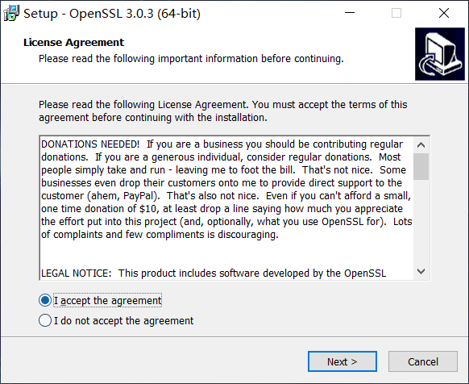

修改一下位置（不要放在C盘容易有权限问题），（找个记得住的地方，一会儿还要配置环境变量）：

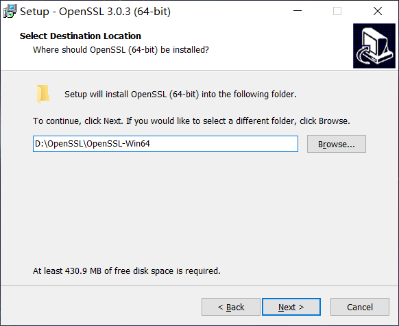

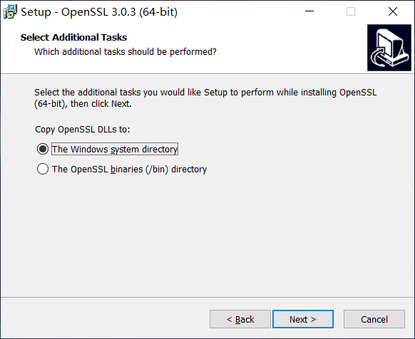

取消所有的捐赠选项：

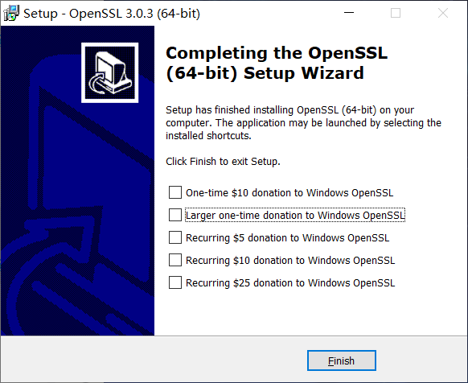

打开对应的位置：

之后打开bin文件，将目录路径复制下来：

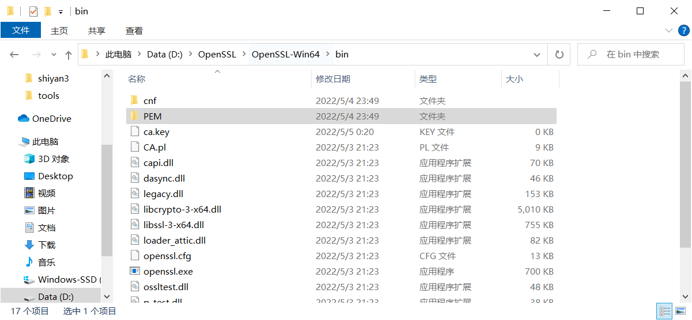

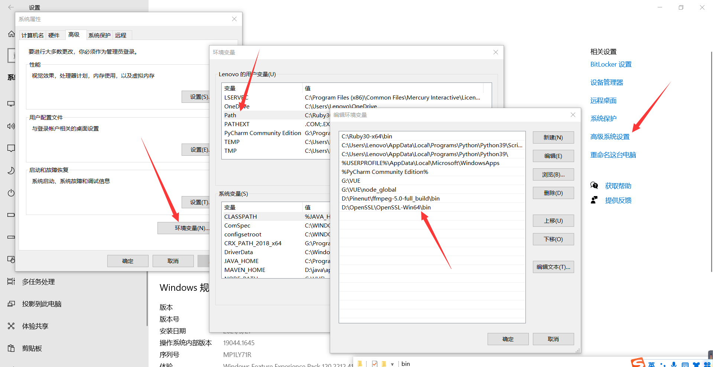

按下Win+R输入cmd，在里面输入openssl提示如图则成功。

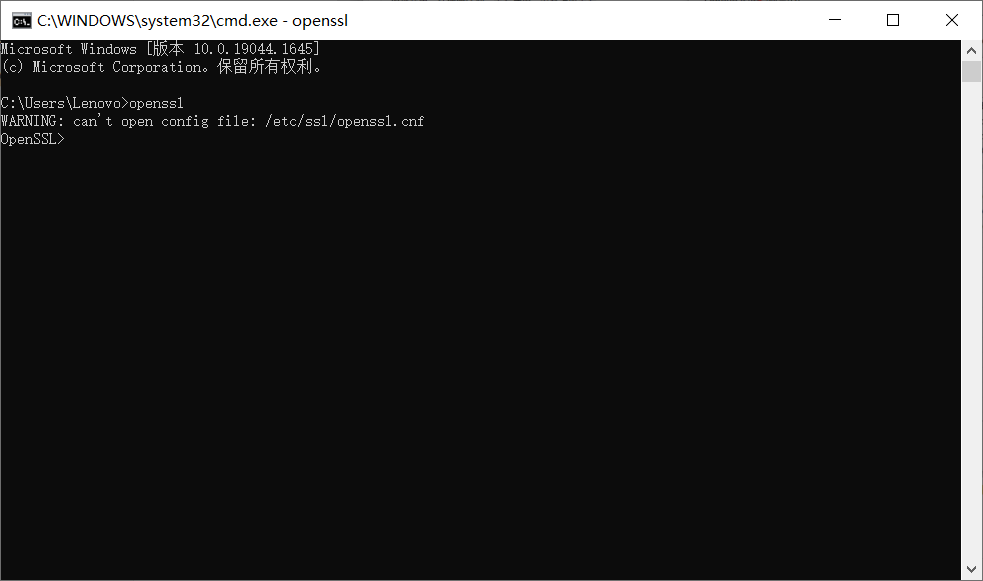

## 进行CA证书的制作

首先在OpenSSL-Win64下新建一个shiyan3文件夹：


在shiyan3文件夹里新建如下文件夹和文件：

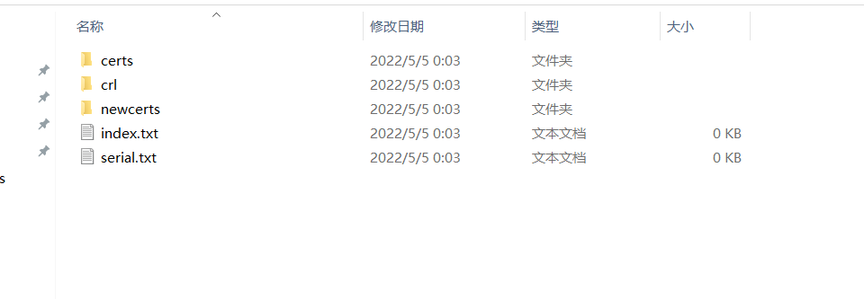

之后将OpenSSL-Win64\bin\cnf\openssl.cnf(安装目录)拷贝到这个文件夹：

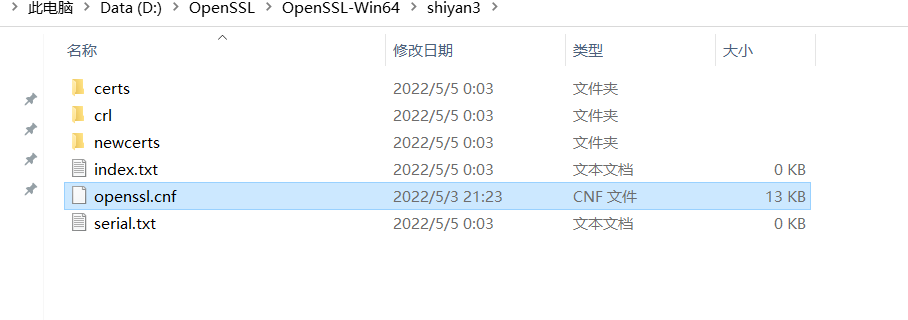

用记事本或者Vscode打开该文件，修改此处：

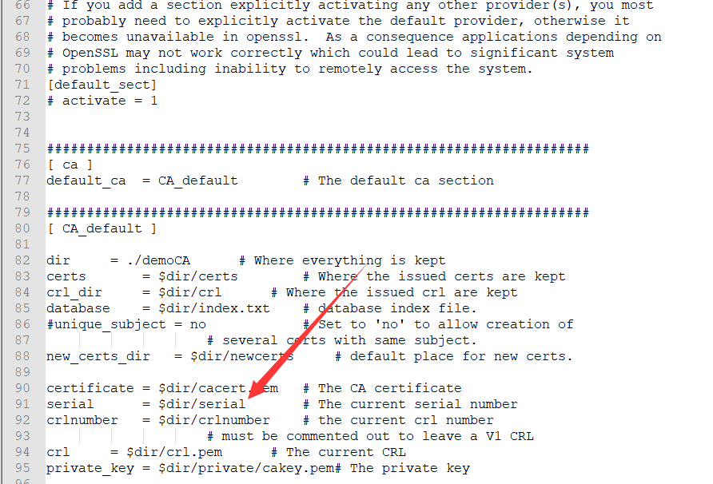

修改成：

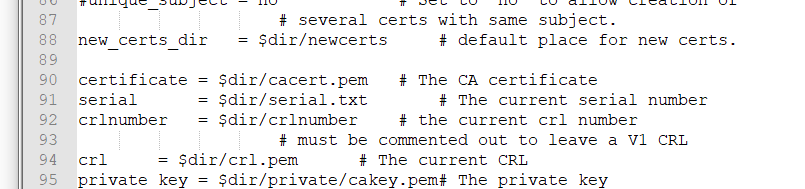

之后打开serial.txt输入纯数字：

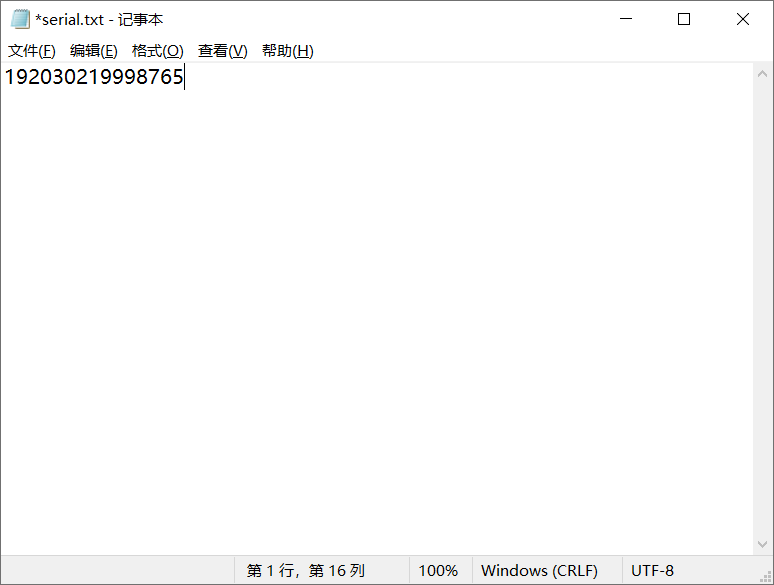

然后按着shift键，右键 - 在此处打开powershell窗口（或者cmd)打开该目录：

之后输入cmd回车，然后：

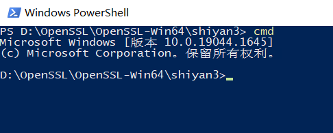

之后输入：

```
openssl req -new -x509 -keyout ca.key -out ca.crt -config openssl.cnf
```


