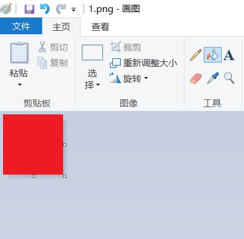
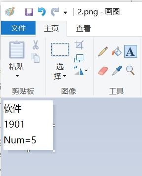
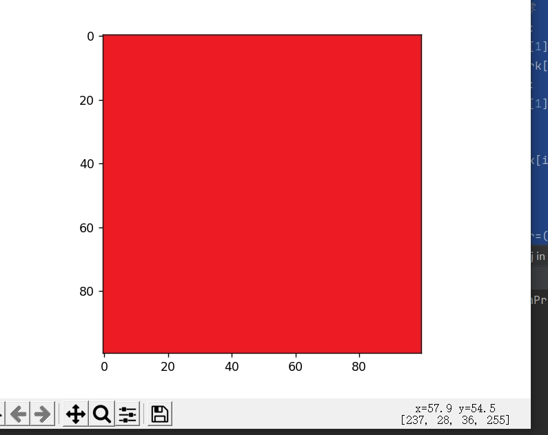
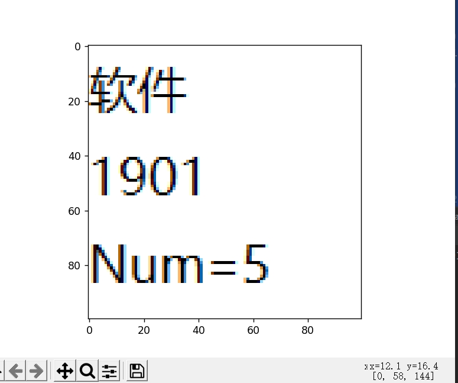
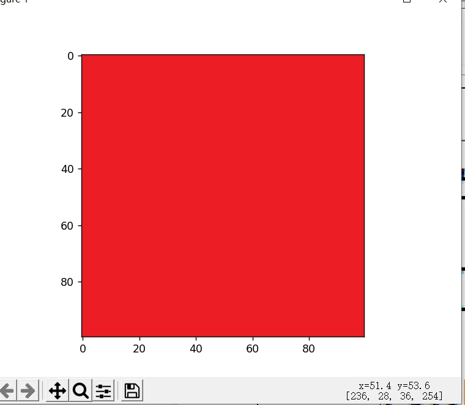
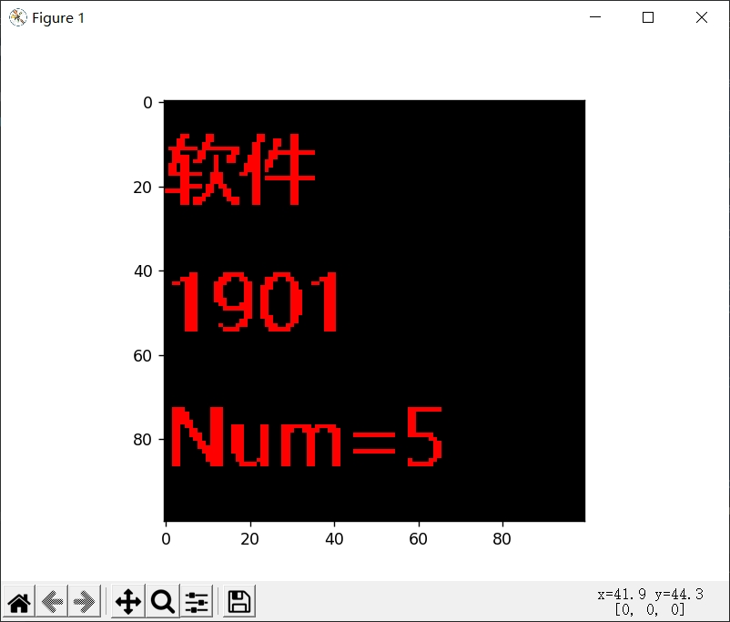

# 数据库实验-图片数据隐藏和提取

## 前言

LSB全称leastsignificant bit，是一种基于图片最低有效位修改储存信息的隐写方法。

## 准备工作

首先打开画图，创建一个纯红色的，100*100的图片**（请自行修改图片……）**：

 

使用QQ的截图工具获取到对应的RGB**（无意义，只是方便叙述）**。

另存为该文件为1.png，放到D盘目录。

之后创建第二个文件为信息文件，大小为100*100，文件内容使用黑色字体书写一部分内容**（建议使用黑色字体，其他字体可能会显示不正常）**：

 

保存为2.png

##  进行代码编写及原理剖析

本思路的LSB算法的核心为：首先，对原始图像的最后1bit（也就是最低位）置零，并不会改变图像的视觉效果；然后，将用1bit表示的版权信息，赋值给原始图像的最后1bit，实现版权信息写入，写入以后依旧不会改变原始图像，观察者也根本看不见版权信息的存在；最后，如果需要解码，只需要将图像的前7bits（高7位）置零，仅留下最后1bit（最低位），这最后1bit就是版权信息。由于只有1bit只能表示黑/白，所以要对第二张图进行二值化（颜色小于xxx的为黑，否则为白）

于是进行代码编写：

```python
import PIL
import cv2
from matplotlib import pyplot as plt
import numpy as np
from PIL import Image


# 输入水印图片和原图
def lsb_encoder(copyright_image, original_image):
    # 读取
    original_image = original_image.astype(np.uint8)
    copyright_image = copyright_image.astype(np.uint8)
    # 2: 对original图像和copyright图像备份，不能在原图上更改
    watermark = original_image.copy()
    copyright = copyright_image.copy()
    # 3：将copyright二值化，使其仅含0和1，用1bit表示
    copyright[copyright < 200] = 1
    copyright[copyright >= 200] = 0
    # 3：将watermark的最后1bit的R、G、B全部置零
    for i in range(0, watermark.shape[0]):
        for j in range(0, watermark.shape[1]):
            watermark[i, j, :] = (watermark[i, j, :] // 2) * 2
    for i in range(0, copyright.shape[0]):
        for j in range(0, copyright.shape[1]):
            # 5：将用1bit表示的二值化的水印信息
            #   添加到watermark最后1bit上
            watermark[i, j, 0] = watermark[i, j, 0] + copyright[i, j, 0]
    return watermark


def remove_transparency(img_pil, bg_colour=(255, 255, 255)):
    # Only process if image has transparency
    if img_pil.mode in ('RGBA', 'LA') or \
            (img_pil.mode == 'P' and 'transparency' in img_pil.info):
        # Need to convert to RGBA if LA format due to a bug in PIL (http://stackoverflow.com/a/1963146)
        alpha = img_pil.convert('RGBA').split()[-1]

        # Create a new background image of our matt color.
        # Must be RGBA because paste requires both images have the same format
        # (http://stackoverflow.com/a/8720632  and  http://stackoverflow.com/a/9459208)
        bg = Image.new("RGBA", img_pil.size, bg_colour + (255,))
        bg.paste(img_pil, mask=alpha)
        return bg
    else:
        return img_pil


def lsb_decoder(watermark_image):
    watermark_image = watermark_image.astype(np.uint8)
    # 获取watermark图像的备份，不在原图上更改
    watermark = watermark_image.copy()
    watermark_copyright = (watermark % 2) * 255
    return watermark_copyright


if __name__ == '__main__':
    img1 = Image.open('D:\\1.png')  # 读取数据
    # 输入原图
    img11 = np.array(img1)
    img2 = Image.open('D:\\2.png')
    # 输入要加密进入的图片
    img22 = np.array(img2)
    plt.imshow(img11)
    plt.show()
    plt.imshow(img2)
    plt.show()
    # 进行加密操作
    img3 = lsb_encoder(img22, img11)
    # 显示加密完成的图片
    plt.imshow(img3)
    plt.show()
    # 进行解密，直接进行取余之后会让第一个数字为255，但是这样操作会导致透明度变成0，所以我们要转换成RGB丢弃掉通道
    # 如果不使用255的话，，可以让显示文字颜色变成其他颜色。
    secret = lsb_decoder(img3)
    # 将解密的图片从数组转换为普通图片对象再变成RGB
    withalpha = PIL.Image.fromarray(secret).convert('RGB')
    # 显示这个没有alpha通道的图
    plt.imshow(withalpha)
    plt.show()

```

## 运行代码查看情况：

 

第一次读取的图片为纯红色图片。

 

要写入的图片展示

 

写入完毕的图片展示，右下角的RGBA值明显发生了变动，但人眼无法读取

 

使用RGB方式显示，可以看到加密进入的图片信息。