# 数据库实验5-跨站请求伪造攻击实验

## 前言

该方式已经尽全力来简化操作流程。

## 创建项目

新建一个Spring Boot项目：

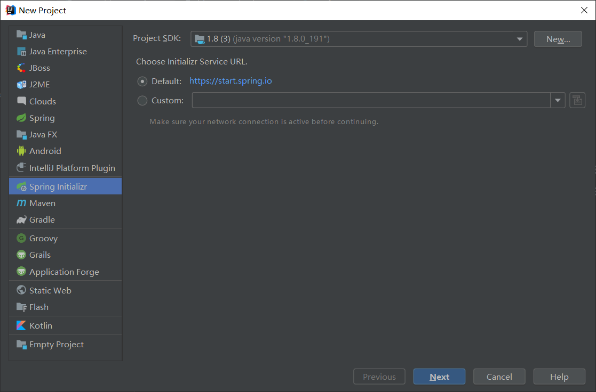

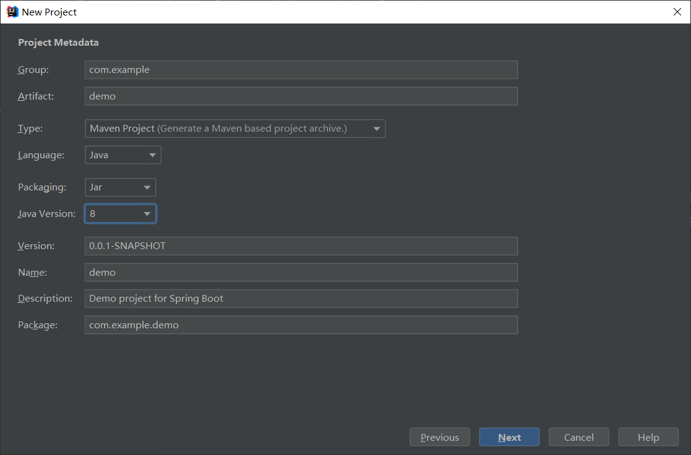

勾选：

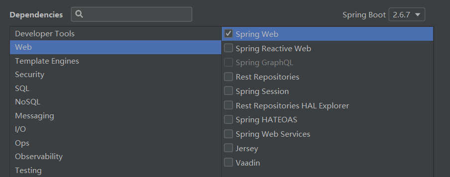

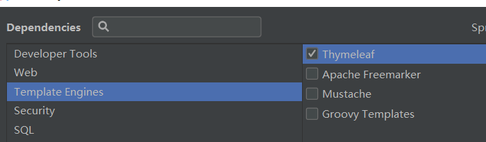

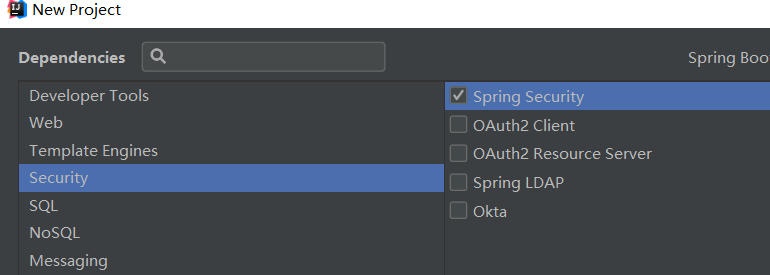

创建后如图所示：

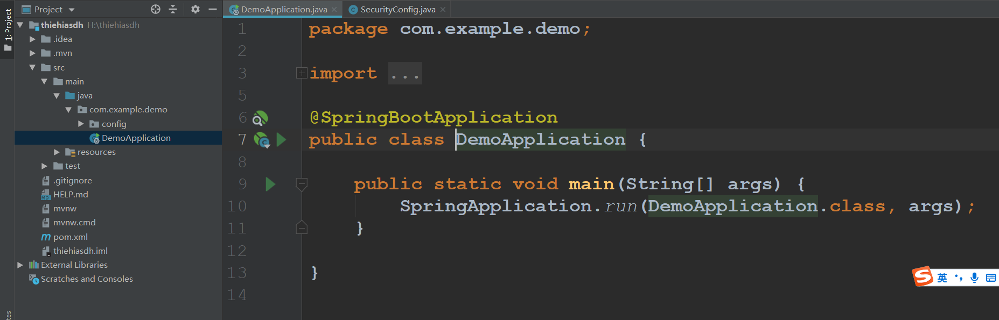

创建config文件夹并配置关闭SpringSecurity的CSRF验证接口：

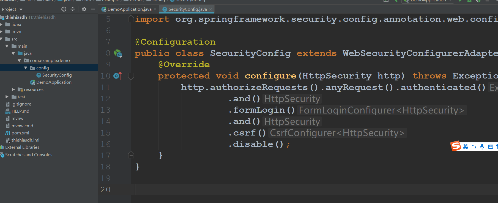

代码如下：

```java
package com.example.demo.config;

import org.springframework.context.annotation.Configuration;
import org.springframework.security.config.annotation.web.builders.HttpSecurity;
import org.springframework.security.config.annotation.web.configuration.WebSecurityConfigurerAdapter;

@Configuration
public class SecurityConfig extends WebSecurityConfigurerAdapter {
    @Override
    protected void configure(HttpSecurity http) throws Exception {
        http.authorizeRequests().anyRequest().authenticated()
                .and()
                .formLogin()
                .and()
                .csrf()
                .disable();
    }
}
```

之后创建调试接口：

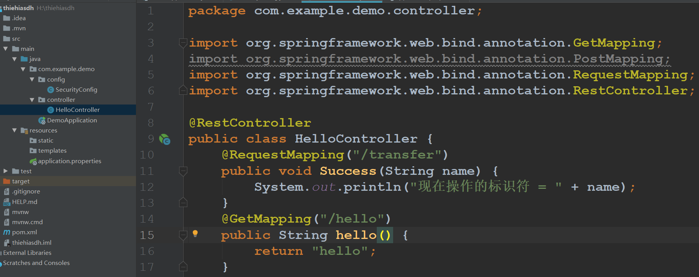

代码如下：

```java
package com.example.demo.controller;

import org.springframework.web.bind.annotation.GetMapping;
import org.springframework.web.bind.annotation.PostMapping;
import org.springframework.web.bind.annotation.RequestMapping;
import org.springframework.web.bind.annotation.RestController;

@RestController
public class HelloController {
    @RequestMapping("/transfer")
    public void Success(String name) {
        System.out.println("现在操作的标识符 = " + name);
    }
    @GetMapping("/hello")
    public String hello() {
        return "hello";
    }
}

```

在application.properties内配置好账号密码：

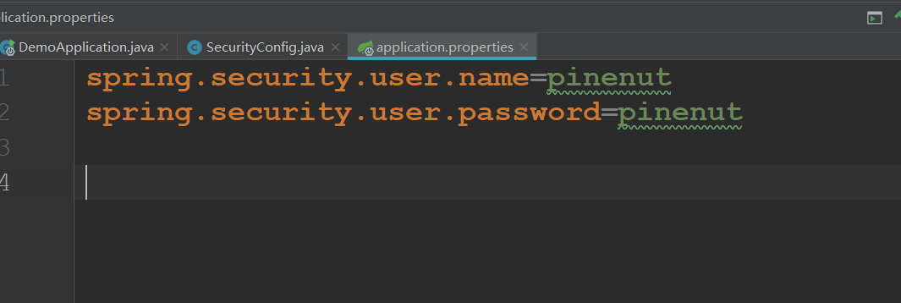

配置完毕。

## 创建项目2

在**VSCode**内，复制粘贴如下代码：

```html
<!DOCTYPE html>
<html>
    <body>
        <form action="http://127.0.0.1:8080/transfer" method="post">
            <input type="hidden" value="我是你爷爷" name="name">
            <input type="submit" value="点击一下我">
        </form>
        </body>
</html>
```

保存为html，如下：

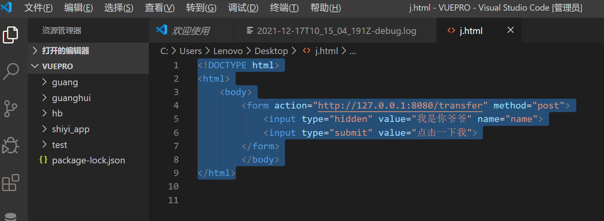

## 开始攻击测试

右键 - 在浏览器中打开，如图所示：

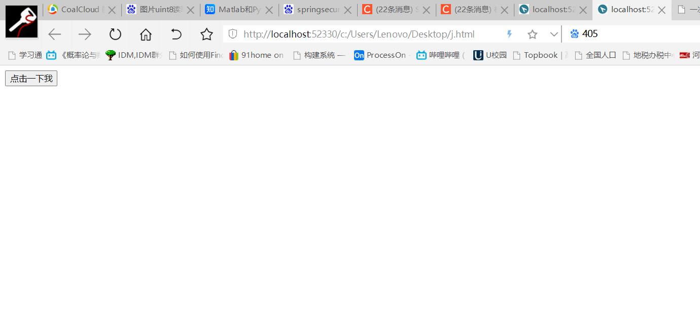

之后在相同浏览器内新建一个标签页，访问：127.0.0.1:8080

由于没有登录，自动跳转到登录页面：

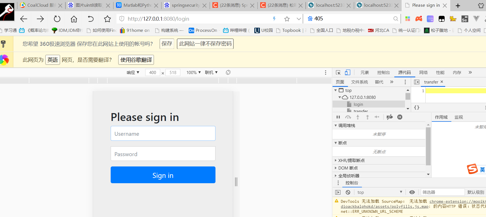

输入账号密码（在application.properties内配置好的那个），点击Sign in：

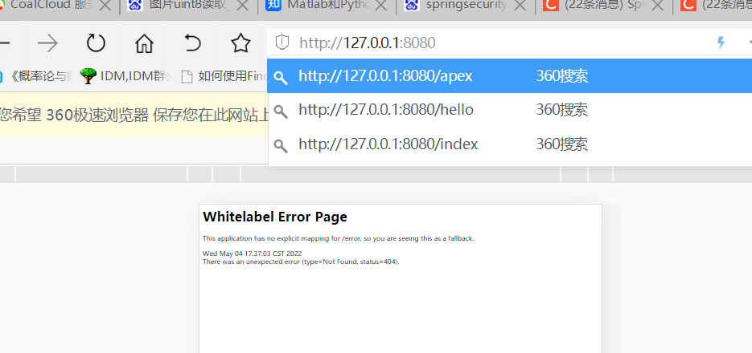

登录成功（没有写对应的页面），我们自己手动访问一下transfer接口：

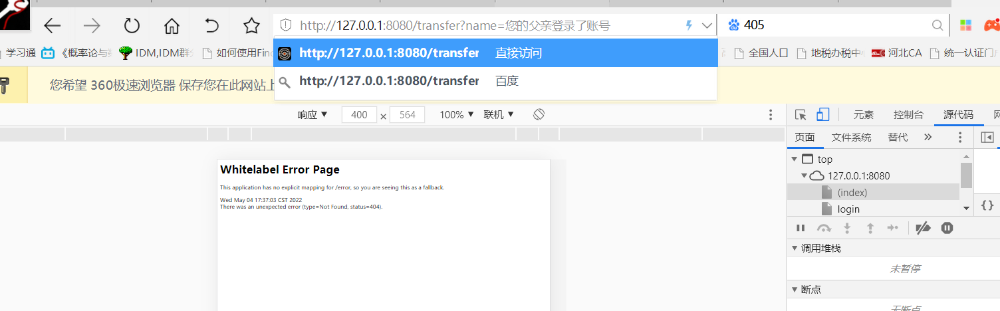

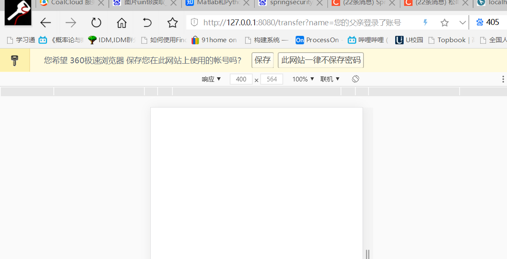

查看后台：

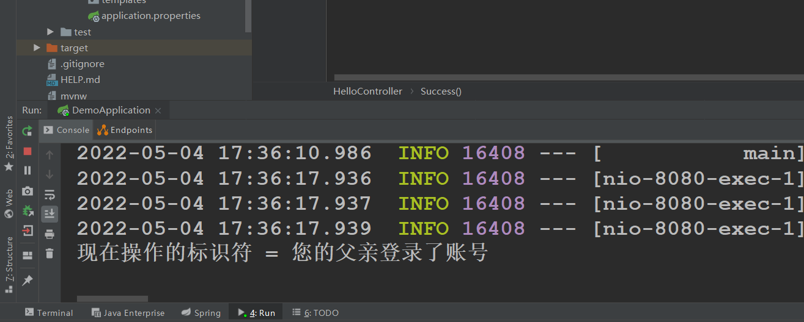

接下来我们关闭这个页面，回到刚才Vscode的那个页面上：

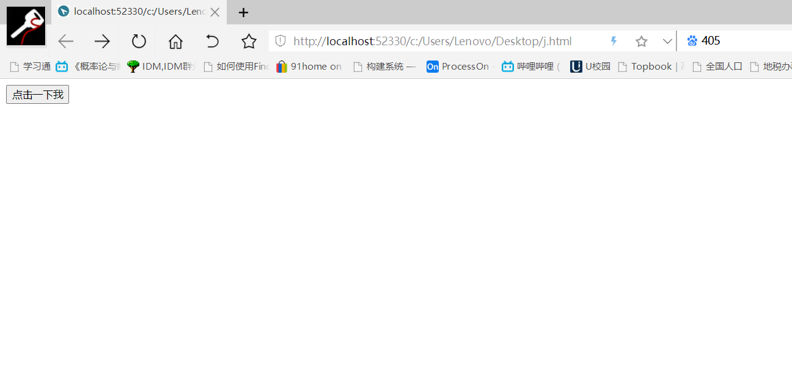

点击“点击一下我”

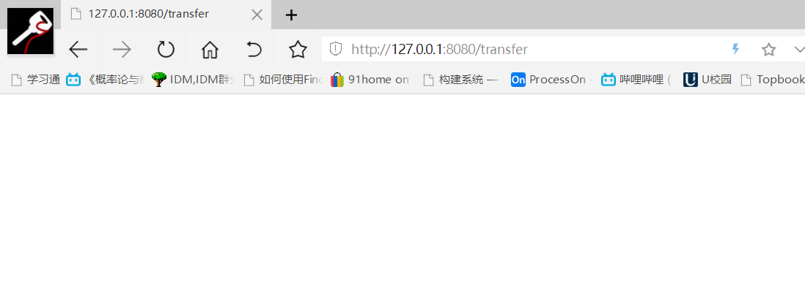

可以看到，在没有再次登录的情况下，在Vscode(服务器为http://localhost:52330/)的接口调用成功了。）

查看后台：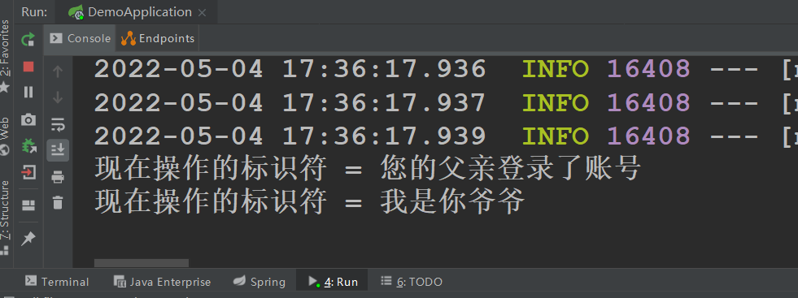

故攻击成功。

