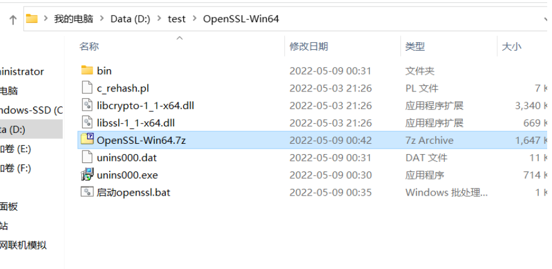
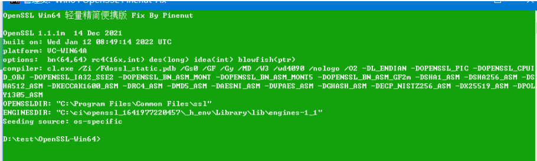
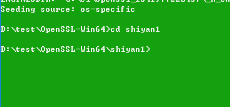
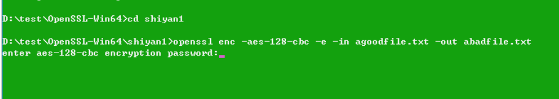
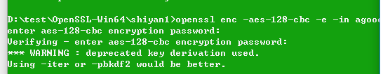
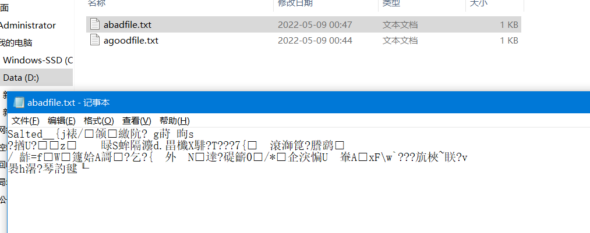
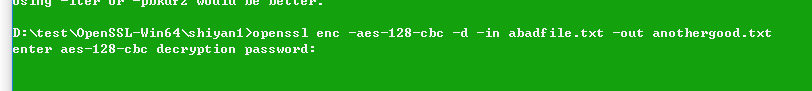
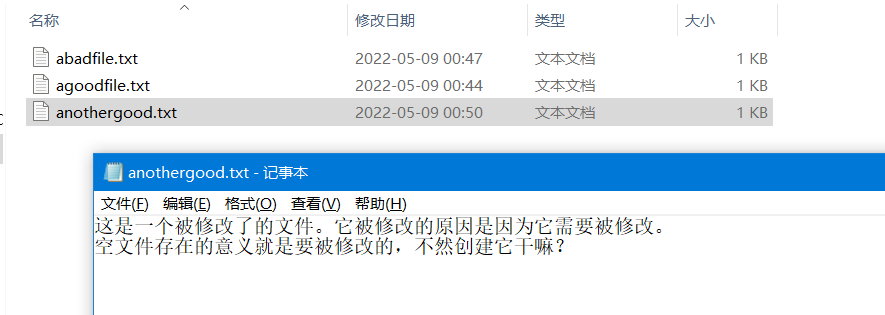

# **数据库安全**-实验1

## 要求

1. 熟悉加密和解密的概念和算法，可以通过使用工具编写程序加密/解密信息。

2. 使用Linux系统的openssl命令行工具。

## 前言

由于目前使用的电脑上面没有虚拟机，我也懒得去装Linux，所以选择另外一个方案：Win32OpenSSL。

这里提供一个轻量版本：

https://wwc.lanzoub.com/ipM2x04ilqvg

（注意：如果自己去官网下载的话，不能使用3.X版本，似乎3.x版本硬编码了一个不应该的数值，导致它完全不可用，切记切记）

另：后面的实验若无注明，则全部使用该软件进行。

## 开始

解压文件得到如图所示：

直接双击启动OpenSSL，启动OpenSSL。



如图提示。

之后进行一些简单的测试以完成实验。

## 加解密测试

在解压后的文件目录新建文件夹shiyan1:


打开并新建一个文件：


修改文件内容：


回到刚刚的框内，输入cd shiyan1进入shiyan1目录：



我们使用 **openssl enc xxx -e **来加密文件：

```bash
openssl enc -aes-128-cbc -e -in agoodfile.txt -out abadfile.txt
```

（复制后右键就可以直接粘贴进入。）



要求输入密码，注意输入不会显示。



加密完毕，查看文件夹内：



多出了加密文件，说明文件被加密。

之后使用解密进行解密：

```bash
openssl enc -aes-128-cbc -d -in abadfile.txt -out anothergood.txt
```



输入刚才的密码



解密成功。