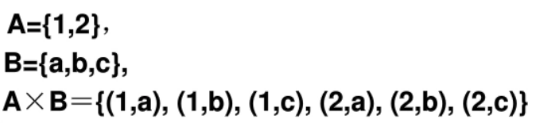
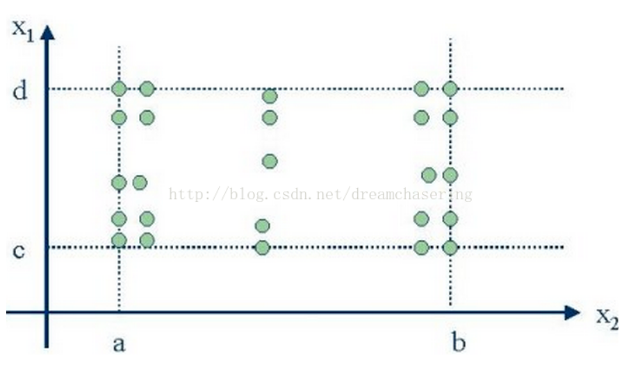
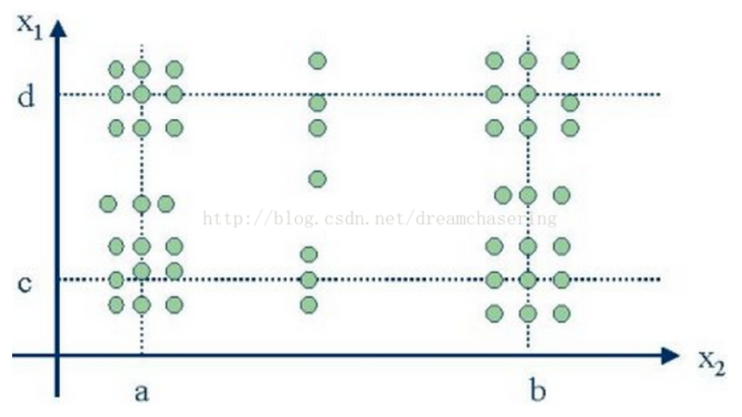

# 边界值分析法（不单独出题，和其他一起分析）

（期末考试时，白盒一道黑盒一道）

## 概念

对输入或输出边界值进行测试的黑盒测试方法。

是等价类划分方法的 **补充** 

## 分类

### 标准/健壮边界值

标准边界值测试只考虑有效数据范围内的边界值。

健壮边界值测试会考虑有效和无效数据范围内的边界值。

#### 取值情况

对于有n个变量的程序，保留一个变量，选取**正好等于，刚刚大于，刚刚小于边界**的值进行测试。取值为：
*斜体加粗代表健壮边界值添加的部分。

+  ***略低于最小值Min-*** 
+ 最小值Min
+ 略高于最小值Min+
+ 正常值Normal
+ 略低于最大值Max-
+ 最大值Max
+ ***略高于最大值Max+***  

其会产生 **4n+1/(6n+1)** 个测试用例。

核心：固定一个为正常值，剩余的有上述（除正常值外）的几种选择，n个则有n种选择，最后加上全部正常得一个）

#### 典型案例

+ 循环测试：第0（进入循环时的数据是否正确），第1次，倒数第二次和第一次。
+ 16位整型数据：32767/-32768
+ 数组第一个和最后一个下标元素
+ 报表第一行和最后一行

### 最坏情况/健壮性最坏情况测试

#### 概念：

**最坏情况测试**：
	  最坏情况测试关心的多个变量极值会出现的情况，其对每一个变量都取极值测试，并进行笛卡尔积计算，以生成测试用例。

**笛卡尔积：表示为*X* × *Y*，第一个对象是*X*的成员而第二个对象是*Y*的所有可能有序对的其中一个成员（看不懂的概念）**

一个示例直接了解：

 

之前我们讨论的**边界值分析测试**，由于取的是“一个正常另外一个为边界值”，其是最坏情况测试的测试用例的子集。

最坏情况测试的测试用例如图所示：

**健壮性最坏情况测试**是对最坏情况测试的拓展。

$$
使用测试/健壮性测试的5/7个元素集合进行笛卡尔积计算，会产生 5^n 或 7^n 个测试用例。
$$

