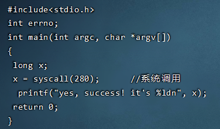

### 实验三 - RHEL5版

考虑到99%的用户不会使用我的Ubuntu，特此使用rhel5进行重做。~~（累死了) 我好难（瘫）~~

本教程基于Hadoop的RHEL5进行，在进行这些步骤之前，记得先备份好你已经配置的Hadoop。

由于RHEL5是一个非常古老的版本，其线上更新需要收费，而我们编译却恰恰需要安装各种各种东西，不得已我们只好对yum进行修改。

但是更蛋疼的来了，这个系统的yum对应centos5.5,这个系统17年已经停止支持，镜像已经基本全部完蛋了。**所以下面的操作都是我自己研究的.jpg**

首先使用SSH链接上RHEL5，准备开始操作。

#### 创建新的联网网卡

Hadoop的RHEL5默认网都没有……

首先在Vmware处新建一个网卡：


设置如图所示之后，重启虚拟机，并查看network：


看到有两个网卡，eth0和eth1都是active，此时你的RHEL5可以正常上网了。

### 更新YUM

由于RHEL5已经是过去时了，它的yum早已经被废弃。我们只能靠CentOS5的yum源。但是很不幸，CentOS5的源也早就被废弃了。

所以我们只好靠镜像……

首先查看系统对应版本：

```
uname -r
```


查看内核为2.6.18，其对应的CentOS5.5。

进入阿里云旧版本镜像，打开链接：

[Index of /centos-vault/5.5/os/x86_64/CentOS/ (aliyun.com)](https://mirrors.aliyun.com/centos-vault/5.5/os/x86_64/CentOS/)

之后用CTRL+F搜索所有的yum:


下载这三个，备用。


再下载这个备用。（搜索关键词：python-iniparse）

下载完成后，SSH内输入：

```
rpm -aq|grep yum|xargs rpm -e --nodeps
```

删除原本的yum。

完成后将刚才的文件用SSH发送上去


之后切换到发送目录，输入

```
rpm -ivh --force *.rpm
```

安装yum。

此时yum可用但需要换源。因为网上的源全废了，所以只好自己配置源：

首先从163的服务器上下载一个他们的模板，准备用这个模板来进行更改：

```bash
# CentOS-Base.repo
#
# The mirror system uses the connecting IP address of the client and the
# update status of each mirror to pick mirrors that are updated to and
# geographically close to the client.  You should use this for CentOS updates
# unless you are manually picking other mirrors.
#
# If the mirrorlist= does not work for you, as a fall back you can try the 
# remarked out baseurl= line instead.
#
#

[base]
name=CentOS-$releasever - Base - 163.com
baseurl=http://mirrors.163.com/centos/$releasever/os/$basearch/
gpgcheck=1
gpgkey=http://mirror.centos.org/centos/RPM-GPG-KEY-CentOS-5

#released updates 
[updates]
name=CentOS-$releasever - Updates - 163.com
baseurl=http://mirrors.163.com/centos/$releasever/updates/$basearch/
gpgcheck=1
gpgkey=http://mirror.centos.org/centos/RPM-GPG-KEY-CentOS-5

#packages used/produced in the build but not released
[addons]
name=CentOS-$releasever - Addons - 163.com
baseurl=http://mirrors.163.com/centos/$releasever/addons/$basearch/
gpgcheck=1
gpgkey=http://mirror.centos.org/centos/RPM-GPG-KEY-CentOS-5

#additional packages that may be useful
[extras]
name=CentOS-$releasever - Extras - 163.com
baseurl=http://mirrors.163.com/centos/$releasever/extras/$basearch/
gpgcheck=1
gpgkey=http://mirror.centos.org/centos/RPM-GPG-KEY-CentOS-5

#additional packages that extend functionality of existing packages
[centosplus]
name=CentOS-$releasever - Plus - 163.com
baseurl=http://mirrors.163.com/centos/$releasever/centosplus/$basearch/
gpgcheck=1
enabled=0
gpgkey=http://mirror.centos.org/centos/RPM-GPG-KEY-CentOS-5

#contrib - packages by Centos Users
[contrib]
name=CentOS-$releasever - Contrib - 163.com
baseurl=http://mirrors.163.com/centos/$releasever/contrib/$basearch/
gpgcheck=1
enabled=0
gpgkey=http://mirror.centos.org/centos/RPM-GPG-KEY-CentOS-5
```

将上面的代码先复制到记事本，然后进行修改：

首先看baseurl，每一个baseurl要从镜像站找到对应：

[Index of /centos-vault/5.5/ (aliyun.com)](https://mirrors.aliyun.com/centos-vault/5.5/)

然后改成对应的状态。注意这个系统更新的时候不能从HTTPS更新，所以我们要去掉https的头变成http，这便对镜像站有了更高的要求。

一番修改之后如下：（可以直接复制走抄了，感谢我吧.jpg)

```bash
# CentOS-Base.repo
#
# The mirror system uses the connecting IP address of the client and the
# update status of each mirror to pick mirrors that are updated to and
# geographically close to the client.  You should use this for CentOS updates
# unless you are manually picking other mirrors.
#
# If the mirrorlist= does not work for you, as a fall back you can try the 
# remarked out baseurl= line instead.
#
#

[base]
name=CentOS-$releasever - Base - 163.com
baseurl=http://mirrors.aliyun.com/centos-vault/5.5/os/x86_64/
gpgcheck=1
gpgkey=http://mirrors.aliyun.com/centos-vault/5.5/os/x86_64/RPM-GPG-KEY-CentOS-5

#released updates 
[updates]
name=CentOS-$releasever - Updates - 163.com
baseurl=http://mirrors.aliyun.com/centos-vault/5.5/updates/x86_64/
gpgcheck=1
gpgkey=http://mirrors.aliyun.com/centos-vault/5.5/os/x86_64/RPM-GPG-KEY-CentOS-5

#packages used/produced in the build but not released
[addons]
name=CentOS-$releasever - Addons - 163.com
baseurl=http://mirrors.aliyun.com/centos-vault/5.5/addons/x86_64/
gpgcheck=1
gpgkey=http://mirrors.aliyun.com/centos-vault/5.5/os/x86_64/RPM-GPG-KEY-CentOS-5

#additional packages that may be useful
[extras]
name=CentOS-$releasever - Extras - 163.com
baseurl=http://mirrors.aliyun.com/centos-vault/5.5/extras/x86_64/
gpgcheck=1
gpgkey=http://mirrors.aliyun.com/centos-vault/5.5/os/x86_64/RPM-GPG-KEY-CentOS-5

#additional packages that extend functionality of existing packages
[centosplus]
name=CentOS-$releasever - Plus - 163.com
baseurl=http://mirrors.aliyun.com/centos-vault/5.5/centosplus/x86_64/
gpgcheck=1
enabled=0
gpgkey=http://mirrors.aliyun.com/centos-vault/5.5/os/x86_64/RPM-GPG-KEY-CentOS-5

#contrib - packages by Centos Users
[contrib]
name=CentOS-$releasever - Contrib - 163.com
baseurl=http://mirrors.aliyun.com/centos-vault/5.5/contrib/x86_64/
gpgcheck=1
enabled=0
gpgkey=http://mirrors.aliyun.com/centos-vault/5.5/os/x86_64/RPM-GPG-KEY-CentOS-5
```

之后我们将文件名改为

```
CentOS5-Base-163.repo
```

然后拷贝到

```
/etc/yum.repos.d
```


拷贝后运行：

```
yum clean all
yum makecache
```


到此成功。

### 下载源码

[Index of /pub/linux/kernel/v2.6/](https://mirrors.edge.kernel.org/pub/linux/kernel/v2.6/)

到这里找2.6.19版本下载（linux-2.6.19.tar.gz ）

下载之后丢进虚拟机。

之后切进目录，使用

```
tar -zxvf linux-2.6.19.tar.gz
```

解压内核源码。

之后进入解压的文件夹。

### 配置内核安装

首先需要安装一个前置插件

```
yum install ncurses-devel ncurses -y
```

安装后**将虚拟机屏幕最大化，里面的终端也最大化后** 执行内核配置命令：

```
make menuconfig
```

运行之后直接选Exit退出。

然后开始修改源码：

#### 源码的修改

2版本和我之前做的5版本许多地方都不一样，不过它的编译速度很快。

参考了这些大佬的博客：

但是这位大佬的博客和实际仍然有一定差距。

[经典 【操作系统实验】实验四 添加系统调用RedHat5 kernel2.6.18_aossda的博客-CSDN博客](https://blog.csdn.net/weixin_42374556/article/details/105713039)

[(64位Linux系统调用的添加以及系统调用的原理_xiaofanzidafanzi的博客-CSDN博客_64位系统调用](https://blog.csdn.net/xiaofanzidafanzi/article/details/52904406)

运行如下命令：

```bash
vi kernel/sys.c
```

Shift + G跳到最后，添加一个自己的函数：

```c
asmlinkage int sys_mycall(int number)
{
		printk("<0>""<0>Hello Super Blade !!\n");
		printk(KERN_EMERG"KERN_EMERG  Hello world!\n");
   		return number;
}
```

再然后修改：（添加指针）**（不太清楚这个是否在64位上有影响，个人猜测是没有的）**

```
vi arch/i386/kernel/syscall_table.S 
```

末尾添加：


**注意，接下来的操作将会有所不同，由于Linux32位和64位有所不同会导致修改点不同**

首先敲uname -a


如果看到X86_64，请跳过分割线的部分，如果是i386则继续看下方内容、

<hr> 我是分割线 <hr>


**i386**：

添加系统调用号：

```
vi include/asm-i386/unistd.h
```


确定这个最后一位（上面是319），然后加一行自己的#define __NR_mycall 320

**（记下这个系统调用号，比如这里是320）**

<hr>分割线结束<hr>

如果是X86_64的版本，则使用如下命令：

```bash
vim include/asm-x86_64/unistd.h
```

修改此处如图：（添加了522-523行）

**注意，这个280是原本279 + 1，也就是放到了最后一位，如果你使用的内核和我不同，请理解后修改下面的代码。**

```bash
#define __NR_mycall             280
__SYSCALL(__NR_mycall, sys_mycall)
```


注意：#define后面，原本是

```bash
#define __NR_syscall_max __NR_move_pages 
```

现在改成了

```bash
#define __NR_syscall_max __NR_mycall
```

其原理仍然是添加系统调用号。

**在添加完之后请记住这个调用号，比如这里是280.**

<hr> <hr>


上方i386和x86_64有所不同，请注意好好确定。

全部完成之后，开始编译工作。

#### 源码的编译

之后开始编译内核，在此之前请先把虚拟机分配的调大一些，方便快速出内核。

分配内核的调整请参考Ubuntu部分的操作，在此不再赘述。

什么，你不知道我说的哪个？自行翻阅 Ubuntu实验三 火力全开部分（右上角Content可以查看目录）

调整好之后,首先进入linux目录下，然后再开始编译：

（感谢 @ncp 的反馈，确实需要提及一下编译位置）

首先输入：

```bash
make mrproper
```

清理可能有过的编译。

之后输入：

```c
make
```

进行内核编译。

等走完进入后输入：

```bash
make modules
make modules_install
make install
```

全部完成后，输入：

```bash
reboot -n
```

重启系统，然后切换到虚拟机里，按键盘的上/下键：


选择这个我们刚刚编译的版本的内核。

注：（根据某些朋友的反馈，没有切换的直接输入账号密码也可，该情况目前存疑，可以自行尝试进入系统后敲uname -r查看是否成功）


之后等待进入系统。

进入系统后，使用：

```bash
vi test.c
```

然后输入如下：

```
#include<stdio.h>
int errno;
int main(int argc, char *argv[])
{
 long x;
 x = syscall(自己改);      //这里的自己改改成上面让你记住的系统调用号。什么？忘了？自己翻去！
 printf("yes, success! it's %ldn", x);
 return 0;
}
```

之后



之后使用

```c
gcc -o test2 test.c
```

编译生成后运行

```
./test2
```

显示：


说明成功！


