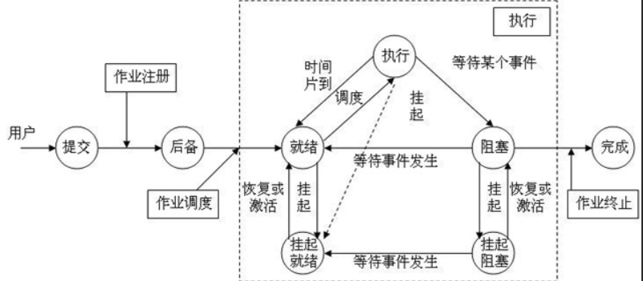

# 处理器调度（重点）

## 处理机调度的层次

### 概念

作业：用户提交的任务

三级调度：

+ 高级调度
+ 中级调度
+ 低级调度

三级调度模型图：

**扩展：关于三级调度**

参考资料：[操作系统——三级调度（作业、内存、进程）【转】_JosiasAnas的博客-CSDN博客](https://blog.csdn.net/weixin_43528025/article/details/105749896)

注意：高级调度和中级调度的区别：一个是调入，一个是调回。

**一个有味道的例子**
故事背景：现在有很多个人想上厕所，他们面前有一间厕所，厕所里面有三个马桶。
接下来，我们把厕所看作是内存，马桶看作是CPU，现在我们来看看这三种调度与这例子的类比。

- **高级调度：研究怎么让还没进入过厕所的人进入厕所。(厕所外 --> 厕所内，之前一直在厕所外，让“人（作业）”进来)**
- **中级调度：有的人进入了厕所，但是尿不出来，于是他们被赶到了等待区。（作业进来了，进程创建但是被挂起）中级调度就是研究怎么让这些被赶到等待区的人再次回到厕所。 (厕所外 -->厕所内，之前进入过厕所，现在回到厕所，对应挂起进程调回内存)**
- **低级调度：研究怎么给厕所内的人分配马桶。(厕所内 --> 马桶上，对应选择一个进程，分配资源)**

## 选择调度算法的原则

1. 资源利用率
CPU利用率=CPU有效工作时间 / CPU总运行时间
CPU总运行时间=CPU有效工作时间 + CPU空闲等待时间
2. 响应时间
- **提交一个请求到接受到响应** 之间的时间间隔称为响应时间。
- 它是分时系统和实时系统衡量调度性能的一个**重要指标**。

3. 吞吐率
单位时间处理的作业数。
4. 公平性
确保每个用户每个进程获得合理的CPU份额或其他资源份额，不会出现饿死（永久等待）情况。
5. 周转时间
批处理用户从作业提交给系统开始到作业完成为止的时间间隔称为作业周转时间。（**批处理系统衡量调度性能的重要指标**）（等待时间+运行时间）

6. **作业周转与平均周转时间** 
   提交的时刻到完成时刻（系统里 **等待时间和运行时间的和** ）
   提高性能就需要：若干个用户平均作业周转时间和平均带权周转时间最小。
   
   公式（就一平均数公式）：
$$
T=(\sum_{i=1}^nt_{i})/n
$$
7. 作业带权周转时间

   带权周转时间W = 周转时间/运行时间.

   由于周转时间 = 等待时间 + 运行时间，故：

   **带权周转时间总是大于1。**

## 作业和进程的关系

作业管理任务：

- 作业组织

- 作业调度

- 运行控制

作业是任务实体，进程是完成任务的执行实体。没有作业任务，进程无事可做；没有进程作业任务无法完成。

## 作业的管理和调度

### 作业控制块

JCB(作业控制块）
其主要包括：

- 作业情况
- 资源需求
- 资源使用情况

和PCB：（没找到对应关系，待补）

PCB 包含三类信息：
- 标识信息
- 现场信息
- 控制信息

### 作业的生命周期：

- 输入
- 后备
- 执行
- 完成

### 批作业调度

- 选择作业
- 分配资源
- 创建进程
- 作业控制
- 后续处理

作业调度与进程调度的关系以及作业和进程的状态转换⬆

# 调度算法（重要必须掌握）

## 低级调度的功能和类型

### 主要功能

调度程序两项任务：调度和分派
调度：什么时候放弃CPU，选择哪个进程/线程执行/放弃
分派实现调度机制，选择：提供资源；放弃：收回资源

进程/线程调度机制通常由两个程序模块组成：

- 队列管理程序：队列管理程序将进程或线程的指针放入队列中，并可以计算优先级备用
- 上下文切换程序：负责进程/线程切换
- 分派程序：从就绪队列中选择下个运行进程

### 基本类型

- 剥夺式；
  1. 高优先级剥夺低优先级
  2. 运行进程/线程时间片用完后剥夺
- 非剥夺式：
  1. 先来先服务算法
     + 例题参考 P97
  2. 最短作业优先算法
  3. 最短剩余时间优先算法
  4. 最高响应比优先算法
  5. 优先级调度算法
  6. 轮转调度算法
  7. 多级反馈队列调度

