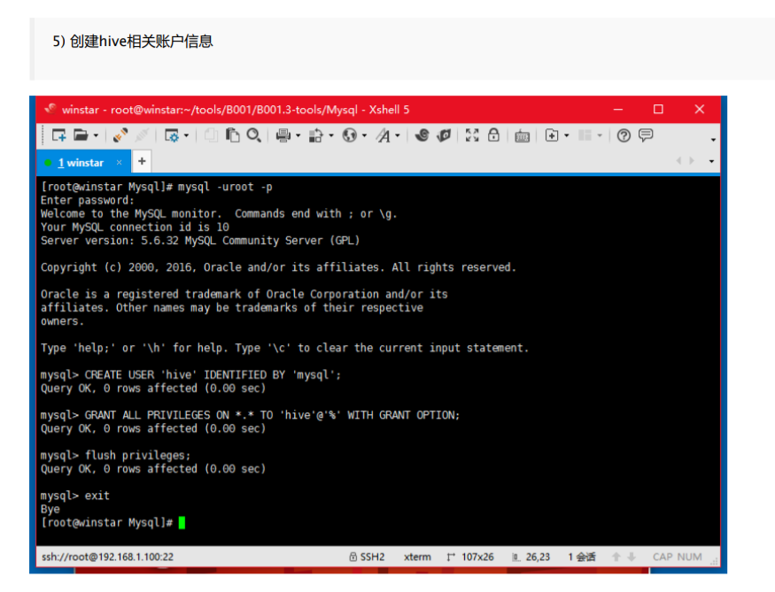
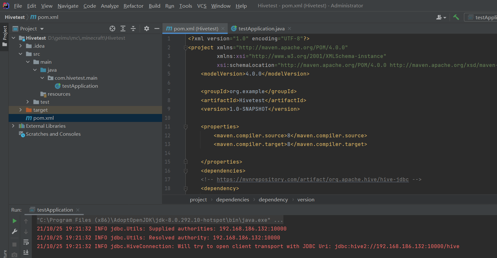

# Hadoop Hive作业 + 避坑

## 前言

由于有人强烈要求我加速更新Hive，故先更新一下Hive。

观察的时候发现了它有一些小坑，帮各位避坑一下；另外，本教程准备：

+ idea(开发工具) + OpenJDK8[理论上jdk1.8即可] (电脑)
+ 虚拟机内均按照老师的配置进行配置。(文件上传到最后)

补：注意有些朋友遇到了


的问题，这是因为我的问题，我的表好像导入出了问题导致表头输入变成了null，而直接使用下面的教程进行导入，会导入成功这个值，解决方案有两个：

1. MySql导入表之后，将所有的表都改成varchar 255类型

2. 将代码判断空的地方改成判断是否对应，如改成这样：

   

## 虚拟机配置

虚拟机配置需要注意几个坑人的问题：

1. MYSQL启动问题：

直接启动MYSQL的方式:

```bash
mysqld start
```

但是如果你使用的root账户，需要用这种方式启动：

```bash
mysqld start --user=mysql
```

否则你将会无法启动，这是因为mysql不建议用root用户启动。使用这种方式就可以规避。

 	2. mysql设置密码问题



登录下面的hive账号时，将会找你要密码。密码为：mysql。

这是由：

```sql
CREATE USER 'hive' IDENTIFIED BY 'mysql'
```

设定的。（我数据库学的不好）

**我后面的教程因为没注意这个，将所有的密码都改成了123456，请注意此处的不同，因为懒，我不打算改密码回去了。**

3. 防火墙问题

因为一会儿要使用各种端口，所以在此之前建议先关闭防火墙。关闭方式：

```bash
./etc/init.d/iptables stop
```

如果你的10000端口连不上，先试试它。

4. hadoop 的Safe Mode

注意！HIVE连接hadoop的时候必须保证safe mode关闭！

建议每次重启都敲一遍。

再次强调！因为这个报错有的时候日志不显示！

```bash
hadoop dfsadmin -safemode leave
```

## 题目解析


首先将数据导入到Hive中。

### 虚拟机部分——HIVE配置

到此本人默认您已将您的hive和mysql连接完毕。您的hive已经可以正常使用。本人没有兴趣重复造老师的轮子。

接下来将数据导入到hive中。

注意到老师提供的文件：


fligh-table就是我们的导入文件，我们首先打开它看看：

```sql
CREATE TABLE IF NOT EXISTS FlightInfo1987(
Year SMALLINT, Month TINYINT, DayofMonth TINYINT, DayOfWeek TINYINT,
DepTime SMALLINT, CRSDepTime SMALLINT, ArrTime SMALLINT, CRSArrTime SMALLINT,
UniqueCarrier STRING, FlightNum STRING, TailNum STRING,
ActualElapsedTime SMALLINT, CRSElapsedTime SMALLINT,
AirTime SMALLINT, ArrDelay SMALLINT, DepDelay SMALLINT,
Origin STRING, Dest STRING,Distance INT,
TaxiIn SMALLINT, TaxiOut SMALLINT, Cancelled SMALLINT,
CancellationCode STRING, Diverted SMALLINT,
CarrierDelay SMALLINT, WeatherDelay SMALLINT,
NASDelay SMALLINT, SecurityDelay SMALLINT, LateAircraftDelay SMALLINT)
COMMENT 'Flight InfoTable'
ROW FORMAT DELIMITED
FIELDS TERMINATED BY ','
LINES TERMINATED BY '\n';

LOAD DATA INPATH 'input/1987_600.csv' INTO TABLE FlightInfo1987;
SELECT * FROM FlightInfo1987 LIMIT 5;
```

你要敢直接用这个代码，你就会知道啥叫人生险恶：

这个代码没有管表头也没有管表位置，所以直接用会导致一点数据都得不到。

我们将代码改成这个样子：

```sql
use flight;
CREATE TABLE IF NOT EXISTS FlightInfo1987(
Year string, Month string, DayofMonth string, DayOfWeek string,
DepTime string, CRSDepTime string, ArrTime string, CRSArrTime string,
UniqueCarrier STRING, FlightNum STRING, TailNum STRING,
ActualElapsedTime string, CRSElapsedTime string,
AirTime string, ArrDelay string, DepDelay string,
Origin STRING, Dest STRING,Distance string,
TaxiIn string, TaxiOut string, Cancelled string,
CancellationCode STRING, Diverted string,
CarrierDelay string, WeatherDelay string,
NASDelay string, SecurityDelay string, LateAircraftDelay string)
COMMENT 'Flight InfoTable'
ROW FORMAT DELIMITED
FIELDS TERMINATED BY ','
LINES TERMINATED BY '\n';

LOAD DATA INPATH 'input/1987_600.csv' INTO TABLE FlightInfo1987;
SELECT * FROM FlightInfo1987 LIMIT 5;

```


首先我们在**这个文件所在文件夹**，打开hive：


之后使用hive数据库（这个数据库是之前跟着操作的话就会建立的）

输入

```sql
CREATE DATABASE flight;
```

之后输入：

```SQL
USE flight;
```

进入这个数据库。

之后输入：

```sql
source fligh-table.hql;
```

报错：


去BP002.2-data文件夹，将这个1987_600.csv推送到input内：

```bash
 hadoop dfs -put 1987_600.csv input/1987_600.csv
```

回到BP002.3-tools文件夹，重新启动hive并运行脚本（上面的三个操作）

运行结束大概是这样的：


之后尝试一下使用类SQL的语句进行测试：

```SQL
select DayOfWeek, count(*) from FlightInfo1987 group by DayOfWeek;
```


得到结果如图（注：NULL是因为DayOfWeek不是Tinyint,这个导入将他设定为tinyint就会丢数据，无伤大雅，一会儿就处理掉了。

这里处理结束后，说明hive已经配置完毕，接下来 **关闭防火墙（参考上面虚拟机配置的方式）**。

之后我们还需要对虚拟机增加一点配置：

进入到SSH里：

首先创建hive用户：

```bash
useradd hive
```

创建了扔一边就行了，这是为了过hadoop的hdfs检查。

之后给/tmp权限，让hive可以写入文件：

```bash
hadoop dfs -chmod -R 777 /tmp
```

完成之后并敲如下命令：

```bash
hive --service hiveserver2
```


敲下之后，这里什么都不会发生，不会报错，不会出现任何输出，什么都没有。

最小化这个ssh，这么放着就OK，这是启动服务，如果你关闭这个窗口，服务就消失了。

这样配置就完成了。

### 客户机部分——麻烦的电脑端

#### MAVEN引入Hive包

首先我默认您电脑上有MySQL。这个实训老师也折腾，咱们老师也折腾的玩意，我懒得再折腾一遍了。

如果您确实已经忘记了MySQL的配置环境，烦请百度一下。

之后请确定您的MYSQL的版本。本教程使用版本8，如果您使用的是版本5，可能需要修改Maven的对应。

全部完成后，打开idea，新建一个maven项目，不使用任何模板。



之后打开新建的文件，打开pom.xml，在</properties>标签下添加如下内容:

```xml
    <dependencies>
    <!-- https://mvnrepository.com/artifact/org.apache.hive/hive-jdbc -->
    <dependency>
        <groupId>org.apache.hive</groupId>
        <artifactId>hive-jdbc</artifactId>
        <version>0.14.0</version>
    </dependency>
        <!-- https://mvnrepository.com/artifact/org.apache.hadoop/hadoop-common -->
        <dependency>
            <groupId>org.apache.hadoop</groupId>
            <artifactId>hadoop-common</artifactId>
            <version>0.22.0</version>
        </dependency>
    </dependencies>
```

之后更新，让它下载这些环境。

完成后新建一个包，并新建一个主函数。

我们的目标是首先测试是否能够成功对接，在主函数里写：

```java
 public static final String driverName = "org.apache.hive.jdbc.HiveDriver";
    public static final String HOST = "192.168.1.100:10000";
    public static final String DATABASE = "hive";
    public static final String URL = "jdbc:hive2://" + HOST + "/" + DATABASE;
    public static void main(String[] args) throws SQLException, ClassNotFoundException {
        //使用hiveserver2进行配置
        Class.forName(driverName);
        //账号密码，配置在hive里
        Connection conn = DriverManager.getConnection(URL, "hive", "mysql");
        Statement stmt = conn.createStatement();
        //添加mysql包，之后获得的hive部分就直接送进mysql.
```

注意：这里的配置“hive","mysql"是hive 的连接账号和密码。

之后根据指示引入java包和添加异常检查，最后大概长这样：

```java
package com.hivetest.main;


import java.sql.Connection;
import java.sql.DriverManager;
import java.sql.SQLException;
import java.sql.Statement;

public class testApplication {
    //hive2
    public static final String driverName = "org.apache.hive.jdbc.HiveDriver";
    public static final String HOST = "192.168.186.132:10000";
    public static final String DATABASE = "flight";
    public static final String URL = "jdbc:hive2://" + HOST + "/" + DATABASE;
    public static void main(String[] args) throws SQLException, ClassNotFoundException {
        //使用hiveserver2进行配置
        Class.forName(driverName);
        //账号密码，配置在hive里
        Connection conn = DriverManager.getConnection(URL, "hive", "123456");
        Statement stmt = conn.createStatement();
        //添加mysql包，之后获得的hive部分就直接送进mysql.

    }
}
```

**（注意：不要直接复制我的代码，我的hadoop出了问题，使用的nat方式，用的IP和你们的不一致，你们用192.168.1.100）**

之后回到idea，运行这个程序：


如果提示的都是INFO，说明连接成功。

之后一番修改之后，代码是这样的：

```java
package com.hivetest.main;


import java.sql.*;

public class testApplication {
    //hive2
    public static final String driverName = "org.apache.hive.jdbc.HiveDriver";
    public static final String HOST = "192.168.186.132:10000";
    public static final String DATABASE = "flight";
    public static final String URL = "jdbc:hive2://" + HOST + "/" + DATABASE;
    public static void main(String[] args) throws SQLException, ClassNotFoundException {
        //使用hiveserver2进行配置
        Class.forName(driverName);
        //账号密码，配置在hive里
        Connection conn = DriverManager.getConnection(URL, "hive", "123456");
        Statement stmt = conn.createStatement();
        //获取星期数据（直接使用之前测试的内容）
        String hql = "select DayOfWeek, count(*) from FlightInfo1987 group by DayOfWeek";
        //使用结果集保存数据（和MySql基本一致）
        ResultSet resultSet = stmt.executeQuery(hql);
        while(resultSet.next())
        {
            //处理获取第一行是不是DayOfWeek(如果是，返回的null?好奇怪，有人能解释一下为什么吗)
            String week = resultSet.getString(1);
            if(week!=null)
                System.out.println( week + "\t" + resultSet.getInt(2));
        }
        //group by分组并用sum函数对一组中的distance变量下的数据进行求和
        hql = "select uniquecarrier, flightnum, sum(distance) from FlightInfo1987 group by uniquecarrier,flightnum";
        resultSet = stmt.executeQuery(hql);
        while(resultSet.next())
        {
            //使用distance进行判断。同样的问题，这个null是什么情况……？
            if(resultSet.getString(3)!=null)
                System.out.println(resultSet.getString(1) + resultSet.getString(2) + "\t" + resultSet.getString(3));
        }
        resultSet.close();
        stmt.close();
        conn.close();
    }
}
```

这个代码没啥大难度，就是sql语句又被反复拿过来用。

#### 对接MYSQL

到这里我们已经可以获取输出了，接下来就是将输出变成放进mysql里。

引入mysql 驱动包：（我引入的是8，因为我电脑上的是8，你们自行对应你们自己的）

```xml
        <!-- https://mvnrepository.com/artifact/mysql/mysql-connector-java -->
        <dependency>
            <groupId>mysql</groupId>
            <artifactId>mysql-connector-java</artifactId>
            <version>8.0.26</version>
        </dependency>
```

之后写上mysql的部分后，代码变成了这样（具体看注释，mysql一个很简单的PrepareStatement，使用表来存放键值对，然后输入进去。建表的时候忘了考虑以后的处理，每次测试一次都得手动删一遍表，你们谁爱改改就改改吧，没那精力了，数据库学的确实不怎么样……）

建表：（保存成SQL文件，Navicat导入即可）

```SQL
/*
Navicat MySQL Data Transfer

Source Server         : asd
Source Server Version : 80022
Source Host           : localhost:3306
Source Database       : hive

Target Server Type    : MYSQL
Target Server Version : 80022
File Encoding         : 65001

Date: 2021-10-26 11:44:59
*/

SET FOREIGN_KEY_CHECKS=0;

-- ----------------------------
-- Table structure for flighttable
-- ----------------------------
DROP TABLE IF EXISTS `flighttable`;
CREATE TABLE `flighttable` (
  `flightname` varchar(255) DEFAULT NULL,
  `distance` int DEFAULT NULL,
  `id` int NOT NULL AUTO_INCREMENT,
  PRIMARY KEY (`id`)
) ENGINE=InnoDB AUTO_INCREMENT=248 DEFAULT CHARSET=utf8mb4 COLLATE=utf8mb4_0900_ai_ci;

-- ----------------------------
-- Table structure for weektable
-- ----------------------------
DROP TABLE IF EXISTS `weektable`;
CREATE TABLE `weektable` (
  `week` int DEFAULT NULL,
  `number` int DEFAULT NULL,
  `id` int NOT NULL AUTO_INCREMENT,
  PRIMARY KEY (`id`)
) ENGINE=InnoDB AUTO_INCREMENT=10 DEFAULT CHARSET=utf8mb4 COLLATE=utf8mb4_0900_ai_ci;
```

代码：hive流程完毕之后即为所需代码

```java
        //使用hiveserver2进行配置
        Class.forName(driverName);
        //添加MySql驱动
        Class.forName(MySQLName);
        //账号密码，配置在hive里
        Connection conn = DriverManager.getConnection(URL, "hive", "123456");
        Statement stmt = conn.createStatement();
        //获取MySQL的connection
        Connection mysqlconn = DriverManager.getConnection(MySQLURL, "root", "password");
        //忘了还有个preparedStatement,真郁闷！
        //两个用来保存数据的TreeMap。
        TreeMap<Integer, Integer> weekana = new TreeMap<Integer, Integer>();
        TreeMap<String, Integer> flightnumana = new TreeMap<>();
        //获取星期数据（直接使用之前测试的内容）
        String hql = "select DayOfWeek, count(*) from FlightInfo1987 group by DayOfWeek";
        //使用结果集保存数据（和MySql基本一致）
        ResultSet resultSet = stmt.executeQuery(hql);
        while (resultSet.next()) {
            //处理获取第一行是不是DayOfWeek(如果是，返回的null?好奇怪，有人能解释一下为什么吗)
            String week = resultSet.getString(1);
            if (week != null)
                //输入到weekana的表内
                weekana.put(Integer.parseInt(week), resultSet.getInt(2));
            System.out.println(week + "\t" + resultSet.getInt(2));
        }
        //group by分组并用sum函数对一组中的distance变量下的数据进行求和
        hql = "select uniquecarrier, flightnum, sum(distance) from FlightInfo1987 group by uniquecarrier,flightnum";
        resultSet = stmt.executeQuery(hql);
        while (resultSet.next()) {
            //使用distance进行判断。同样的问题，这个null是什么情况……？
            if (resultSet.getString(3) != null)
                //添加到flightnumana内
                flightnumana.put(resultSet.getString(1) + resultSet.getString(2), Integer.parseInt(resultSet.getString(3)));
            System.out.println(resultSet.getString(1) + resultSet.getString(2) + "\t" + resultSet.getString(3));
        }
        resultSet.close();
        stmt.close();
        conn.close();

        //hive流程完毕，开始mysql流程（下面的都没有考虑多次插入，到时候手动清理一遍表得了，懒得多写了，烦死了）
        String my_sql = "INSERT INTO `weektable` (`week`, `number`) VALUES (?, ?)";
        PreparedStatement pstmt = mysqlconn.prepareStatement(my_sql);
        //遍历整个week表获取key-value。
        Integer key = null;
        Integer integ = null;
        for (Integer integer : weekana.keySet()) {
            // 获取key
            key = integer;
            // 根据key，获取value
            integ = (Integer) weekana.get(key);
            //输入到pstmt,并添加最后的验证输入（防止插入两遍，测试用的）
            pstmt.setInt(1, key);
            pstmt.setInt(2, integ);
            //提交请求并commit(自动commit开着，很奇怪，这是啥的设定？不用写xxx.commit()了？
            int result = pstmt.executeUpdate();
        }
        //提交请求并commit(自动commit开着，很奇怪，这是啥的设定？不用写xxx.commit()了？

        //插入第二个表
        String my_sql2 = "INSERT INTO `flighttable` (`flightname`, `distance`) VALUES (?, ?)";
        pstmt = mysqlconn.prepareStatement(my_sql2);
        //遍历整个flight表获取key-value。
        String key2 = null;
        Integer integ2 = null;
        for (String s : flightnumana.keySet()) {
            // 获取key
            key2 = s;
            // 根据key，获取value
            integ2 = (Integer) flightnumana.get(key2);
            //插入第二个表
            pstmt.setString(1, key2);
            pstmt.setInt(2, integ2);
            //提交请求并commit(自动commit开着，很奇怪，这是啥的设定？不用写xxx.commit()了？
            int result2 = pstmt.executeUpdate();
```

最后结果如下：


#### Web端实现

真的会有人做到我现在这一步么……没有吧，不可能有的吧，有的人怎么会看我的博客呢，他们自己就会做了，用不到我哇。

实现它如果还用什么TOMCAT和Spring，未免有点太大材小用，杀鸡用牛刀了点，就输出个数据而已，duck不必。

网上搜了搜“轻量web框架”，找到一个什么NanoHTTPD的，正好顺手用一用，教程还算全。

参考：[NanoHTTPD指南 | 码农家园 (codenong.com)](https://www.codenong.com/b-nanohttpd/)

首先我们先按照要求引入包：

```XML
<dependency>
    <groupId>org.nanohttpd</groupId>
    <artifactId>nanohttpd</artifactId>
    <version>2.3.1</version>
</dependency>
```


之后按照要求，实现这个HTTPD服务：

新建一个class，并且按它的说明扩展方法：


之后我们回到主函数新建一个SimpleHttpServer对象：


测试运行：


并且确定有这个的时候程序不会自动关闭：


之后我们稍加修改，让他输出我们需要的内容。为了方便直接拼凑一个HTTP很方便。

首先从菜鸟教程那里弄一个框架：


代码拿下来

```html
<!DOCTYPE html>
<html>
<head>
<meta charset="utf-8">
<title>结果报告</title>
</head>
<body>
	<h1>航班统计</h1>
  <table border="1">
    <tr>
      <td>WEEK</td>
      <td>NUM</td>
      </tr>
    <tr>
  <td>400</td>
  <td>500</td>
</tr>
    </table>
  <h1>航班统计2</h1>
    <table border="1">
    <tr>
      <td>FLIGHTNUM</td>
      <td>DISTANCE</td>
      </tr>
    <tr>
  <td>400</td>
  <td>500</td>
</tr>
    </table>
</body>
</html>
```

一番拼凑之后……代码如下：

```java
package com.hivetest.main;

import fi.iki.elonen.NanoHTTPD;

import java.io.IOException;
import java.sql.*;

import static com.hivetest.main.testApplication.MySQLName;
import static com.hivetest.main.testApplication.MySQLURL;

//用于完成Web部分
public class SimpleHTTPServer extends NanoHTTPD {

    public SimpleHTTPServer(int port) throws IOException {
        //设置端口为8080
        super(8080);
        //在这个类被新建的时候，立即启动HTTPD Server
        start(NanoHTTPD.SOCKET_READ_TIMEOUT, false);
    }
    @Override
    public Response serve(IHTTPSession session) {

        //表格前半部分
        String headstr = "<!DOCTYPE html>\n" +
                "<html>\n" +
                "<head>\n" +
                "<meta charset=\"utf-8\">\n" +
                "<title>结果报告</title>\n" +
                "</head>\n" +
                "<body>\n" +
                "\t<h1>航班统计</h1>\n" +
                "  <table border=\"1\">\n" +
                "    <tr>\n" +
                "      <td>WEEK</td>\n" +
                "      <td>NUM</td>\n" +
                "      </tr>";

        String sql = "SELECT " +
                "weektable.`week`, " +
                "weektable.number " +
                "FROM " +
                "weektable";
        String sql2 = "SELECT " +
                "flighttable.flightname," +
                "flighttable.distance " +
                "FROM " +
                "flighttable";
        //表格中段，需要自己添加从SQL里取到的数据，这个程序写的很乱，应该把DB单独拿出来的，不过现在说也没啥意思了。
        StringBuilder sheet = new StringBuilder();
        StringBuilder sheet2 = new StringBuilder();
        try {
            Class.forName(MySQLName);
            Connection sqlcon = DriverManager.getConnection(MySQLURL, "root", "password");
            PreparedStatement pstmt = sqlcon.prepareStatement(sql);
            PreparedStatement pstmt2 = sqlcon.prepareStatement(sql2);
            ResultSet rs = pstmt.executeQuery();
            ResultSet rs2 = pstmt2.executeQuery();
            while (rs.next()) {
                sheet.append("<tr>").append("<td>").append(rs.getInt(1)).append("</td>").append("<td>").append(rs.getInt(2)).append("</td>").append("</tr>");
            }

            rs.close();
            pstmt.close();
            while (rs2.next()) {
                sheet2.append("<tr>").append("<td>").append(rs2.getString(1)).append("</td>").append("<td>").append(rs2.getInt(2)).append("</td>").append("</tr>");
            }
            pstmt2.close();
            rs2.close();
            sqlcon.close();
        } catch (ClassNotFoundException | SQLException e) {
            e.printStackTrace();
        }

        String weeksheet = sheet.toString();
        String flightsheet = sheet2.toString();
                String centerstr = "</tr>" +
                " </table>\n" +
                "  <h1>航班统计2</h1>\n" +
                "    <table border=\"1\">\n" +
                "    <tr>\n" +
                "      <td>FLIGHTNUM</td>\n" +
                "      <td>DISTANCE</td>\n" +
                "      </tr>\n" +
                "    <tr>";
        String laststr = "</tr>\n" +
                "    </table>\n" +
                "\n" +
                "</body>\n" +
                "</html>";
        String allstr = headstr + weeksheet + centerstr + flightsheet + laststr;
        return newFixedLengthResponse(allstr);
    }
}
```


整体项目给大家放在了末尾。SQL语句自己往上面翻翻吧。

 [Hivetest.zip](..\..\src\assets\Hivetest.zip) 