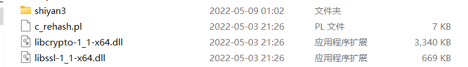
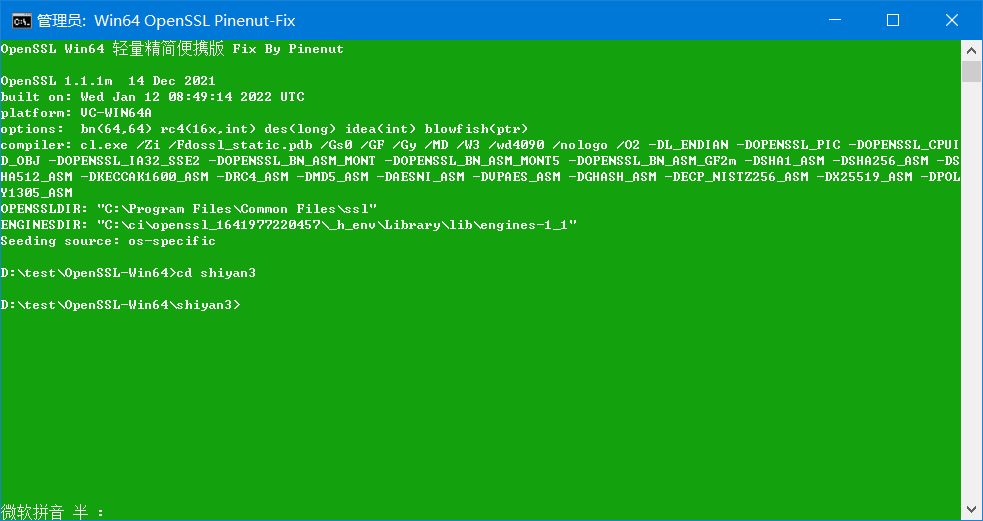
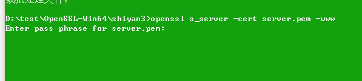

# 数据库安全3

## 要求

（1）熟悉公钥加密与PKI的概念，本实验包含公钥加密，数字签名，公钥认证，认证授权，基于PKI授权等内容。

（2）使用openssl 命令行工具或者写程序的方式建立基于PKI的安全信道。

## 前言

该实验基于实验1的Win64OpenSSL来做。如果您拥有linux，可以直接使用下方的openssl命令。

## 开始

新建shiyan3文件：



双击并启动OpenSSL，并使用

```bash
cd shiyan3
```

进入实验3文件夹：



### 拷贝配置文件


将openssl的dir进行选中，然后右键复制。

我已经给你们复制好了，如果一样的可以直接用：

```bash
C:\Program Files\Common Files\ssl
```

随便打开我的电脑或者文件夹，将这个地址粘贴到地址栏：


敲回车，之后寻找这个文件：


将这个openssl.cnf复制下来，粘贴到shiyan3文件夹内。

在shiyan3文件夹内，用记事本打开openssl.cnf


修改如图所示的位置：


之后保存。

保存完毕后，在shiyan3目录下新建文件夹和文件，到我如图所示为止（注意别敲错了！）

首先新建一个demoCA文件夹：


打开demoCA文件夹：


新建certs,crl,newcerts文件夹：


新建index.txt和serial.txt


打开serial.txt，输入一个四位数：


于是最后变成这样子。

### 成为数字证书认证机构CA

输入如下指令：

```bash
openssl req -new -x509 -keyout ca.key -out ca.crt -config openssl.cnf
```


输入CA密码，注意，这里和后面会出现两个密码，一个我称为CA密码，一个我直接称为密码，如果您怕弄混，可以全部输入一样的。

这里的密码输入不会显示。


输入两次后开始输入信息（注：那个中括号里的就是示例，比如上图里的AU就是示例。)：

第一个是国家名称，要求是2个字母：

第二个是省名，有个名字就行：


如图所示。

创建好后，检查文件夹：


可以找到ca.crt和ca.key。

### 签发服务器证书

签发服务器证书前，我们首先要有一个假域名。

我们此处以firehomework.niubi为例子：

首先打开hosts文件，将下面的地址复制下来：

```bash
C:\Windows\System32\drivers\etc
```

同样的随便打开个文件夹将路径粘贴进去：


用记事本打开hosts文件：


如图所示，注意我这里自己添加过一些破解的信息，所以这里不一样是正常的不必惊慌。

我们在下面添加如下一行：


保存文件。

#### 生成key

在刚刚的openssl（您没有关掉它吧？关了也没关系……）内输入如下指令：

```bash
openssl genrsa -des3 -out server.key 1024
```

输入密码（注意，这里是和CA密码不同的，但您当然可以输入相同的）：


完成后查看文件夹：


多出了server.key文件。

#### 生成对应证书

输入如下指令：

```bash
openssl req -new -key server.key -out server.csr -config openssl.cnf
```

之后会让你输入密码。


之后这些东西你可以随便填（上方配置里已经针对此进行了修改防止你输入错误）

但是有一个需要注意的：


就是这个Common Name，**必须输入那个域名！**


如图所示

#### 签发证书

输入该命令：

```bash
openssl ca -in server.csr -out server.crt -cert ca.crt -keyfile ca.key -config openssl.cnf
```

之后输入CA密码：


之后输入y

再y


看到如图所示就是成功。


之后可以看到这两个证书：


双击可以打开：


### 构建简易测试平台


将该文件复制一份，并命名为server.pem。如果您的不显示后缀名，请您自行寻找显示后缀名的方法。


使用记事本打开server.pem和server.key，如图：


在pem后面再敲一下空格，然后把server.key的内容全部复制进去，如图：


之后保存server.pem文件。

完成后，在openssl内输入：

```bash
openssl s_server -cert server.pem -www
```



之后输入密码。


允许访问。

之后输入：

https://firehomework.niubi:4433/

注意：https:// 不能丢这个头，因为它不会自己补。

如果您用的Chrome浏览器，可能就会报错，我建议使用IE浏览器，因为这个生成方式，证书并不能完全的通过验证。

![image-20220509013239358](../../src/assets/img/image-20220509013239358.png


接下来我们安装证书：


找到ca.crt双击，点击安装证书


导入之后，从IE打开就是这样的：


如果提示变成了这个：


说明证书安装成功了，但是我们的证书生成的确实是有问题，我也懒得重新生成导致的。

据说火狐浏览器就能通过，我自测IE能通过就没管。

这个真要解决也好办：

https://www.dyxmq.cn/network/err_cert_common_name_invalid.html

照着操作一下就好。

我反正是懒惰的很，交给你们了。
