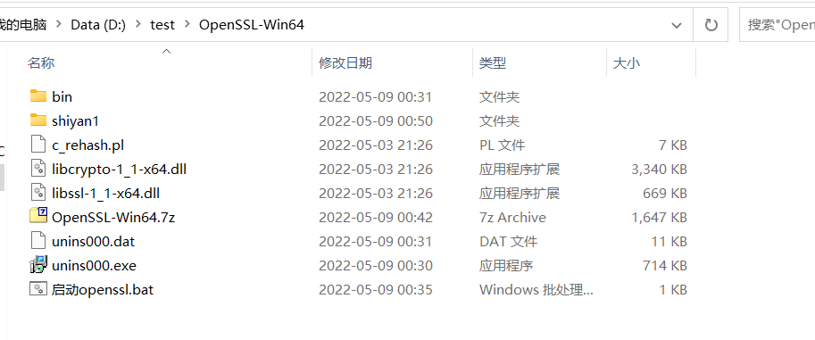
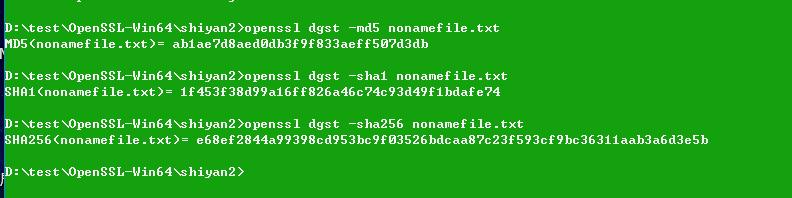
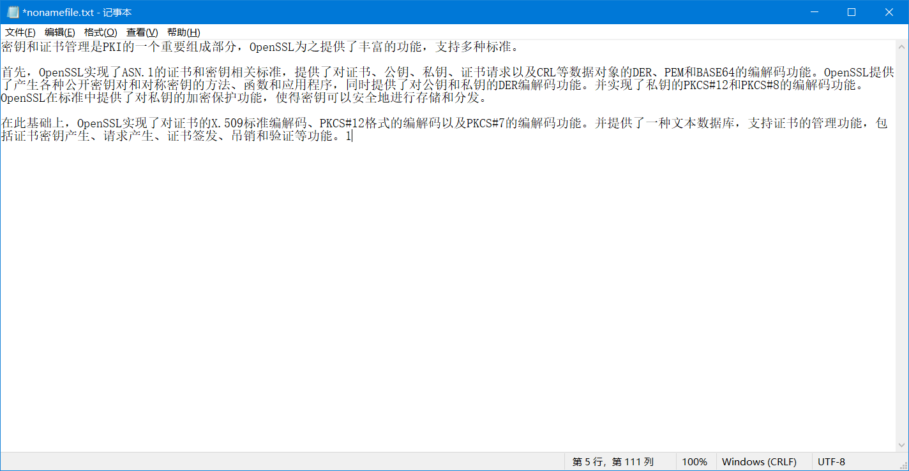
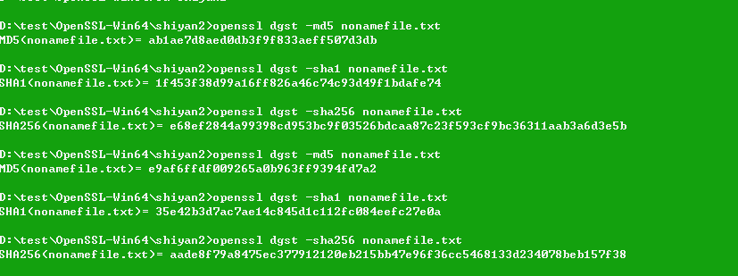
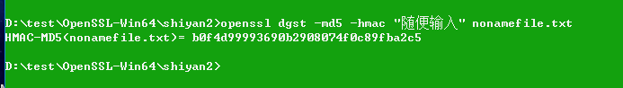
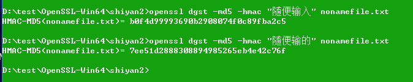
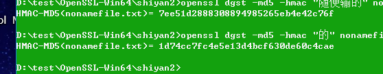

# 数据库安全实验2

熟悉单向哈希函数以及消息认证码（MAC），使用工具或者编程为一段指定的信息生成哈希值以及消息认证码。（使用Linux系统的openssl命令行工具及开发库）

## 前言

其实现使用了实验1的Win64OpenSSL。注意，您可以在Linux里随意复现这些操作。

## 实验



在文件目录下创建shiyan2文件夹。

双击启动openssl并输入

```bash
cd shiyan2
```

在shiyan2下新建一个文件并写入一些数据：


## 进行测试

使用-md5,-sha1,-sha256算法，分别进行计算，得到消息摘要：

```bash
openssl dgst -md5 nonamefile.txt
openssl dgst -sha1 nonamefile.txt
openssl dgst -sha256 nonamefile.txt
```

结果如图所示：



接下来进行修改：在文件最后添加一个字符：



重新运行上面的命令：



可以看到，之前和之后的文件，消息摘要发生了巨大的变化。

## 生成消息认证码

```bash
openssl dgst -md5 -hmac "随便输入" nonamefile.txt
```



我们对参数进行一些修改：

```bash
openssl dgst -md5 -hmac "随便输的" nonamefile.txt
```



可以发现和之前不同并发生较大变化。

将对应的参数进行删减：

```bash
openssl dgst -md5 -hmac "的" nonamefile.txt
```



生成的串长度不变。