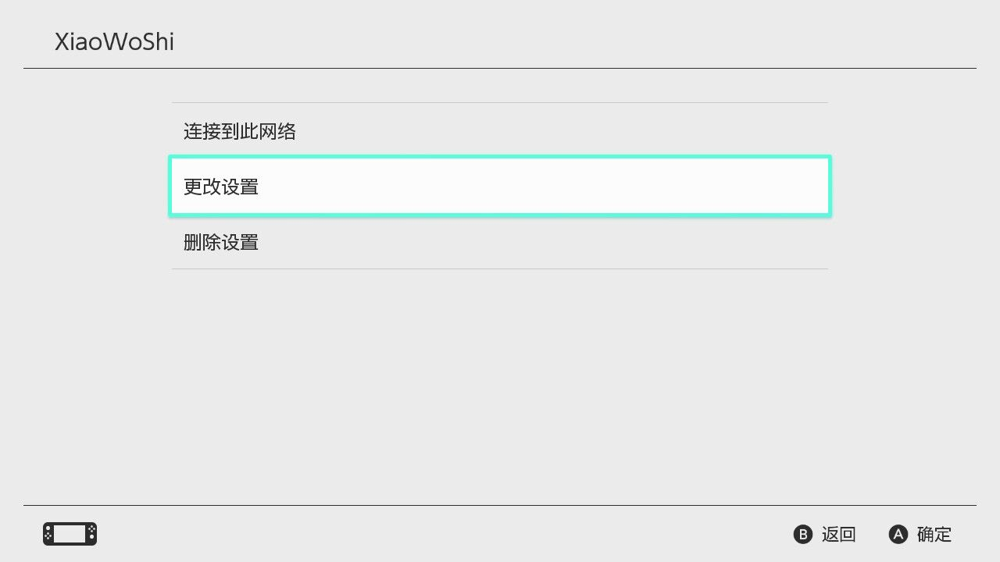

记录时间：2022-08-24 21:42

第一步：安装必备组件：

解压我的软件目录

然后打开软件文件夹：

双击第一个，并安装：

如图所示勾选：

完成之后，安装第二个运行库.net6.0:

点击安装即可，没有什么复杂的。

之后安装完毕，打开这个软件：

如图所示：

默认会是我的服务器，模式是pcap2socks，这种情况就是正确的。现在点击启动：

点击启动后这边会显示一个框。

然后你的电脑和你的NS连到同一个WIFI里，确定无误后，到NS上：

到互联网设置处，找到NS连着的WIFI。按一下A，点击更改设置。

点击IP地址设置，切换为手动。刚刚我们点击电脑启动后图里的IP ADDRESS代表IP地址，MASK代表子网掩码，Gateway代表网关，照着抄一遍。

DNS设置无法换成自动，直接点手动，设置223.5.5.5

然后把下面的MTU设置成1500.
点击保存后，再次点击连接到此网络，此时会发现这里多了一句

（Device xxxxx joined the network)
接下来进行网络测试：
您测试到的全球IP地址应该是112.126.67.230，NAT类型为A，此时极度适合联机。
注意：当你不需要加速游戏而需要更新的时候，请把网络设置调整回自动。否则速度（服务器流量比较小）

需要用的时候就从自动改成手动，它会自动设置原来设置好的内容。