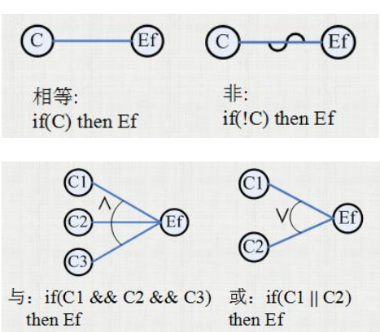
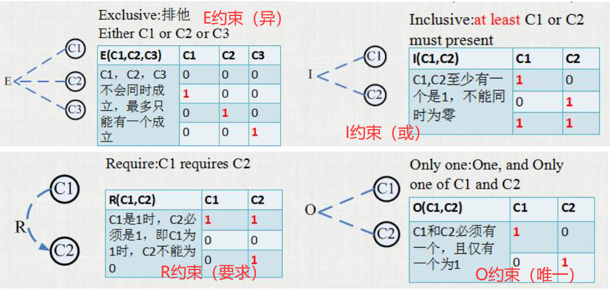
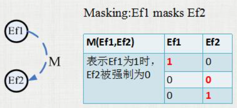

# 因果图

## 概念

因果图法是一种利用图解法分析输入的各种组合情况，从而设计测试用例的方法。

## 优点

+ 考虑多个输入的相互组合/制约关系
+ 指导测试用例的选择，能够指出需求规格说明描述中存在的问题。
+ 能够帮助测试人员按照一定的步骤高效开发测试用例。
+ **因果图可将自然语言说明转化为形式语言的严格方法，可以指出规格说明存在的不完整性和二义性。**

## 因果图的四种基本关系

四种基本关系如下图所示：

其中：

c代表：原因

e代表：结果

i 代表标号。

四种基本关系分别为：

- 恒等：c1为1,e1也为1，否则为0
- 非(～):c1为1，e1为0，否则为1
- 或(∨):c1/c2/c3是1则e1为1，否则为0。
- 与(∧):c1和c2都是1，e1为1,否则为0。

## 因果图的五种约束

因果图的输入状态之间可能存在某些依赖关系，比如一个人或者按下A按钮或者按下B按钮。

此种依赖关系我们称为约束。

输出状态中也存在某些约束。

### 四种输入约束

（**注意使用的是虚线，以及箭头的指向关系！**）

* 箭头：要求/被要求的指向关系。

+ E约束:a和b不能同时为1 (异约束)
+ I约束：a,b,c不能同时为0 (或约束)
+ O约束：a和b必须有一个，且有且仅有一个为1(唯一约束)
+ R约束:a是1时，b必须是1（要求约束）
  E约束包含了O约束，O约束是E约束的子集。
## 输出约束：

+ M约束（强制约束）：结果a是1，则b强制为0

## 设计测试用例步骤（等待学习）

