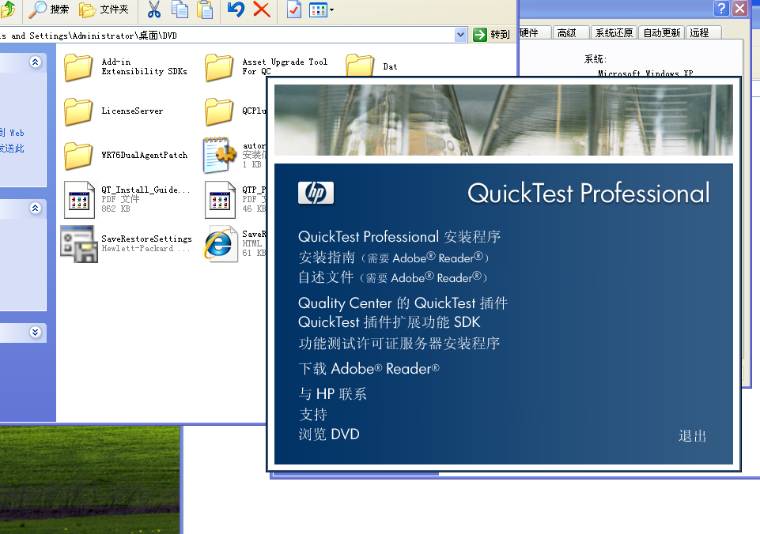
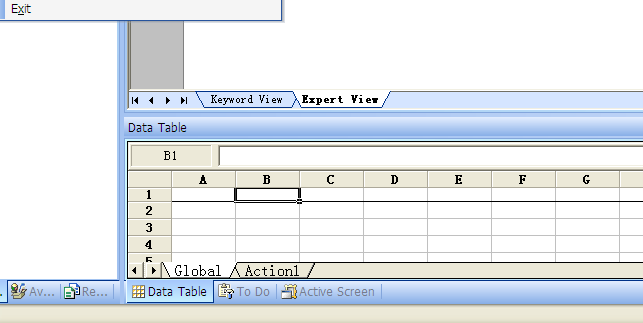

# 前言

注：本次使用仍然为QTP10。使用Windows XP进行测试。

如您使用的是Win7以及QTP11，请参考机构老师的视频。

由于身体原因，更新速度不快，烦请见谅。

## 前置准备

请先下载好：

 [破解文件.zip](../../src/assets/破解文件.zip) 

T6510-15063.zip

（文件太大，只能给百度了）

链接: https://pan.baidu.com/s/1QSqkDg9XPfK3BVwJLQRnrQ 

提取码: dne2 

合成的XP镜像：

链接: https://pan.baidu.com/s/11c4UVggNT4r_uhbT94Xr8Q 

提取码: ehc5 

## 安装Windows XP虚拟机（有可跳过）

为了怀旧安装的是一个自己很喜欢的版本——三叠纪XP SP4。

结果因为手残，折腾半天没折腾好激活QTP（后来才知道为啥，但是，哎，为时已晚，为时已晚呐）

最后换上了专注于Win7大佬做的GhostXP最终版。加上微PE合成了一个新文件这样子。

为什么不用WIN7？一来WIN7镜像比较大，对硬盘不友好，二来WIN7开始有了管理员权限这个麻烦东西，稍不注意就会导致测试啥的出问题，所以不喜欢。

首先加载合成文件的镜像，镜像到上面能找到。

找到之后运行会看到如图所示：


### 创建主分区

首先需要进行分区：

双击分区工具DiskGenius.


右键 - 快速分区


如图顺手分区即可。

注意分区后稍微等待一会儿，否则不会分配盘符，后面会出错。

### 安装GHOST版本

分区之后，找到光盘，打开并拷贝它到软件盘符。（注意不要拷贝到主盘符……）

点击Ghost备份还原：


点击下拉按钮会自动搜索到


之后点击确定，会出来一个框，等他加载完并消失之后，重启即可。


之后就是漫长的等待时间。

### 安装Vmtools

等完事之后，点击Vmware软件 - 虚拟机 - 安装Vmtools，等待。


这里会有一个设备。它名字有的时候显示不清楚，打开看看是不是这样：


如果是，双击setup，一路next即可。

完成后会要求重新启动。话说回来，装了这玩意感觉声音就不正常了（吐槽）

### 安装QTP

首先从上面弄下来破解文件，之后直接拷贝里面的所有文件到D盘：


#### 安装脚本调试器和破解

双击scd10chs然后一路next即可安装脚本调试器。

之后创建如下目录：

C:\Program Files\Common Files\Mercury Interactive\License Manager

把mgn-mqt82丢进去运行。


运行成功之后会生成这个文件。用记事本打开备用。

#### 安装本体

把下载的本体文件拷贝进去运行即可。



第一次点击否：


然后再点击是：


安装一下必备组件什么的。

全部安装完成之后再次弹出：


继续点否


接下来就是一路下一步。路径建议别改，这样后面的脚本你就不用改任何东西了。

安装之后如图：


点击运行，一会儿会出现这个窗口：


从刚刚让你用记事本打开的那个文件里找到第一个#之前的东西，粘贴进去。


继续一路next。


点击关闭，到此安装完成。

## QTP实验 - 拉胯的航班

### 测试什么

本次测试为：测试登录功能，订票功能，传真订单功能，删除订单功能。

和附赠的实例测试的相同。

#### 登录测试

##### 用例设计

根据登录模块的条件：

1. 用户什么也不输入，是否提示输入用户名
2. 只输入名字不输入密码，提示输入密码
3. 密码太短，提示输入密码长度不够
4. 名字太短，提示输入名字长度不够
5. 正确输入，OK进入操作界面

据此进行用例设计：

| 测试编号 |  输 入 | 条 件   | 预期输出                | 实际输出                |
| -------- | -----: | :------ | ----------------------- | ----------------------- |
| ————     | 用户名 | 密码    | ——————                  | ——————                  |
| 001      |     空 | 空      | 提示：输入用户名        | 提示：输入用户名        |
| 002      |     空 | asdsda  | 提示：输入用户名        | 提示：输入用户名        |
| 003      |     空 | mercury | 提示：输入用户名        | 提示：输入用户名        |
| 004      |    sss | 空      | 提示：用户名长度少于4位 | 提示：用户名长度少于4位 |
| 005      |    sss | asdsda  | 提示：用户名长度少于4位 | 提示：用户名长度少于4位 |
| 006      |    sss | mercury | 提示：用户名长度少于4位                      | 提示：用户名长度少于4位 |
| 007 | asdsada | 空      | 提示：输入密码 | 提示：输入密码 |
| 008 | asdsada | asdsda | 提示：密码错误 | 提示：密码错误 |
| 009 | asdsada | mercury | 无提示进入主界面 | 无提示进入主界面 |

##### 测试过程

注：不同于某个Word，这里将会对脚本产生方式进行详细说明。

首先使用QTP进行一次用户名密码的输入录制：

```vbscript
Dialog("Login").WinEdit("Agent Name:").Set "asda"
Dialog("Login").WinEdit("Password:").SetSelection 0,3
Dialog("Login").WinEdit("Password:").SetSecure "6166f2318916990d6bec6c3f25c4e82b73d638f0"
Dialog("Login").WinButton("OK").Click
Dialog("Login").Dialog("Flight Reservations").WinButton("确定").Click
Dialog("Login").WinButton("OK").Click
```

可以看到这些是生成的代码，接下来对他进行修改来循环满足用例设计需求。

首先让他每次都能自动打开待测程序：

```vbscript
systemUtil.Run"C:\Program Files\HP\QuickTest Professional\samples\flight\app\flight4a.exe"
```

之后用

```vbscript
If Dialog("Login").Dialog("Flight Reservations") Then
```

来作为控制每一次的运行的部分。

然后使用dtLocalSheet作为数据来源。并使用

```vbscript
Reporter.ReportEvent micFail和Reporter.ReportEvent micPass
```

进行结果的输出。

首先介绍一下这个dtLocalSheet。在你不录制的时候，可以看到这个：



你点击那个Action1:


就能改到Action1的部分，这就是dtLocalSheet，上面那个A,B,C可以双击之后改：


**这边我们改成了username和password。如果你不改并且照抄我的代码的话，就会不停地崩**

下面就是输入数据的地方。

这样就可以了吗？NONONO，很不幸的是：

出错识别方法没有一个靠谱的识别方式：

```vbscript
err_message=Dialog("Login").Dialog("Flight Reservations").Static("Agent name must be at").GetROProperty("text")
```

这个的方案是：识别Static里包含"Agent must be at"的内容。

我们需要识别各种方式的，但是一番搜索之后……：

```
那如果我就是要获取各种提示框里面的不同提示信息的内容，怎么实现比较好呢，比如飞机订票系统输入用户名或密码有错误时提示信息都会不同，我就是想要获取这不同的提示内容，但是我只能添加一个提示信息的static对象到OR中，再添加别的就不能添加了。如果使用描述性编程的方法的话，我要把各种情况都列出来，感觉有点麻烦，不知道有没有好点的方法。
```

不幸的是，没有。

于是我们需要用一些魔幻的方法来实现我们的目标：

首先让他报错一次：


这次是随便的报错，接下来从这里找到Object Spy。


点击之后我们可以查看到Static：


（鼠标指向）


这是一个static，我们可以看到原本的筛选是靠"text"属性来确定的。


然后根据这种确定方式，我们发现这里面至少有两个Static，一个是那个叹号标识，一个是那个提示信息。

我们拉到values的最底端：


注意到这个x每次都是不变的。我们把x填写到代码里（由于我不确定你们的x和我的x是否一致，所以请自行确定并输入！）

代码如下：

```vbscript
err_message=Dialog("Login").Dialog("Flight Reservations").Static("x:=65").GetROProperty("text")
```

总代码如下：

```vbscript
systemUtil.Run"C:\Program Files\HP\QuickTest Professional\samples\flight\app\flight4a.exe"
Dialog("Login").WinEdit("Agent Name:").Set DataTable("username", dtLocalSheet)
Dialog("Login").WinEdit("Password:").Set DataTable("password", dtLocalSheet)
Dialog("Login").WinButton("OK").Click
If Dialog("Login").Dialog("Flight Reservations").Exist(5)  Then
    Dim err_message
	err_message=Dialog("Login").Dialog("Flight Reservations").Static("x:=65").GetROProperty("text")
	Reporter.ReportEvent micFail, "登录失败","错误信息是： "&err_message
	Dialog ("Login").Dialog("Flight Reservations").WinButton("确定").Click
	Dialog("Login").WinButton("Cancel").Click
	Else
	Reporter.ReportEvent micPass,"登陆成功","登陆成功"
	Window("Flight Reservation").Close
End If
```

接下来输入测试案例：


然后点击Global:


复制一份Action1的进入（这个操作是为了能让它重复这么多次）

进行测试：


测试成功（最后一次成功，其他的失败，正常）

查看错误项：


查看正确项：


测试完毕。

#### 订票测试

##### 用例设计

订票测试要在登录成功之后进行测试。


根据测试情况整理测试：

注意改日期……

| 编号 | 输入                         | 预期结果                                    | 实际结果         |
| ---- | ---------------------------- | ------------------------------------------- | ---------------- |
| 001  | 空                           | 在Fly中选择一个地点，弹出警告信息           | 不能为空的警告   |
| 002  | 10/10/21                     | 在Fly中选择一个地点，弹出警告信息           | 日期要在今天之后 |
| 003  | 13/10/21                     | 在Fly中选择一个地点，弹出警告信息           | 月份要小于13     |
| 004  | 10/32/21                     | 在Fly中选择一个地点，弹出警告信息           | 天要在1-31之间   |
| 005  | 10/31/21                     | 在Fly中选择一个地点，弹出警告信息           | 天要在1-30之间   |
| 006  | 10/25/21                     | 正确                                        | 正确（无提示）   |
| 007  | 空                           | 在Flyto中选择一个地点，弹出警告信息         | Ff不能为空的警告 |
| 008  | Fly From 选择Frankfurt       | 正确                                        | 成功（无提示）   |
| 009  | 空                           | Flights按钮不可用                           | 成功             |
| 010  | Fly to选择 Denver            | Flights按钮可用                             | 成功             |
| 011  | 单击Flights，选择第一个航班  | 在窗口显示航班信息                          | 显示航班信息     |
| 012  | 在Fly to中改选其他航班       | 清空航班信息, Flights按钮不可用，Ft自动清空 | 成功             |
| 013  | 输入名字test,1张票，Economy  | 显示 Price:和  Total:价格                   | 成功             |
| 014  | 输入名字test，2张票，Economy | 显示 Price:和  Total:价格                   | 成功             |

##### 测试过程

首先录制一个简单的成功案例准备进行修改：

点击Record进行录制：


之后填入用户名和密码：


填入时间，Fly from和Fly to.


点击Flights


点击一个Flights Table。


输入名称和订票数，点击订票


录制代码如下：

```vbscript
Dialog("Login").WinEdit("Agent Name:").Set "measdsa"
Dialog("Login").WinEdit("Password:").SetSecure "61684fdc47c246af82ce308ddde96237bb27c843"
Dialog("Login").WinButton("OK").Click
Window("Flight Reservation").WinObject("Date of Flight:").Type "102521"
Window("Flight Reservation").Move 574,328
Window("Flight Reservation").WinComboBox("Fly From:").Select "Denver"
Window("Flight Reservation").WinComboBox("Fly To:").Select "Frankfurt"
Window("Flight Reservation").WinButton("FLIGHT").Click
Window("Flight Reservation").Dialog("Flights Table").WinList("From").Select "14205   DEN   12:57 PM   FRA   01:41 PM   AF     $121.20"
Window("Flight Reservation").Dialog("Flights Table").WinButton("OK").Click
Window("Flight Reservation").WinEdit("Name:").Set "test"
Window("Flight Reservation").WinRadioButton("Economy").Set
Window("Flight Reservation").WinButton("Insert Order").Click
```

接下来修改代码使其可以进行测试：

