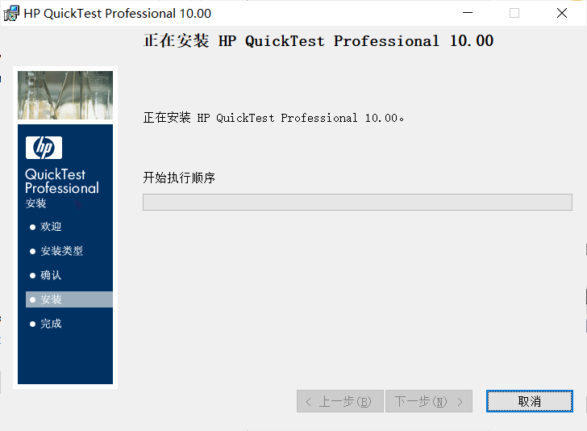
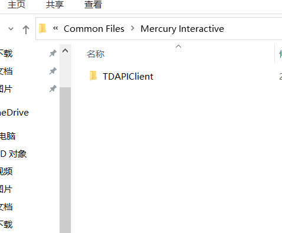
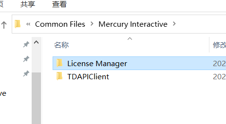
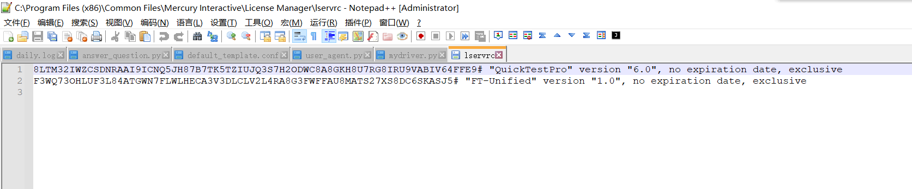
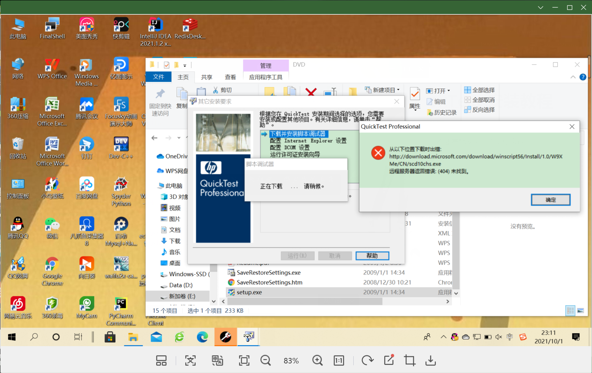
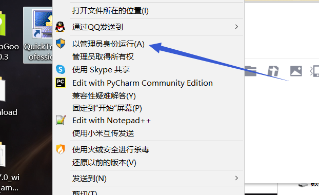
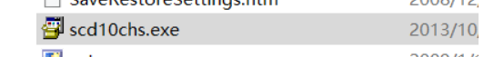
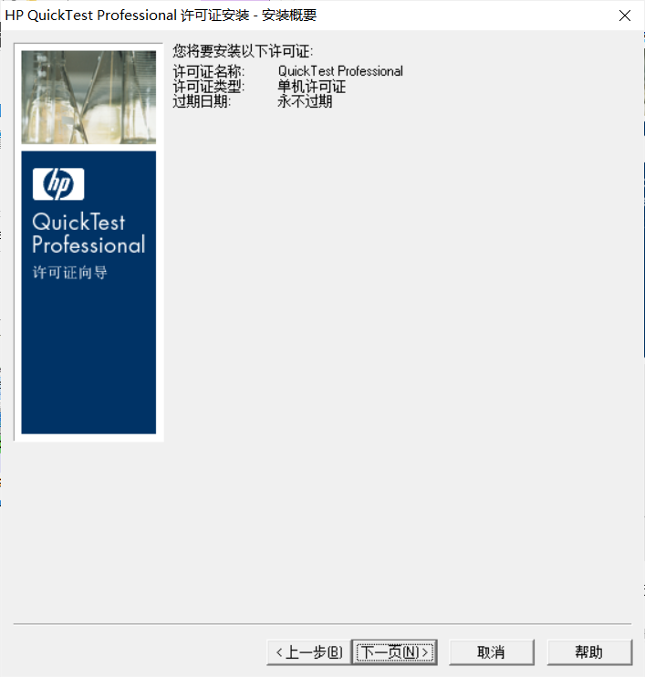
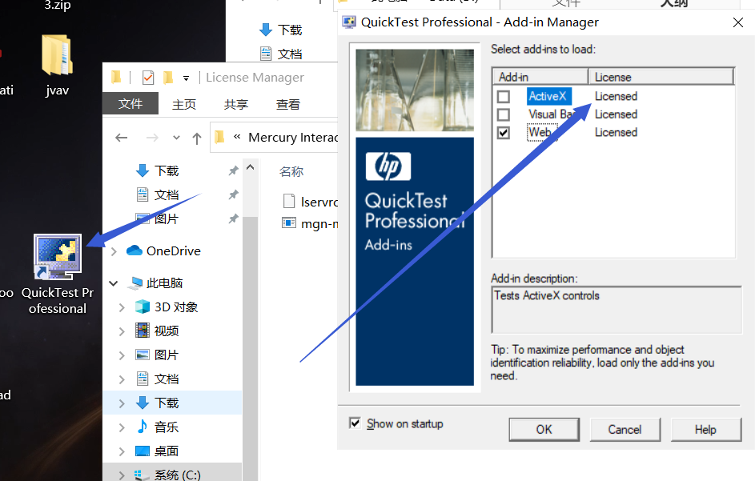

# QuickTest 安装教程

第一步：解压

点击安装程序之后一路下一步。

安装成功，点击完成。

之后安装

之后找到这个文件夹：

C:\Program Files (x86)\Common Files\Mercury Interactive

新建一个文件夹在里面：

注意中间的空格。

之后下载这个破解补丁：

mgn-mqt82.exe

放到License Manager里打开。

之后会生成一个lservrc的文件，记事本打开。

打开后将第一个井号前面的复制下来。此时你的这玩意出来了：

它肯定会显示下面这样子：

（感谢 @敬爱的王雪飞（不是） 提供的配图）

这个报错是缺少脚本调试器，而这个玩意的服务器已经炸了。

下载scd10chs.exe文件，手动安装即可。

注意！

**使用管理员权限安装！使用管理员权限安装！**

**使用管理员权限安装！使用管理员权限安装！**

**使用管理员权限安装！使用管理员权限安装！**

**使用管理员权限安装！使用管理员权限安装！**

它报错不用管点下一步：

再下一步，然后再下一步。

刚刚复制的密钥，粘贴进去，点确定

可能会提示安装许可证失败，许可证已安装，不要惊慌。

此时破解已经完成了。

所有文件下载在此： [破解文件.zip](../../src/assets/破解文件.zip) 

